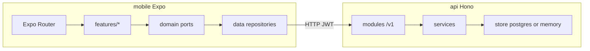

# Bản đồ codebase — Em Plus

## Kiến trúc tổng quan

## API (Hono + Bun)

- **Cổng vào:** `app.ts` gắn middleware theo thứ tự: security → CORS → rate limit → sanitize → logger → requestId. Route REST dưới `/v1/*`.
- **Môi trường:** `config/env.ts`, kiểu `AppEnv` trong `app-env.ts`.
- **Lỗi:** `utils/http.ts` (`AppError`, `success`/`fail`), xử lý tập trung trong `app.onError`.
- **Dữ liệu:** `store/` abstract hóa Postgres vs in-memory (test). Migration/seed trong `db/`.
- **Realtime:** WebSocket qua `hono/bun` (entry `index.ts`).

## Mobile (Expo Router)

- **Điều hướng:** file-based trong `app/`; tab chính trong `app/(tabs)/`.
- **Tách lớp:** `features/*` (UI + hooks dữ liệu) → `domain` (use case, interface repo) → `data/repositories` (HTTP). Phù hợp mở rộng và test.
- **Session / API:** `framework/ctx/session-context.tsx`, `api-context.tsx`, token trong `core/api/token-manager.ts`.
- **Realtime (Phase 4):** WebSocket `GET /v1/live/ws?token=&coupleId=` — URL suy ra từ `EXPO_PUBLIC_API_BASE` (`core/config/live-ws-url.ts`, http→ws / https→wss). `LiveChannelProvider` + `useLiveChannel` trong `features/live/` (mount ở `app/(tabs)/_layout.tsx`). Tắt: `EXPO_PUBLIC_LIVE_WS_ENABLED=false`.
- **Giao diện:** theme tách token (`theme/tokens`, `semantic.ts`), component atom trong `components/atoms`.

## Chất lượng & kiểm thử

- API: `bun test` với `DATA_STORE=memory` (xem `api/package.json`).
- Mobile: `typecheck` qua `tsc`.

## Rủi ro / điểm cần ý

- **Đồng bộ contract:** Mọi thay đổi route/DTO API nên kèm `bun run api:sync` để tránh lệch type phía mobile.
- **Bảo mật:** Auth middleware + rate limit + sanitize — feature nhạy cảm cần kiểm tra cả server và client (token storage: Secure Store).
- **Môi trường:** API phụ thuộc Docker cho DB/Redis/MinIO khi dev full stack.
