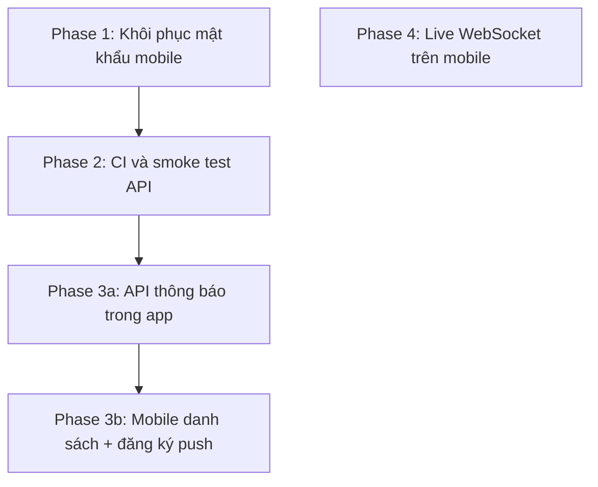

# Kế hoạch phase — backlog từ discuss-phase

Nguồn: đối chiếu tiến độ dự án (auth mobile thiếu forgot/reset, notifications mock, Live WS chưa dùng trên app, thiếu CI/test mobile).

**Nguyên tắc:** phase nhỏ, có tiêu chí xong rõ ràng; backend thiết kế trước khi mobile cần contract mới.

---

## Dependency graph (thứ tự gợi ý)

- **Phase 1** và **Phase 2** có thể **song song** (khác nhánh git / khác dev).
- **Phase 3b** phụ thuộc **3a** (cần endpoint list/mark-read tối thiểu).
- **Phase 4** độc lập; ưu tiên sau khi 1–2 ổn định trừ khi realtime là USP.

---

## Phase 1 — Khôi phục mật khẩu trên mobile (API đã sẵn)

**Kế hoạch thực thi (UAT + đóng phase):** [phase-1-password-reset/PLAN.md](./phase-1-password-reset/PLAN.md)

**Mục tiêu:** Người dùng quên mật khẩu có luồng hoàn chỉnh: gửi OTP → nhập OTP + mật khẩu mới → đăng nhập lại.

**Contract API hiện có (đã implement server):**

| Method | Path | Body (khái niệm) |
|--------|------|------------------|
| POST | `/v1/auth/forgot-password` | `{ email }` |
| POST | `/v1/auth/reset-password` | `{ email, otp, newPassword }` |

**Công việc (theo thứ tự):**

1. **Domain + schema** (`mobile`): Bổ sung type request/response trong `domain/entities/schemas` (hoặc file Auth module) khớp DTO API; chạy `bun run api:sync` nếu OpenAPI đã có field tương ứng.
2. **Port:** Mở rộng `AuthRepository`: `forgotPassword`, `resetPassword`.
3. **Impl:** `AuthRepositoryImpl` gọi `POST /auth/forgot-password`, `POST /auth/reset-password` (prefix base URL đã có trong `apiClient`).
4. **Use case:** `RequestPasswordResetUseCase`, `ResetPasswordUseCase`; đăng ký trong `framework/di/dependencies.ts`.
5. **Màn hình:**  
   - `forgot-password.tsx`: gọi use case, toast lỗi qua `toDisplayError`, navigate tới verify/reset với `email` params.  
   - `reset-password.tsx`: gọi reset, sau thành công → `login` hoặc màn login với thông báo.
6. **Kiểm thử thủ công:** Luồng đầy đủ với Mailpit (OTP trong email dev).

**Tiêu chí xong (Definition of Done):**

- Không còn comment `TODO` trong hai file trên.
- Luồng e2e thủ công pass trên dev (email nhận OTP hoặc mock được document nếu env test).

**Rủi ro:** Rate limit / spam email — đã có rate limit API; không mở rộng scope trừ khi cần CAPTCHA sau.

---

## Phase 2 — CI và smoke test API

**Mục tiêu:** Mỗi PR chạy `test:api` + typecheck tối thiểu; fail sớm khi regress.

**Công việc:**

1. Thêm workflow GitHub Actions (hoặc CI đang dùng):  
   - Checkout → cài Bun → `bun install` tại root → `bun run test:api` → `bun run --cwd api typecheck` (hoặc `lint` nếu có).
2. (Tuỳ chọn) Matrix: chỉ `api` trước; mobile typecheck thêm job riêng (`typecheck:mobile`) khi ổn định thời gian chạy.
3. Badge README (tuỳ chọn).

**Tiêu chí xong:**

- PR không merge nếu test API đỏ (policy team thống nhất).
- Thời gian job &lt; ~3 phút với cache dependency.

---

## Phase 3a — API thông báo trong ứng dụng (in-app)

**Bối cảnh:** Hiện **chưa có** module notifications trong `api/src/modules`. Cần thiết kế trước khi thay mock trên mobile.

**Mục tiêu tối thiểu (MVP):**

- Bảng / entity: thông báo theo `userId` (và có thể `coupleId`), loại, payload, `readAt`, `createdAt`.
- Endpoint gợi ý:  
  - `GET /v1/notifications?cursor=` — phân trang  
  - `PATCH /v1/notifications/:id/read` — đánh dấu đã đọc  
  - (Tuỳ chọn) `POST /v1/notifications/read-all`
- Tích hợp chỗ tạo thông báo: ví dụ sau khi partner làm hành động (có thể gọi từ service có sẵn) — **có thể tách sub-task** “emitter” sau MVP list-only.

**Công việc:**

1. Migration + store methods + DTO + module `notifications.ts` + đăng ký route trong `app.ts`.
2. Test Bun: list + read ít nhất một case happy path (memory store).
3. Export OpenAPI + `api:sync`.

**Tiêu chí xong:**

- Mobile có thể gọi API thật thay mock (sang Phase 3b).

---

## Phase 3b — Mobile: danh sách thông báo + push (Expo)

**Mục tiêu:** Màn `notifications.tsx` bind dữ liệu từ API; đăng ký token push để nhận tin ngoài app (theo policy sản phẩm).

**Công việc:**

1. Repository + React Query: `useNotifications`, `useMarkRead`, invalidate sau mutation.
2. Thay mock array bằng list từ API; empty/loading/error states.
3. **Push:**  
   - Endpoint lưu `expoPushToken` (hoặc FCM) gắn `userId` — có thể mở rộng `users/me` hoặc `POST /v1/users/push-token`.  
   - Cấu hình `expo-notifications` (quyền, channel Android); xử lý notification tap → deep link vào màn chi tiết (nếu có).

**Tiêu chí xong:**

- Danh sách đọc từ server; đánh dấu đọc persist.
- (Nếu trong scope) một notification test gửi từ server/dev tool tới thiết bị thật.

**Rủi ro:** Apple/Google credentials, sandbox — ghi rõ trong task infra.

---

## Phase 4 — Tích hợp Live WebSocket trên mobile

**Mục tiêu:** Client kết nối `GET /v1/live/ws` với query `token`, `coupleId` (đúng contract server hiện tại); hiển thị hoặc đồng bộ trạng thái realtime (theo spec sản phẩm).

**Công việc:**

1. Hook `useLiveChannel` (hoặc service): kết nối/ngắt khi coupleId + token đổi; reconnect backoff.
2. Gắn vào màn hình cần realtime (home / care / …) — **quyết định UX trong spec nhỏ trước khi code**.
3. Feature flag hoặc kill switch nếu server tắt WS.

**Tiêu chí xong:**

- Không crash khi mất mạng; reconnect hợp lý.
- Tài liệu ngắn trong CODEBASE-MAP hoặc README mobile về URL WS (env).

---

## Tổng hợp ước lượng (chỉ mang tính relative)

| Phase | Độ phức tạp | Phụ thuộc ngoài code |
|-------|-------------|----------------------|
| 1 | Thấp | — |
| 2 | Thấp | Repo GitHub + secret nếu cần |
| 3a | Trung bình | Thiết kế DB, migration |
| 3b | Trung bình–cao | Expo push, store credentials |
| 4 | Trung bình | Spec UX realtime |

---

## Ghi chú cho verifier / phase sau

- Sau mỗi phase: cập nhật `INDEX.md` (endpoint mới) và chạy `api:sync` khi OpenAPI đổi.
- Phase 3 có thể tách **“chỉ in-app list, chưa push”** nếu cần ship nhanh.
