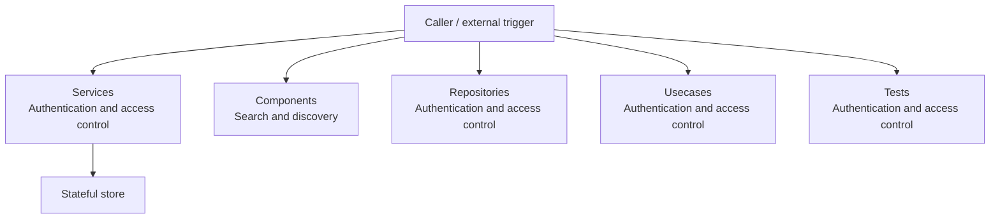

# Basic Design

- Overview: [emplus Docs Wiki](../index.md)
- Design overview: [Design Overview](./index.md)
- Detail design: [Detail Design](./detail-design.md)
- API contracts: [API Contracts](./api-contracts.md)
- Flow catalog: [Flow Catalog](./flows.md)

## System Intent

emplus is organized around 6 main modules with 399 scanned files and 1051 documented symbols.

## Actors

- Authenticated end user
- Background worker
- External provider

## Context Diagram

## Primary Capabilities

### [Services](../reference/modules/api/src/services.md)

Authentication Service API

### [Components](../reference/modules/mobile/src/components.md)

AnimatedSplashScreen component

### [Repositories](../reference/modules/mobile/src/data/repositories.md)

AuthRepositoryImpl class

### [Usecases](../reference/modules/mobile/src/domain/usecases.md)

LoginUseCase class.

### [Tests](../reference/modules/api/src/__tests__.md)

Unit tests for anniversary functionality.

### [Design Builder](../reference/modules/design-builder.md)

JSON schema definition for components file
