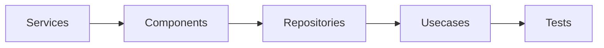

# Detail Design

- Overview: [emplus Docs Wiki](../index.md)
- Design overview: [Design Overview](./index.md)
- Basic design: [Basic Design](./basic-design.md)
- API contracts: [API Contracts](./api-contracts.md)
- Flow catalog: [Flow Catalog](./flows.md)

## Runtime View

The runtime shape is dominated by Services, Components, Repositories, Usecases, Tests, Design Builder.

## Runtime Layers

- Entry point
- UI surface
- Service / use case

## Interaction Diagram

## Module Responsibilities

### [Services](../reference/modules/api/src/services.md)

- Basic design: Services is inferred as a authentication and access control area. The visible implementation layers are Entry point. State is likely persisted in session / token state, primary database. The module also integrates with node, ioredis, postgres, nodemailer, minio.
- Detail design: Primary flow coverage includes Auth login, Password reset, Auth registration. Representative files are api/src/services/auth.service.ts, api/src/services/budget.service.ts, api/src/services/couple.service.ts, api/src/services/crypto.ts, api/src/services/dependencies.ts. Observed behavior hints: Budget Service Interface Summary

### [Components](../reference/modules/mobile/src/components.md)

- Basic design: Components is inferred as a search and discovery area. The visible implementation layers are UI surface, Utility, Entry point. The module also integrates with expo-linear-gradient, react, react-native, react-native-reanimated, react-native-svg, @.
- Detail design: Primary flow coverage includes Search Discovery listing, Search Discovery creation, Search Discovery synchronization. Representative files are mobile/src/components/AnimatedSplashScreen.tsx, mobile/src/components/atoms/Avatar.tsx, mobile/src/components/atoms/Badge.tsx, mobile/src/components/atoms/BottomSheet.tsx, mobile/src/components/atoms/Button.tsx. Observed behavior hints: Retrieves a color from an avatar's name

### [Repositories](../reference/modules/mobile/src/data/repositories.md)

- Basic design: Repositories is inferred as a authentication and access control area. The visible implementation layers are Entry point.
- Detail design: Primary flow coverage includes Password reset, Auth login, Auth registration. Representative files are mobile/src/data/repositories/auth.repository.impl.ts, mobile/src/data/repositories/modules.repository.impl.ts, mobile/src/data/repositories/notifications.repository.impl.ts. Observed behavior hints: Provides 20 documented symbols in mobile/src/data/repositories/modules.repository.impl.ts.

### [Usecases](../reference/modules/mobile/src/domain/usecases.md)

- Basic design: Usecases is inferred as a authentication and access control area. The visible implementation layers are Service / use case, Entry point.
- Detail design: Primary flow coverage includes Password reset, Auth login, Auth registration. Representative files are mobile/src/domain/usecases/auth/index.ts, mobile/src/domain/usecases/base.ts, mobile/src/domain/usecases/modules/index.ts. Observed behavior hints: Base Usecase Class Declaration.

### [Tests](../reference/modules/api/src/__tests__.md)

- Basic design: Tests is inferred as a authentication and access control area. The visible implementation layers are Entry point. The module also integrates with bun.
- Detail design: Primary flow coverage includes Password reset, Auth registration. Representative files are api/src/__tests__/anniversary.test.ts, api/src/__tests__/app.test.ts, api/src/__tests__/auth.test.ts, api/src/__tests__/love-days-utc.test.ts, api/src/__tests__/notifications.test.ts. Observed behavior hints: Registers a new user with a profile and returns an access token.

### [Design Builder](../reference/modules/design-builder.md)

- Basic design: Design Builder is inferred as a files and storage area. The visible implementation layers are UI surface, Configuration, Utility. The module also integrates with next, sonner, @, lucide-react, react, react-colorful.
- Detail design: Primary flow coverage includes Files Storage listing, Files Storage synchronization. Representative files are design-builder/components.json, design-builder/next-env.d.ts, design-builder/next.config.js, design-builder/package.json, design-builder/postcss.config.js. Observed behavior hints: Provides 0 documented symbols in design-builder/next-env.d.ts.
