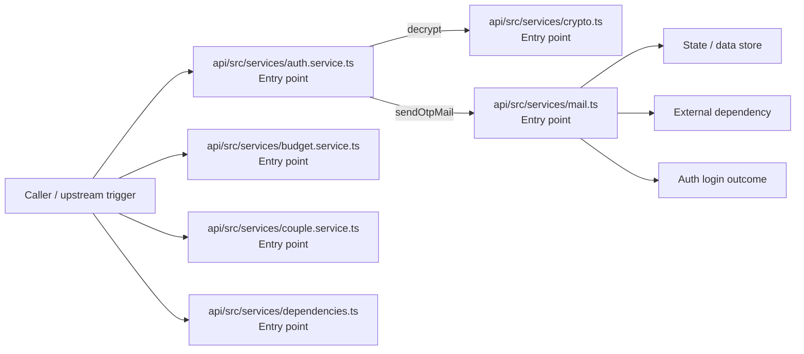
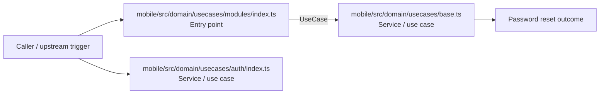

```mermaid
flowchart LR
  caller["Caller / upstream trigger"]
  n1_AnimatedSplashScreen_tsx["mobile/src/components/AnimatedSplashScreen.tsx\nUI surface"]
  n2_Badge_tsx["mobile/src/components/atoms/Badge.tsx\nUI surface"]
  n3_Button_tsx["mobile/src/components/atoms/Button.tsx\nUI surface"]
  n4_Checkbox_tsx["mobile/src/components/atoms/Checkbox.tsx\nUI surface"]
  n5_EmplusLottie_tsx["mobile/src/components/atoms/EmplusLottie.tsx\nUI surface"]
  n6_index_ts["mobile/src/components/atoms/index.ts\nUI surface"]
  caller --> n1_AnimatedSplashScreen_tsx
  n1_AnimatedSplashScreen_tsx --> n2_Badge_tsx
  n2_Badge_tsx --> n3_Button_tsx
  n3_Button_tsx --> n4_Checkbox_tsx
  n4_Checkbox_tsx --> n5_EmplusLottie_tsx
  n5_EmplusLottie_tsx --> n6_index_ts
  ext["External dependency"]
  n6_index_ts --> ext
  outcome["Search Discovery listing outcome"]
  n6_index_ts --> outcome
```

```mermaid
flowchart LR
  caller["Caller / upstream trigger"]
  n1_auth_repository_impl_ts["mobile/src/data/repositories/auth.repository.impl.ts\nEntry point"]
  n2_modules_repository_impl_ts["mobile/src/data/repositories/modules.repository.impl.ts\nEntry point"]
  n3_notifications_repository_impl_ts["mobile/src/data/repositories/notifications.repository.impl.ts\nEntry point"]
  caller --> n1_auth_repository_impl_ts
  n1_auth_repository_impl_ts --> n2_modules_repository_impl_ts
  n2_modules_repository_impl_ts --> n3_notifications_repository_impl_ts
  outcome["Password reset outcome"]
  n3_notifications_repository_impl_ts --> outcome
```

```mermaid
flowchart LR
  caller["Caller / upstream trigger"]
  n1_App_tsx["design-builder/src/App.tsx\nUI surface"]
  n2_layout_tsx["design-builder/src/app/layout.tsx\nUI surface"]
  n3_page_tsx["design-builder/src/app/page.tsx\nUI surface"]
  n4_theme_preview_tsx["design-builder/src/components/theme-preview.tsx\nUI surface"]
  n5_token_category_list_tsx["design-builder/src/components/token-category-list.tsx\nUI surface"]
  n6_token_editor_tsx["design-builder/src/components/token-editor.tsx\nUI surface"]
  caller --> n1_App_tsx
  n1_App_tsx --> n2_layout_tsx
  n2_layout_tsx --> n3_page_tsx
  n3_page_tsx --> n4_theme_preview_tsx
  n4_theme_preview_tsx --> n5_token_category_list_tsx
  n5_token_category_list_tsx --> n6_token_editor_tsx
  ext["External dependency"]
  n6_token_editor_tsx --> ext
  outcome["Files Storage listing outcome"]
  n6_token_editor_tsx --> outcome
```

# Flow Catalog

- Overview: [emplus Docs Wiki](../index.md)
- Design overview: [Design Overview](./index.md)
- Basic design: [Basic Design](./basic-design.md)
- Detail design: [Detail Design](./detail-design.md)
- API contracts: [API Contracts](./api-contracts.md)

## Inferred Flows

### Auth login

Authenticate the caller, validate credentials, and establish a usable session or token.

#### Steps

- api/src/services/auth.service.ts receives the request and turns it into an application-level login command. It then hands off to index.ts, generateNumericCode, generateTokens.
- api/src/services/budget.service.ts receives the request and turns it into an application-level login command. It then hands off to StoreMode, mapDisplayStatusToInternal, store.ts.
- api/src/services/couple.service.ts receives the request and turns it into an application-level login command. It then hands off to index.ts, formatDate, store.ts.
- api/src/services/crypto.ts receives the request and turns it into an application-level login command.
- api/src/services/dependencies.ts receives the request and turns it into an application-level login command. It then hands off to StoreMode, env.ts.
- api/src/services/mail.ts receives the request and turns it into an application-level login command. It then hands off to StoreMode, env.ts.

#### Flow Diagram

### Search Discovery listing

Execute the module's listing use case inside search and discovery.

#### Steps

- The user or operator enters the flow through mobile/src/components/AnimatedSplashScreen.tsx, which surfaces the listing interaction.
- The user or operator enters the flow through mobile/src/components/atoms/Badge.tsx, which surfaces the listing interaction.
- The user or operator enters the flow through mobile/src/components/atoms/Button.tsx, which surfaces the listing interaction.
- The user or operator enters the flow through mobile/src/components/atoms/Checkbox.tsx, which surfaces the listing interaction. It then hands off to Text, Text.tsx.
- The user or operator enters the flow through mobile/src/components/atoms/EmplusLottie.tsx, which surfaces the listing interaction.
- The user or operator enters the flow through mobile/src/components/atoms/index.ts, which surfaces the listing interaction.

#### Flow Diagram

### Password reset

Execute the module's password reset use case inside authentication and access control.

#### Steps

- mobile/src/data/repositories/auth.repository.impl.ts receives the request and turns it into an application-level password reset command. It then hands off to ApiResponse, index.ts.
- mobile/src/data/repositories/modules.repository.impl.ts receives the request and turns it into an application-level password reset command. It then hands off to ApiResponse, index.ts.
- mobile/src/data/repositories/notifications.repository.impl.ts receives the request and turns it into an application-level password reset command. It then hands off to ApiResponse, index.ts.

#### Flow Diagram

### Password reset

Execute the module's password reset use case inside authentication and access control.

#### Steps

- mobile/src/domain/usecases/modules/index.ts receives the request and turns it into an application-level password reset command. It then hands off to base.ts.
- mobile/src/domain/usecases/auth/index.ts coordinates the core business rules and state changes for the flow.
- mobile/src/domain/usecases/base.ts coordinates the core business rules and state changes for the flow.

#### Flow Diagram

### Password reset

Execute the module's password reset use case inside authentication and access control.

#### Steps

- api/src/__tests__/anniversary.test.ts receives the request and turns it into an application-level password reset command. It then hands off to anniversary.ts, date.ts, types.ts.
- api/src/__tests__/app.test.ts receives the request and turns it into an application-level password reset command. It then hands off to app.ts, store.ts.
- api/src/__tests__/auth.test.ts receives the request and turns it into an application-level password reset command. It then hands off to app.ts.
- api/src/__tests__/love-days-utc.test.ts receives the request and turns it into an application-level password reset command. It then hands off to diffDays, date.ts.
- api/src/__tests__/notifications.test.ts receives the request and turns it into an application-level password reset command. It then hands off to app.ts, store.ts.
- api/src/__tests__/security_random.test.ts receives the request and turns it into an application-level password reset command. It then hands off to code.ts.

#### Flow Diagram

```mermaid
flowchart LR
  caller["Caller / upstream trigger"]
  n1_anniversary_test_ts["api/src/__tests__/anniversary.test.ts\nEntry point"]
  n2_app_test_ts["api/src/__tests__/app.test.ts\nEntry point"]
  n3_auth_test_ts["api/src/__tests__/auth.test.ts\nEntry point"]
  n4_love_days_utc_test_ts["api/src/__tests__/love-days-utc.test.ts\nEntry point"]
  n5_notifications_test_ts["api/src/__tests__/notifications.test.ts\nEntry point"]
  n6_security_random_test_ts["api/src/__tests__/security_random.test.ts\nEntry point"]
  caller --> n1_anniversary_test_ts
  n1_anniversary_test_ts --> n2_app_test_ts
  n2_app_test_ts --> n3_auth_test_ts
  n3_auth_test_ts --> n4_love_days_utc_test_ts
  n4_love_days_utc_test_ts --> n5_notifications_test_ts
  n5_notifications_test_ts --> n6_security_random_test_ts
  ext["External dependency"]
  n6_security_random_test_ts --> ext
  outcome["Password reset outcome"]
  n6_security_random_test_ts --> outcome
```

### Files Storage listing

Execute the module's listing use case inside files and storage.

#### Steps

- The user or operator enters the flow through design-builder/src/App.tsx, which surfaces the listing interaction. It then hands off to BuilderPage, builder-page.tsx.
- The user or operator enters the flow through design-builder/src/app/layout.tsx, which surfaces the listing interaction. It then hands off to globals.css.
- The user or operator enters the flow through design-builder/src/app/page.tsx, which surfaces the listing interaction.
- The user or operator enters the flow through design-builder/src/components/theme-preview.tsx, which surfaces the listing interaction.
- The user or operator enters the flow through design-builder/src/components/token-category-list.tsx, which surfaces the listing interaction.
- The user or operator enters the flow through design-builder/src/components/token-editor.tsx, which surfaces the listing interaction.

#### Flow Diagram

