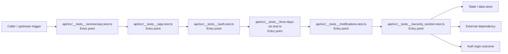
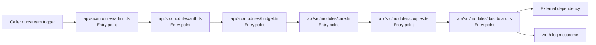
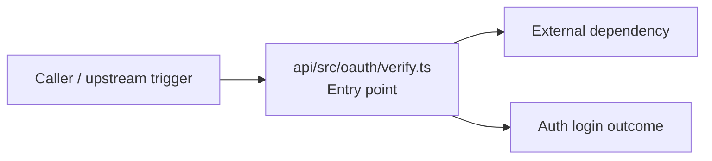
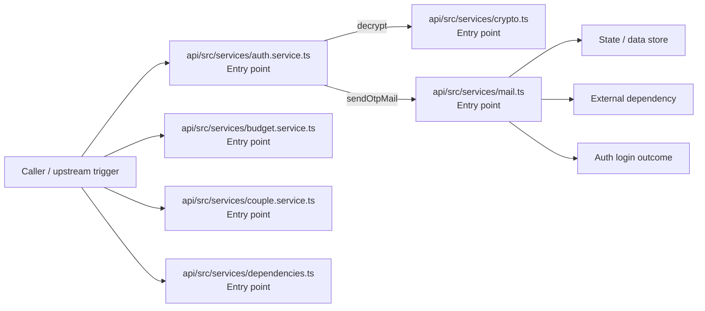
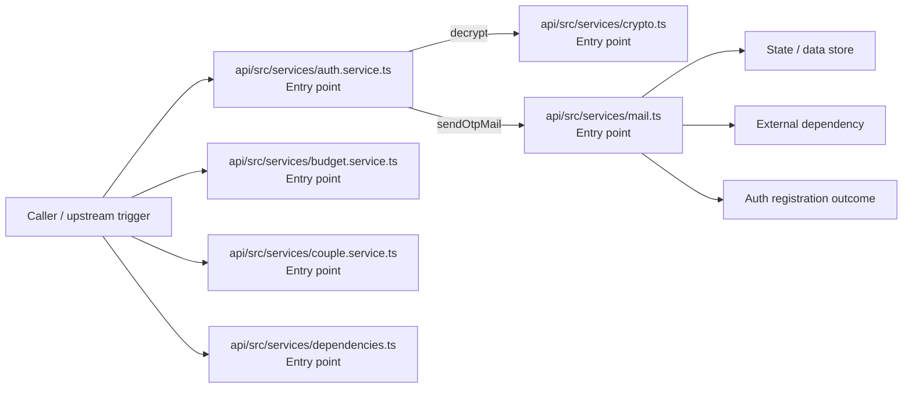
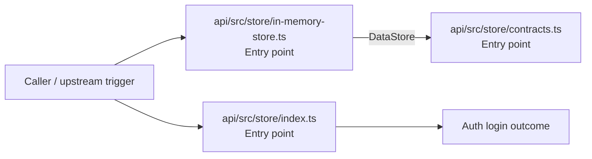
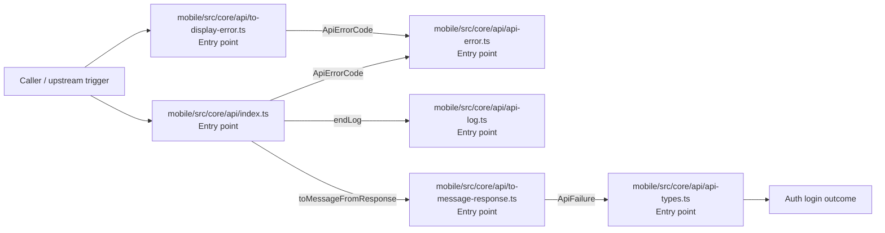
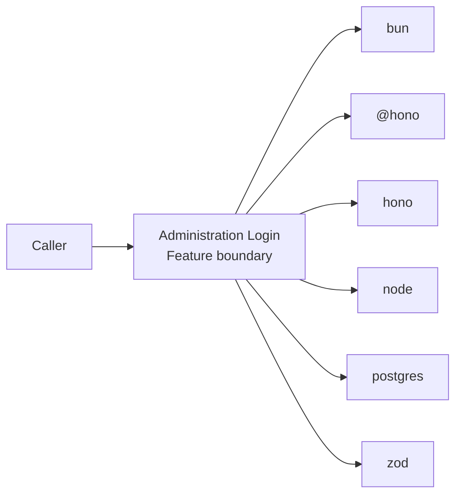
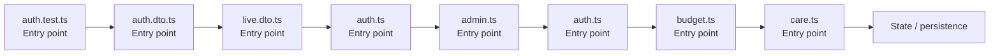

```mermaid
flowchart LR
  caller["Caller / upstream trigger"]
  n1_anniversary_test_ts["api/src/__tests__/anniversary.test.ts\nEntry point"]
  n2_app_test_ts["api/src/__tests__/app.test.ts\nEntry point"]
  n3_auth_test_ts["api/src/__tests__/auth.test.ts\nEntry point"]
  n4_love_days_utc_test_ts["api/src/__tests__/love-days-utc.test.ts\nEntry point"]
  n5_notifications_test_ts["api/src/__tests__/notifications.test.ts\nEntry point"]
  n6_security_random_test_ts["api/src/__tests__/security_random.test.ts\nEntry point"]
  caller --> n1_anniversary_test_ts
  n1_anniversary_test_ts --> n2_app_test_ts
  n2_app_test_ts --> n3_auth_test_ts
  n3_auth_test_ts --> n4_love_days_utc_test_ts
  n4_love_days_utc_test_ts --> n5_notifications_test_ts
  n5_notifications_test_ts --> n6_security_random_test_ts
  ext["External dependency"]
  n6_security_random_test_ts --> ext
  outcome["Auth registration outcome"]
  n6_security_random_test_ts --> outcome
```

# Administration Login

- Overview: [emplus Docs Wiki](../index.md)
- Feature catalog: [All features](index.md)
- Reference: [Reference Index](../reference/index.md)

## Overview

Unit tests for anniversary functionality. Functionality to validate and format user input for various types of authentication and login processes. /api/auth.middleware.requireAuth JS API for the admin module. Identifies an identity from an OAuth token and pro…

## Actors & User Stories

### As user

- Goal: Auth login
- Benefit: Authenticate the caller, validate credentials, and establish a usable session or token.

#### Acceptance Criteria

- api/src/__tests__/anniversary.test.ts receives the request and turns it into an application-level login command. It then hands off to anniversary.ts, date.ts, types.ts.
- api/src/__tests__/app.test.ts receives the request and turns it into an application-level login command. It then hands off to app.ts, store.ts.
- api/src/__tests__/auth.test.ts receives the request and turns it into an application-level login command. It then hands off to app.ts.

## Business Flows

### Auth login

Authenticate the caller, validate credentials, and establish a usable session or token.

#### Steps

- api/src/__tests__/anniversary.test.ts receives the request and turns it into an application-level login command. It then hands off to anniversary.ts, date.ts, types.ts.
- api/src/__tests__/app.test.ts receives the request and turns it into an application-level login command. It then hands off to app.ts, store.ts.
- api/src/__tests__/auth.test.ts receives the request and turns it into an application-level login command. It then hands off to app.ts.
- api/src/__tests__/love-days-utc.test.ts receives the request and turns it into an application-level login command. It then hands off to diffDays, date.ts.
- api/src/__tests__/notifications.test.ts receives the request and turns it into an application-level login command. It then hands off to app.ts, store.ts.
- api/src/__tests__/security_random.test.ts receives the request and turns it into an application-level login command. It then hands off to code.ts.

#### Flow Diagram

### Auth registration

Execute the module's registration use case inside authentication and access control.

#### Steps

- api/src/__tests__/anniversary.test.ts receives the request and turns it into an application-level registration command. It then hands off to anniversary.ts, date.ts, types.ts.
- api/src/__tests__/app.test.ts receives the request and turns it into an application-level registration command. It then hands off to app.ts, store.ts.
- api/src/__tests__/auth.test.ts receives the request and turns it into an application-level registration command. It then hands off to app.ts.
- api/src/__tests__/love-days-utc.test.ts receives the request and turns it into an application-level registration command. It then hands off to diffDays, date.ts.
- api/src/__tests__/notifications.test.ts receives the request and turns it into an application-level registration command. It then hands off to app.ts, store.ts.
- api/src/__tests__/security_random.test.ts receives the request and turns it into an application-level registration command. It then hands off to code.ts.

#### Flow Diagram

### Auth login

Authenticate the caller, validate credentials, and establish a usable session or token.

#### Steps

- api/src/modules/admin.ts receives the request and turns it into an application-level login command. It then hands off to app-env.ts, auth.ts, store.ts.
- api/src/modules/auth.ts receives the request and turns it into an application-level login command. It then hands off to app-env.ts, auth.dto.ts, auth.ts.
- api/src/modules/budget.ts receives the request and turns it into an application-level login command. It then hands off to app-env.ts, budget.dto.ts, auth.ts.
- api/src/modules/care.ts receives the request and turns it into an application-level login command. It then hands off to store.ts, User, AppError.
- api/src/modules/couples.ts receives the request and turns it into an application-level login command. It then hands off to app-env.ts, couples.dto.ts, auth.ts.
- api/src/modules/dashboard.ts receives the request and turns it into an application-level login command. It then hands off to app-env.ts, env.ts, anniversary.ts.

#### Flow Diagram

### Auth login

Authenticate the caller, validate credentials, and establish a usable session or token.

#### Steps

- api/src/oauth/verify.ts receives the request and turns it into an application-level login command. It then hands off to StoreMode, AuthProvider, AppError.

#### Flow Diagram

### Auth login

Authenticate the caller, validate credentials, and establish a usable session or token.

#### Steps

- api/src/services/auth.service.ts receives the request and turns it into an application-level login command. It then hands off to index.ts, generateNumericCode, generateTokens.
- api/src/services/budget.service.ts receives the request and turns it into an application-level login command. It then hands off to StoreMode, mapDisplayStatusToInternal, store.ts.
- api/src/services/couple.service.ts receives the request and turns it into an application-level login command. It then hands off to index.ts, formatDate, store.ts.
- api/src/services/crypto.ts receives the request and turns it into an application-level login command.
- api/src/services/dependencies.ts receives the request and turns it into an application-level login command. It then hands off to StoreMode, env.ts.
- api/src/services/mail.ts receives the request and turns it into an application-level login command. It then hands off to StoreMode, env.ts.

#### Flow Diagram

### Auth registration

Execute the module's registration use case inside authentication and access control.

#### Steps

- api/src/services/auth.service.ts receives the request and turns it into an application-level registration command. It then hands off to index.ts, generateNumericCode, generateTokens.
- api/src/services/budget.service.ts receives the request and turns it into an application-level registration command. It then hands off to StoreMode, mapDisplayStatusToInternal, store.ts.
- api/src/services/couple.service.ts receives the request and turns it into an application-level registration command. It then hands off to index.ts, formatDate, store.ts.
- api/src/services/crypto.ts receives the request and turns it into an application-level registration command.
- api/src/services/dependencies.ts receives the request and turns it into an application-level registration command. It then hands off to StoreMode, env.ts.
- api/src/services/mail.ts receives the request and turns it into an application-level registration command. It then hands off to StoreMode, env.ts.

#### Flow Diagram

### Auth login

Authenticate the caller, validate credentials, and establish a usable session or token.

#### Steps

- api/src/store/contracts.ts receives the request and turns it into an application-level login command. It then hands off to Anniversary, types.ts.
- api/src/store/in-memory-store.ts receives the request and turns it into an application-level login command. It then hands off to generateInviteCode, Anniversary, DataStore.
- api/src/store/index.ts receives the request and turns it into an application-level login command.

#### Flow Diagram

### Auth login

Authenticate the caller, validate credentials, and establish a usable session or token.

#### Steps

- mobile/src/core/api/api-error.ts receives the request and turns it into an application-level login command.
- mobile/src/core/api/api-log.ts receives the request and turns it into an application-level login command.
- mobile/src/core/api/api-types.ts receives the request and turns it into an application-level login command.
- mobile/src/core/api/index.ts receives the request and turns it into an application-level login command. It then hands off to app-config.ts, ApiErrorCode, endLog.
- mobile/src/core/api/to-display-error.ts receives the request and turns it into an application-level login command. It then hands off to messages.ts, ApiErrorCode, api-error.ts.
- mobile/src/core/api/to-message-response.ts receives the request and turns it into an application-level login command. It then hands off to isRecord, messages.ts, ApiFailure.

#### Flow Diagram

## Basic Design

Administration Login captures the login workflow inside administration. It spans 2 workspaces. Key flows include Auth login, Auth registration, Auth login.

### Boundaries

- Workspaces: @emplus/api, @emplus/mobile
- Entry points (FE): api/src/__tests__/auth.test.ts, api/src/dto/auth.dto.ts, api/src/dto/live.dto.ts, api/src/middleware/auth.ts, api/src/modules/admin.ts, api/src/modules/auth.ts, api/src/modules/budget.ts, api/src/modules/care.ts
- Entry points (BE): api/src/__tests__/auth.test.ts, api/src/dto/auth.dto.ts, api/src/dto/live.dto.ts, api/src/middleware/auth.ts, api/src/modules/admin.ts, api/src/modules/auth.ts, api/src/modules/budget.ts, api/src/modules/care.ts

### Context Diagram

## Detail Design

- Data stores: Primary database, Session / token state
- Integrations: bun, @hono, hono, node, postgres, zod, ioredis, @faker-js, google-auth-library, jose, nodemailer, minio, @, react, react-native, react-native-safe-area-context, react-native-reanimated, expo-linear-gradient

### Component Diagram

## API Contracts

No API contracts were linked to this feature.

## Edge Cases & Error Handling

No edge cases were inferred from the clustered code.

## Related Files

| File | Workspace | Role | Why It Belongs |
| --- | --- | --- | --- |
| [api/src/__tests__/auth.test.ts](../reference/files/api/src/__tests__/auth.test.ts.md) | @emplus/api | Entry point | Matches the login action heuristics for this feature. |
| [api/src/dto/auth.dto.ts](../reference/files/api/src/dto/auth.dto.ts.md) | @emplus/api | Entry point | Matches the login action heuristics for this feature. |
| [api/src/dto/live.dto.ts](../reference/files/api/src/dto/live.dto.ts.md) | @emplus/api | Entry point | Matches the login action heuristics for this feature. |
| [api/src/middleware/auth.ts](../reference/files/api/src/middleware/auth.ts.md) | @emplus/api | Entry point | Matches the login action heuristics for this feature. |
| [api/src/modules/admin.ts](../reference/files/api/src/modules/admin.ts.md) | @emplus/api | Entry point | Matches the login action heuristics for this feature. |
| [api/src/modules/auth.ts](../reference/files/api/src/modules/auth.ts.md) | @emplus/api | Entry point | Matches the login action heuristics for this feature. |
| [api/src/modules/budget.ts](../reference/files/api/src/modules/budget.ts.md) | @emplus/api | Entry point | Matches the login action heuristics for this feature. |
| [api/src/modules/care.ts](../reference/files/api/src/modules/care.ts.md) | @emplus/api | Entry point | Matches the login action heuristics for this feature. |
| [api/src/modules/couples.ts](../reference/files/api/src/modules/couples.ts.md) | @emplus/api | Entry point | Matches the login action heuristics for this feature. |
| [api/src/modules/dashboard.ts](../reference/files/api/src/modules/dashboard.ts.md) | @emplus/api | Entry point | Matches the login action heuristics for this feature. |
| [api/src/modules/debug.ts](../reference/files/api/src/modules/debug.ts.md) | @emplus/api | Entry point | Matches the login action heuristics for this feature. |
| [api/src/modules/live.ts](../reference/files/api/src/modules/live.ts.md) | @emplus/api | Entry point | Matches the login action heuristics for this feature. |
| [api/src/modules/media.ts](../reference/files/api/src/modules/media.ts.md) | @emplus/api | Entry point | Matches the login action heuristics for this feature. |
| [api/src/modules/notifications.ts](../reference/files/api/src/modules/notifications.ts.md) | @emplus/api | Entry point | Matches the login action heuristics for this feature. |
| [api/src/modules/system.ts](../reference/files/api/src/modules/system.ts.md) | @emplus/api | Entry point | Matches the login action heuristics for this feature. |
| [api/src/modules/timeline.ts](../reference/files/api/src/modules/timeline.ts.md) | @emplus/api | Entry point | Matches the login action heuristics for this feature. |
| [api/src/modules/user.ts](../reference/files/api/src/modules/user.ts.md) | @emplus/api | Entry point | Matches the login action heuristics for this feature. |
| [api/src/oauth/verify.ts](../reference/files/api/src/oauth/verify.ts.md) | @emplus/api | Entry point | Matches the login action heuristics for this feature. |
| [api/src/services/auth.service.ts](../reference/files/api/src/services/auth.service.ts.md) | @emplus/api | Entry point | Matches the login action heuristics for this feature. |
| [api/src/store/in-memory-store.ts](../reference/files/api/src/store/in-memory-store.ts.md) | @emplus/api | Entry point | Matches the login action heuristics for this feature. |
| [api/src/types.ts](../reference/files/api/src/types.ts.md) | @emplus/api | Entry point | Matches the login action heuristics for this feature. |
| [mobile/src/api.ts](../reference/files/mobile/src/api.ts.md) | @emplus/mobile | Entry point | Matches the login action heuristics for this feature. |
| [mobile/src/core/api/index.ts](../reference/files/mobile/src/core/api/index.ts.md) | @emplus/mobile | Entry point | Matches the login action heuristics for this feature. |
| [mobile/src/data/repositories/auth.repository.impl.ts](../reference/files/mobile/src/data/repositories/auth.repository.impl.ts.md) | @emplus/mobile | Entry point | Matches the login action heuristics for this feature. |
| [mobile/src/domain/usecases/auth/index.ts](../reference/files/mobile/src/domain/usecases/auth/index.ts.md) | @emplus/mobile | Service / use case | Matches the login action heuristics for this feature. |
| [mobile/src/domain/repositories/auth.repository.ts](../reference/files/mobile/src/domain/repositories/auth.repository.ts.md) | @emplus/mobile | Repository / persistence | Matches the login action heuristics for this feature. |
| [mobile/src/framework/di/dependencies.ts](../reference/files/mobile/src/framework/di/dependencies.ts.md) | @emplus/mobile | Repository / persistence | Matches the login action heuristics for this feature. |