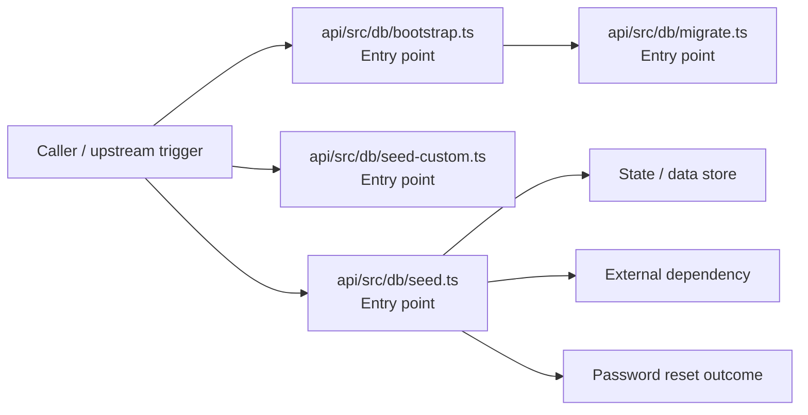
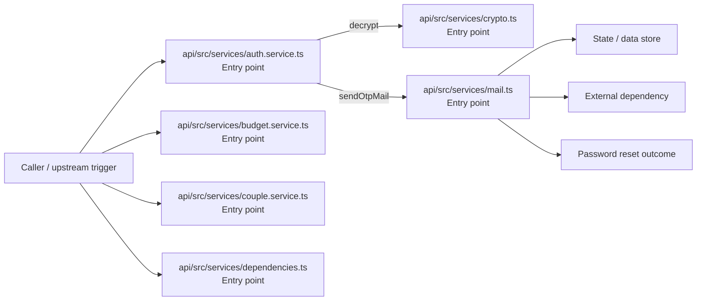
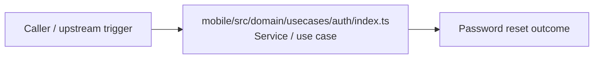
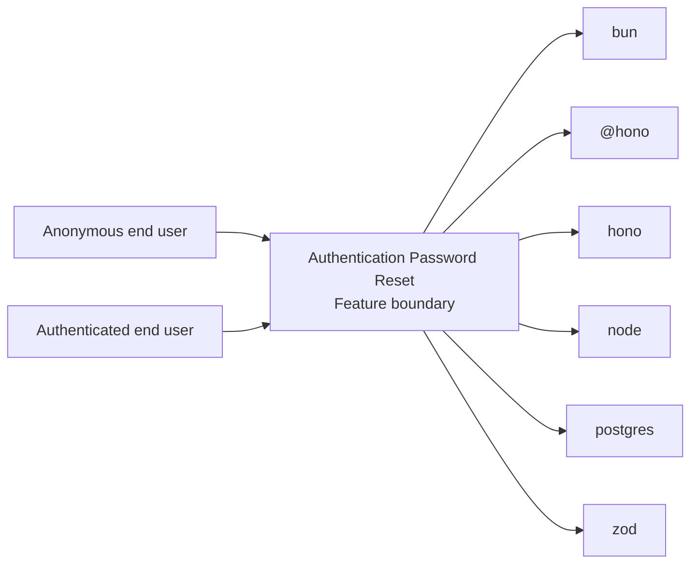

```mermaid
flowchart LR
  caller["Caller / upstream trigger"]
  n1_anniversary_test_ts["api/src/__tests__/anniversary.test.ts\nEntry point"]
  n2_app_test_ts["api/src/__tests__/app.test.ts\nEntry point"]
  n3_auth_test_ts["api/src/__tests__/auth.test.ts\nEntry point"]
  n4_love_days_utc_test_ts["api/src/__tests__/love-days-utc.test.ts\nEntry point"]
  n5_notifications_test_ts["api/src/__tests__/notifications.test.ts\nEntry point"]
  n6_security_random_test_ts["api/src/__tests__/security_random.test.ts\nEntry point"]
  caller --> n1_anniversary_test_ts
  n1_anniversary_test_ts --> n2_app_test_ts
  n2_app_test_ts --> n3_auth_test_ts
  n3_auth_test_ts --> n4_love_days_utc_test_ts
  n4_love_days_utc_test_ts --> n5_notifications_test_ts
  n5_notifications_test_ts --> n6_security_random_test_ts
  ext["External dependency"]
  n6_security_random_test_ts --> ext
  outcome["Password reset outcome"]
  n6_security_random_test_ts --> outcome
```

```mermaid
flowchart LR
  caller["Caller / upstream trigger"]
  n1_auth_repository_impl_ts["mobile/src/data/repositories/auth.repository.impl.ts\nEntry point"]
  n2_modules_repository_impl_ts["mobile/src/data/repositories/modules.repository.impl.ts\nEntry point"]
  n3_notifications_repository_impl_ts["mobile/src/data/repositories/notifications.repository.impl.ts\nEntry point"]
  caller --> n1_auth_repository_impl_ts
  n1_auth_repository_impl_ts --> n2_modules_repository_impl_ts
  n2_modules_repository_impl_ts --> n3_notifications_repository_impl_ts
  outcome["Password reset outcome"]
  n3_notifications_repository_impl_ts --> outcome
```

# Authentication Password Reset

- Overview: [emplus Docs Wiki](../index.md)
- Feature catalog: [All features](index.md)
- Reference: [Reference Index](../reference/index.md)

## Overview

Unit tests for anniversary functionality. Initialize the database connection and schema. Functionality to validate and format user input for various types of authentication and login processes. /api/auth.middleware.requireAuth JS API for the admin module. Aut…

## Actors & User Stories

### As Anonymous end user

- Goal: Password reset
- Benefit: Execute the module's password reset use case inside authentication and access control.

#### Acceptance Criteria

- api/src/__tests__/anniversary.test.ts receives the request and turns it into an application-level password reset command. It then hands off to anniversary.ts, date.ts, types.ts.
- api/src/__tests__/app.test.ts receives the request and turns it into an application-level password reset command. It then hands off to app.ts, store.ts.
- api/src/__tests__/auth.test.ts receives the request and turns it into an application-level password reset command. It then hands off to app.ts.

## Business Flows

### Password reset

Execute the module's password reset use case inside authentication and access control.

#### Steps

- api/src/__tests__/anniversary.test.ts receives the request and turns it into an application-level password reset command. It then hands off to anniversary.ts, date.ts, types.ts.
- api/src/__tests__/app.test.ts receives the request and turns it into an application-level password reset command. It then hands off to app.ts, store.ts.
- api/src/__tests__/auth.test.ts receives the request and turns it into an application-level password reset command. It then hands off to app.ts.
- api/src/__tests__/love-days-utc.test.ts receives the request and turns it into an application-level password reset command. It then hands off to diffDays, date.ts.
- api/src/__tests__/notifications.test.ts receives the request and turns it into an application-level password reset command. It then hands off to app.ts, store.ts.
- api/src/__tests__/security_random.test.ts receives the request and turns it into an application-level password reset command. It then hands off to code.ts.

#### Flow Diagram

### Password reset

Execute the module's password reset use case inside authentication and access control.

#### Steps

- api/src/db/bootstrap.ts receives the request and turns it into an application-level password reset command. It then hands off to migrate.ts.
- api/src/db/migrate.ts receives the request and turns it into an application-level password reset command. It then hands off to StoreMode, env.ts.
- api/src/db/seed-custom.ts receives the request and turns it into an application-level password reset command. It then hands off to StoreMode, hashPassword, env.ts.
- api/src/db/seed.ts receives the request and turns it into an application-level password reset command. It then hands off to StoreMode, Gender, hashPassword.

#### Flow Diagram

### Password reset

Execute the module's password reset use case inside authentication and access control.

#### Steps

- api/src/services/auth.service.ts receives the request and turns it into an application-level password reset command. It then hands off to index.ts, generateNumericCode, generateTokens.
- api/src/services/budget.service.ts receives the request and turns it into an application-level password reset command. It then hands off to StoreMode, mapDisplayStatusToInternal, store.ts.
- api/src/services/couple.service.ts receives the request and turns it into an application-level password reset command. It then hands off to index.ts, formatDate, store.ts.
- api/src/services/crypto.ts receives the request and turns it into an application-level password reset command.
- api/src/services/dependencies.ts receives the request and turns it into an application-level password reset command. It then hands off to StoreMode, env.ts.
- api/src/services/mail.ts receives the request and turns it into an application-level password reset command. It then hands off to StoreMode, env.ts.

#### Flow Diagram

### Password reset

Execute the module's password reset use case inside authentication and access control.

#### Steps

- mobile/src/data/repositories/auth.repository.impl.ts receives the request and turns it into an application-level password reset command. It then hands off to ApiResponse, index.ts.
- mobile/src/data/repositories/modules.repository.impl.ts receives the request and turns it into an application-level password reset command. It then hands off to ApiResponse, index.ts.
- mobile/src/data/repositories/notifications.repository.impl.ts receives the request and turns it into an application-level password reset command. It then hands off to ApiResponse, index.ts.

#### Flow Diagram

### Password reset

Execute the module's password reset use case inside authentication and access control.

#### Steps

- mobile/src/domain/usecases/auth/index.ts coordinates the core business rules and state changes for the flow.

#### Flow Diagram

## Basic Design

Authentication Password Reset captures the password reset workflow inside authentication. It spans 3 workspaces. Key flows include Password reset, Password reset, Password reset.

### Boundaries

- Workspaces: @emplus/api, @emplus/design-builder, @emplus/mobile
- Entry points (FE): mobile/app/forgot-password.tsx, mobile/src/features/auth/components/AuthGridScreenShell.tsx, mobile/src/features/auth/components/ForgotPasswordHeroSection.tsx, mobile/src/features/auth/forgotPassword.styles.ts, api/src/__tests__/app.test.ts, api/src/__tests__/validation.test.ts, api/src/db/seed-custom.ts, api/src/db/seed.ts
- Entry points (BE): api/src/__tests__/app.test.ts, api/src/__tests__/validation.test.ts, api/src/db/seed-custom.ts, api/src/db/seed.ts, api/src/dto/auth.dto.ts, api/src/middleware/rate-limit.ts, api/src/modules/debug.ts, api/src/services/auth.service.ts

### Context Diagram

## Detail Design

- Data stores: Primary database, Session / token state
- Integrations: bun, @hono, hono, node, postgres, zod, ioredis, @faker-js, nodemailer, minio, zustand, @, @expo-google-fonts, expo-font, expo-router, expo-splash-screen, expo-status-bar, react, react-native, react-native-safe-area-context, react-native-reanimated, expo-linear-gradient, react-native-keyboard-aware-scroll-view, @tanstack

### Component Diagram

```mermaid
flowchart LR
  cmp_1["forgot-password.tsx\nUI surface"]
  cmp_2["AuthGridScreenShell.tsx\nUI surface"]
  cmp_3["ForgotPasswordHeroSection.tsx\nUI surface"]
  cmp_4["forgotPassword.styles.ts\nUI surface"]
  cmp_5["app.test.ts\nEntry point"]
  cmp_6["validation.test.ts\nEntry point"]
  cmp_7["seed-custom.ts\nEntry point"]
  cmp_8["seed.ts\nEntry point"]
  cmp_1 --> cmp_2
  cmp_2 --> cmp_3
  cmp_3 --> cmp_4
  cmp_4 --> cmp_5
  cmp_5 --> cmp_6
  cmp_6 --> cmp_7
  cmp_7 --> cmp_8
  data_store["State / persistence"]
  cmp_8 --> data_store
```

## API Contracts

No API contracts were linked to this feature.

## Edge Cases & Error Handling

No edge cases were inferred from the clustered code.

## Related Files

| File | Workspace | Role | Why It Belongs |
| --- | --- | --- | --- |
| [mobile/app/forgot-password.tsx](../reference/files/mobile/app/forgot-password.tsx.md) | @emplus/mobile | UI surface | Matches the password reset action heuristics for this feature. |
| [mobile/src/features/auth/components/AuthGridScreenShell.tsx](../reference/files/mobile/src/features/auth/components/AuthGridScreenShell.tsx.md) | @emplus/mobile | UI surface | Matches the password reset action heuristics for this feature. |
| [mobile/src/features/auth/components/ForgotPasswordHeroSection.tsx](../reference/files/mobile/src/features/auth/components/ForgotPasswordHeroSection.tsx.md) | @emplus/mobile | UI surface | Matches the password reset action heuristics for this feature. |
| [mobile/src/features/auth/forgotPassword.styles.ts](../reference/files/mobile/src/features/auth/forgotPassword.styles.ts.md) | @emplus/mobile | UI surface | Matches the password reset action heuristics for this feature. |
| [api/src/__tests__/app.test.ts](../reference/files/api/src/__tests__/app.test.ts.md) | @emplus/api | Entry point | Matches the password reset action heuristics for this feature. |
| [api/src/__tests__/validation.test.ts](../reference/files/api/src/__tests__/validation.test.ts.md) | @emplus/api | Entry point | Matches the password reset action heuristics for this feature. |
| [api/src/db/seed-custom.ts](../reference/files/api/src/db/seed-custom.ts.md) | @emplus/api | Entry point | Matches the password reset action heuristics for this feature. |
| [api/src/db/seed.ts](../reference/files/api/src/db/seed.ts.md) | @emplus/api | Entry point | Matches the password reset action heuristics for this feature. |
| [api/src/dto/auth.dto.ts](../reference/files/api/src/dto/auth.dto.ts.md) | @emplus/api | Entry point | Matches the password reset action heuristics for this feature. |
| [api/src/middleware/rate-limit.ts](../reference/files/api/src/middleware/rate-limit.ts.md) | @emplus/api | Entry point | Matches the password reset action heuristics for this feature. |
| [api/src/modules/debug.ts](../reference/files/api/src/modules/debug.ts.md) | @emplus/api | Entry point | Matches the password reset action heuristics for this feature. |
| [api/src/services/auth.service.ts](../reference/files/api/src/services/auth.service.ts.md) | @emplus/api | Entry point | Matches the password reset action heuristics for this feature. |
| [api/src/store/in-memory-store.ts](../reference/files/api/src/store/in-memory-store.ts.md) | @emplus/api | Entry point | Matches the password reset action heuristics for this feature. |
| [api/src/types.ts](../reference/files/api/src/types.ts.md) | @emplus/api | Entry point | Matches the password reset action heuristics for this feature. |
| [api/src/utils/password.ts](../reference/files/api/src/utils/password.ts.md) | @emplus/api | Entry point | Matches the password reset action heuristics for this feature. |
| [mobile/app/reset-password.tsx](../reference/files/mobile/app/reset-password.tsx.md) | @emplus/mobile | Entry point | Matches the password reset action heuristics for this feature. |
| [mobile/src/data/repositories/auth.repository.impl.ts](../reference/files/mobile/src/data/repositories/auth.repository.impl.ts.md) | @emplus/mobile | Entry point | Matches the password reset action heuristics for this feature. |
| [mobile/src/features/auth/components/ForgotPasswordAuthForm.tsx](../reference/files/mobile/src/features/auth/components/ForgotPasswordAuthForm.tsx.md) | @emplus/mobile | Entry point | Matches the password reset action heuristics for this feature. |
| [mobile/src/features/auth/components/ForgotPasswordLoginFooter.tsx](../reference/files/mobile/src/features/auth/components/ForgotPasswordLoginFooter.tsx.md) | @emplus/mobile | Entry point | Matches the password reset action heuristics for this feature. |
| [mobile/src/features/auth/components/RegisterTopBar.tsx](../reference/files/mobile/src/features/auth/components/RegisterTopBar.tsx.md) | @emplus/mobile | Entry point | Matches the password reset action heuristics for this feature. |
| [mobile/src/presentation/hooks/auth/useForgotPasswordRequest.ts](../reference/files/mobile/src/presentation/hooks/auth/useForgotPasswordRequest.ts.md) | @emplus/mobile | Entry point | Matches the password reset action heuristics for this feature. |
| [mobile/src/forms.ts](../reference/files/mobile/src/forms.ts.md) | @emplus/mobile | Guard / middleware | Matches the password reset action heuristics for this feature. |
| [mobile/src/domain/usecases/auth/index.ts](../reference/files/mobile/src/domain/usecases/auth/index.ts.md) | @emplus/mobile | Service / use case | Matches the password reset action heuristics for this feature. |
| [design-builder/src/store/builder-store.ts](../reference/files/design-builder/src/store/builder-store.ts.md) | @emplus/design-builder | Repository / persistence | Matches the password reset action heuristics for this feature. |
| [mobile/src/framework/di/dependencies.ts](../reference/files/mobile/src/framework/di/dependencies.ts.md) | @emplus/mobile | Repository / persistence | Supports the feature as repository / persistence. |
| [mobile/assets/lottie/verify-otp-password-auth.json](../reference/files/mobile/assets/lottie/verify-otp-password-auth.json.md) | @emplus/mobile | Utility | Matches the password reset action heuristics for this feature. |
| [mobile/src/lottie/inventory.ts](../reference/files/mobile/src/lottie/inventory.ts.md) | @emplus/mobile | Utility | Matches the password reset action heuristics for this feature. |