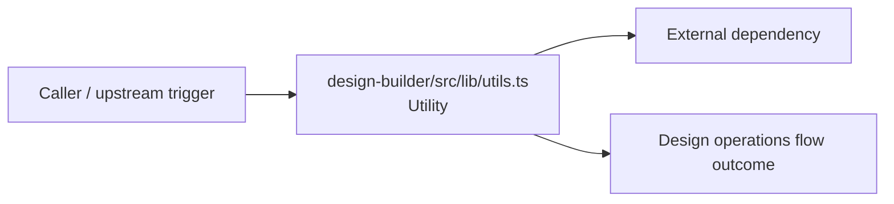
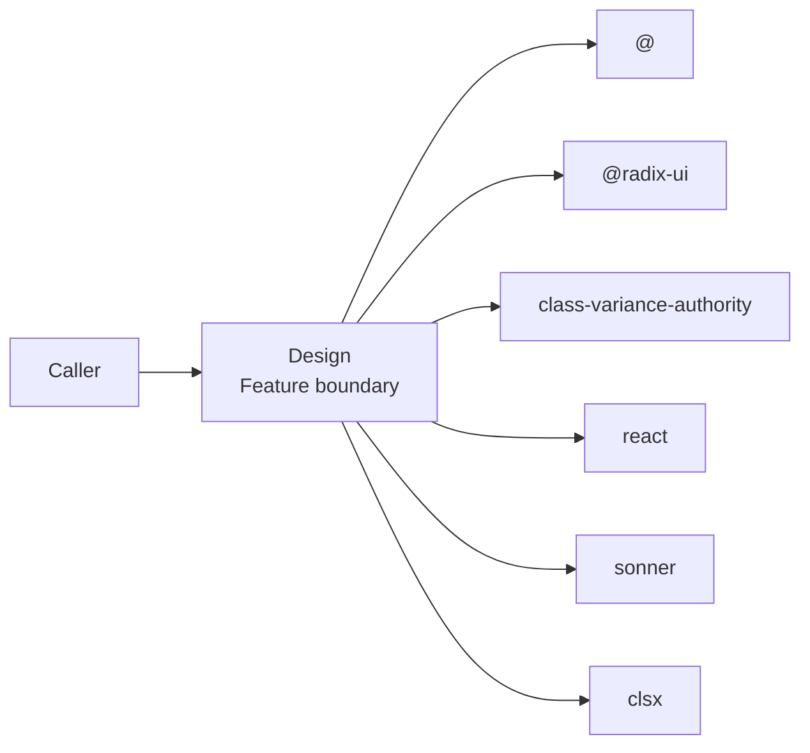
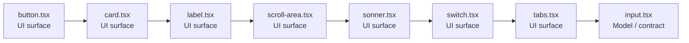

```mermaid
flowchart LR
  caller["Caller / upstream trigger"]
  n1_button_tsx["design-builder/src/components/ui/button.tsx\nUI surface"]
  n2_card_tsx["design-builder/src/components/ui/card.tsx\nUI surface"]
  n3_label_tsx["design-builder/src/components/ui/label.tsx\nUI surface"]
  n4_scroll_area_tsx["design-builder/src/components/ui/scroll-area.tsx\nUI surface"]
  n5_sonner_tsx["design-builder/src/components/ui/sonner.tsx\nUI surface"]
  n6_switch_tsx["design-builder/src/components/ui/switch.tsx\nUI surface"]
  caller --> n1_button_tsx
  n1_button_tsx --> n2_card_tsx
  n2_card_tsx --> n3_label_tsx
  n3_label_tsx --> n4_scroll_area_tsx
  n4_scroll_area_tsx --> n5_sonner_tsx
  n5_sonner_tsx --> n6_switch_tsx
  ext["External dependency"]
  n6_switch_tsx --> ext
  outcome["Design operations flow outcome"]
  n6_switch_tsx --> outcome
```

# Design

- Overview: [emplus Docs Wiki](../index.md)
- Feature catalog: [All features](index.md)
- Reference: [Reference Index](../reference/index.md)

## Overview

Button component props. Builds a design-builder by merging input models using twMerge. Design captures the main design behavior discovered in the codebase. Key flows include Design operations flow, Design operations flow.

## Actors & User Stories

### As user

- Goal: Design operations flow
- Benefit: Handle the main design operations use case exposed by this module.

#### Acceptance Criteria

- The user or operator enters the flow through design-builder/src/components/ui/button.tsx, which surfaces the request handling interaction.
- The user or operator enters the flow through design-builder/src/components/ui/card.tsx, which surfaces the request handling interaction.
- The user or operator enters the flow through design-builder/src/components/ui/label.tsx, which surfaces the request handling interaction.

## Business Flows

### Design operations flow

Handle the main design operations use case exposed by this module.

#### Steps

- The user or operator enters the flow through design-builder/src/components/ui/button.tsx, which surfaces the request handling interaction.
- The user or operator enters the flow through design-builder/src/components/ui/card.tsx, which surfaces the request handling interaction.
- The user or operator enters the flow through design-builder/src/components/ui/label.tsx, which surfaces the request handling interaction.
- The user or operator enters the flow through design-builder/src/components/ui/scroll-area.tsx, which surfaces the request handling interaction.
- The user or operator enters the flow through design-builder/src/components/ui/sonner.tsx, which surfaces the request handling interaction.
- The user or operator enters the flow through design-builder/src/components/ui/switch.tsx, which surfaces the request handling interaction.

#### Flow Diagram

### Design operations flow

Handle the main design operations use case exposed by this module.

#### Steps

- design-builder/src/lib/utils.ts provides helper logic used during the flow.

#### Flow Diagram

## Basic Design

Design captures the main design behavior discovered in the codebase. Key flows include Design operations flow, Design operations flow.

### Boundaries

- Workspaces: @emplus/design-builder
- Entry points (FE): design-builder/src/components/ui/button.tsx, design-builder/src/components/ui/card.tsx, design-builder/src/components/ui/label.tsx, design-builder/src/components/ui/scroll-area.tsx, design-builder/src/components/ui/sonner.tsx, design-builder/src/components/ui/switch.tsx, design-builder/src/components/ui/tabs.tsx
- Entry points (BE): n/a

### Context Diagram

## Detail Design

- Data stores: n/a
- Integrations: @, @radix-ui, class-variance-authority, react, sonner, clsx, tailwind-merge

### Component Diagram

## API Contracts

No API contracts were linked to this feature.

## Edge Cases & Error Handling

No edge cases were inferred from the clustered code.

## Related Files

| File | Workspace | Role | Why It Belongs |
| --- | --- | --- | --- |
| [design-builder/src/components/ui/button.tsx](../reference/files/design-builder/src/components/ui/button.tsx.md) | @emplus/design-builder | UI surface | Grouped with the feature through shared domain signals. |
| [design-builder/src/components/ui/card.tsx](../reference/files/design-builder/src/components/ui/card.tsx.md) | @emplus/design-builder | UI surface | Grouped with the feature through shared domain signals. |
| [design-builder/src/components/ui/label.tsx](../reference/files/design-builder/src/components/ui/label.tsx.md) | @emplus/design-builder | UI surface | Grouped with the feature through shared domain signals. |
| [design-builder/src/components/ui/scroll-area.tsx](../reference/files/design-builder/src/components/ui/scroll-area.tsx.md) | @emplus/design-builder | UI surface | Grouped with the feature through shared domain signals. |
| [design-builder/src/components/ui/sonner.tsx](../reference/files/design-builder/src/components/ui/sonner.tsx.md) | @emplus/design-builder | UI surface | Grouped with the feature through shared domain signals. |
| [design-builder/src/components/ui/switch.tsx](../reference/files/design-builder/src/components/ui/switch.tsx.md) | @emplus/design-builder | UI surface | Grouped with the feature through shared domain signals. |
| [design-builder/src/components/ui/tabs.tsx](../reference/files/design-builder/src/components/ui/tabs.tsx.md) | @emplus/design-builder | UI surface | Grouped with the feature through shared domain signals. |
| [design-builder/src/components/ui/input.tsx](../reference/files/design-builder/src/components/ui/input.tsx.md) | @emplus/design-builder | Model / contract | Supports the feature as model / contract. |
| [design-builder/src/lib/utils.ts](../reference/files/design-builder/src/lib/utils.ts.md) | @emplus/design-builder | Utility | Grouped with the feature through shared domain signals. |