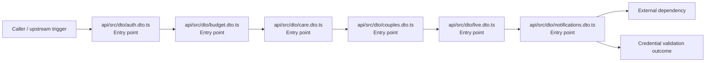
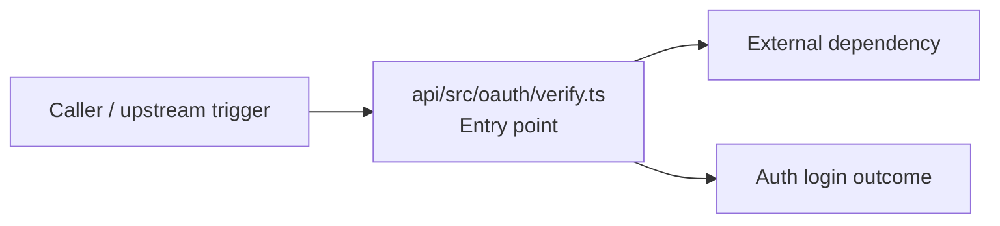
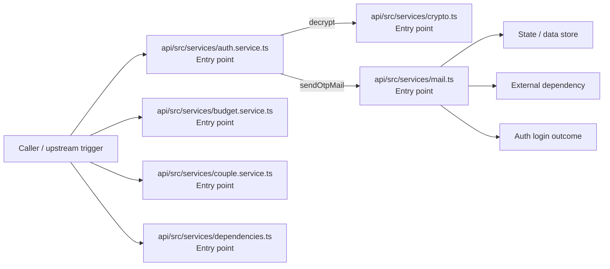
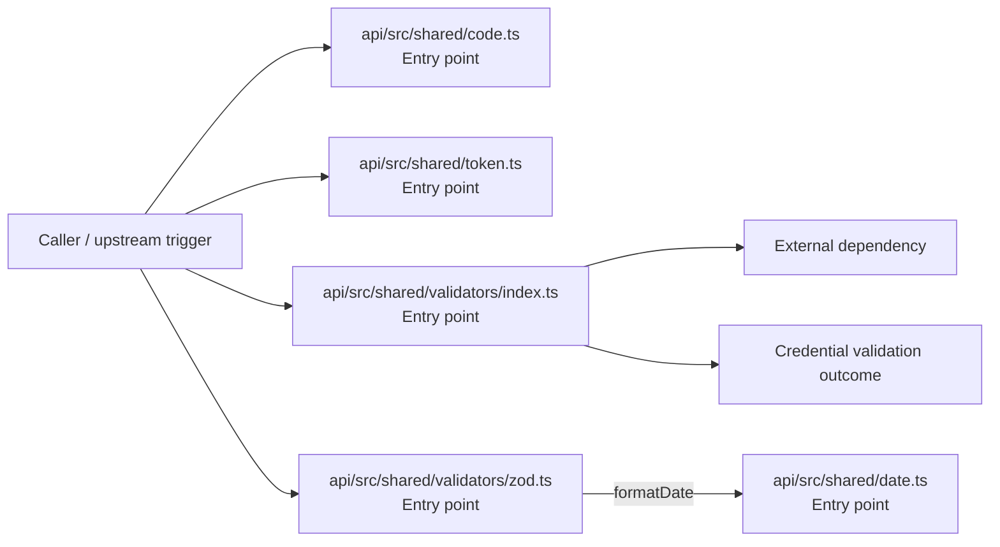
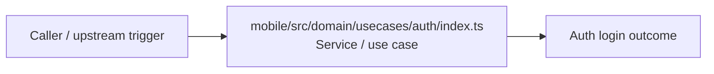
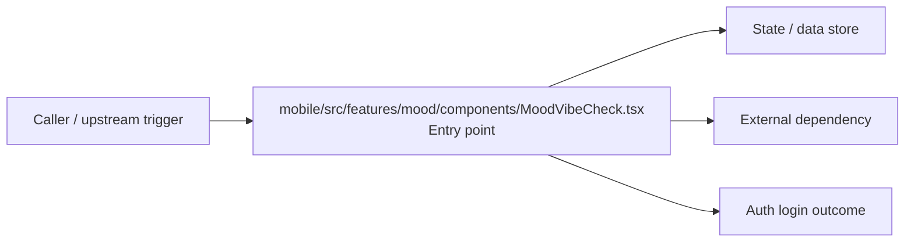
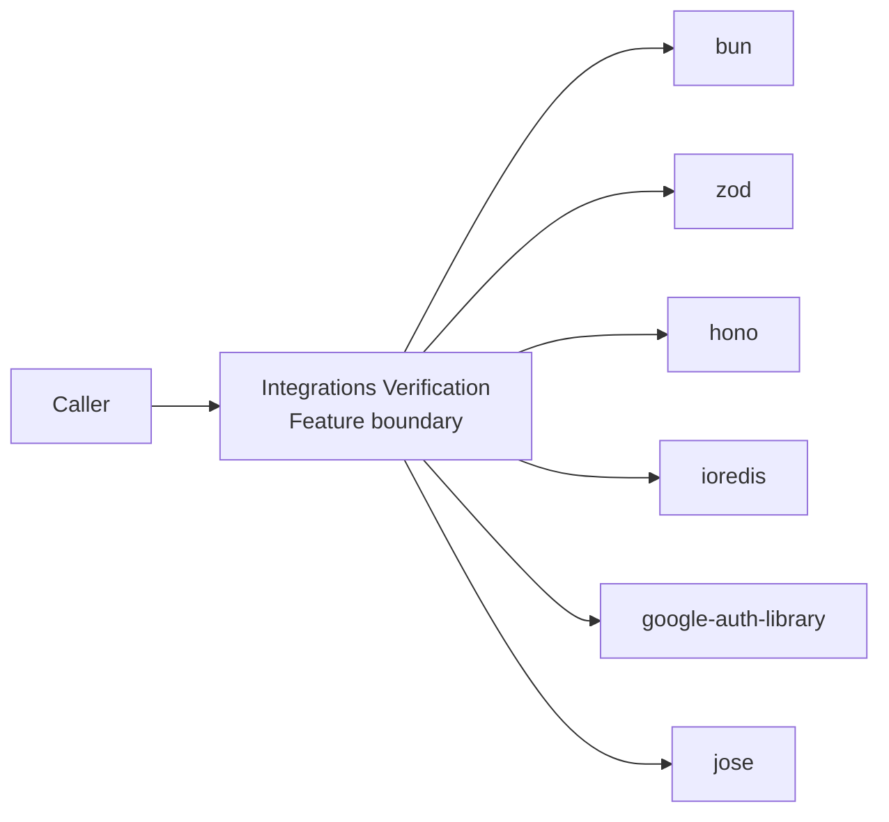
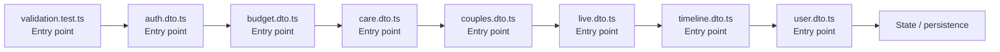

```mermaid
flowchart LR
  caller["Caller / upstream trigger"]
  n1_auth_repository_impl_ts["mobile/src/data/repositories/auth.repository.impl.ts\nEntry point"]
  n2_modules_repository_impl_ts["mobile/src/data/repositories/modules.repository.impl.ts\nEntry point"]
  n3_notifications_repository_impl_ts["mobile/src/data/repositories/notifications.repository.impl.ts\nEntry point"]
  caller --> n1_auth_repository_impl_ts
  n1_auth_repository_impl_ts --> n2_modules_repository_impl_ts
  n2_modules_repository_impl_ts --> n3_notifications_repository_impl_ts
  outcome["Auth login outcome"]
  n3_notifications_repository_impl_ts --> outcome
```

# Integrations Verification

- Overview: [emplus Docs Wiki](../index.md)
- Feature catalog: [All features](index.md)
- Reference: [Reference Index](../reference/index.md)

## Overview

Unit tests for anniversary functionality. Functionality to validate and format user input for various types of authentication and login processes. /api/auth.middleware.requireAuth Identifies an identity from an OAuth token and provides fallbacks in case of is…

## Actors & User Stories

### As user

- Goal: Credential validation
- Benefit: Execute the module's verification use case inside authentication and access control.

#### Acceptance Criteria

- api/src/dto/auth.dto.ts receives the request and turns it into an application-level verification command. It then hands off to parseWithSchema, index.ts, zod.ts.
- api/src/dto/budget.dto.ts receives the request and turns it into an application-level verification command. It then hands off to index.ts, parseWithSchema, zod.ts.
- api/src/dto/care.dto.ts receives the request and turns it into an application-level verification command. It then hands off to parseWithSchema, zod.ts.

## Business Flows

### Credential validation

Execute the module's verification use case inside authentication and access control.

#### Steps

- api/src/dto/auth.dto.ts receives the request and turns it into an application-level verification command. It then hands off to parseWithSchema, index.ts, zod.ts.
- api/src/dto/budget.dto.ts receives the request and turns it into an application-level verification command. It then hands off to index.ts, parseWithSchema, zod.ts.
- api/src/dto/care.dto.ts receives the request and turns it into an application-level verification command. It then hands off to parseWithSchema, zod.ts.
- api/src/dto/couples.dto.ts receives the request and turns it into an application-level verification command. It then hands off to parseWithSchema, zod.ts.
- api/src/dto/live.dto.ts receives the request and turns it into an application-level verification command. It then hands off to parseWithSchema, zod.ts.
- api/src/dto/notifications.dto.ts receives the request and turns it into an application-level verification command.

#### Flow Diagram

### Auth login

Authenticate the caller, validate credentials, and establish a usable session or token.

#### Steps

- api/src/oauth/verify.ts receives the request and turns it into an application-level login command. It then hands off to StoreMode, AuthProvider, AppError.

#### Flow Diagram

### Auth login

Authenticate the caller, validate credentials, and establish a usable session or token.

#### Steps

- api/src/services/auth.service.ts receives the request and turns it into an application-level login command. It then hands off to index.ts, generateNumericCode, generateTokens.
- api/src/services/budget.service.ts receives the request and turns it into an application-level login command. It then hands off to StoreMode, mapDisplayStatusToInternal, store.ts.
- api/src/services/couple.service.ts receives the request and turns it into an application-level login command. It then hands off to index.ts, formatDate, store.ts.
- api/src/services/crypto.ts receives the request and turns it into an application-level login command.
- api/src/services/dependencies.ts receives the request and turns it into an application-level login command. It then hands off to StoreMode, env.ts.
- api/src/services/mail.ts receives the request and turns it into an application-level login command. It then hands off to StoreMode, env.ts.

#### Flow Diagram

### Credential validation

Execute the module's verification use case inside authentication and access control.

#### Steps

- api/src/shared/code.ts receives the request and turns it into an application-level verification command.
- api/src/shared/date.ts receives the request and turns it into an application-level verification command.
- api/src/shared/token.ts receives the request and turns it into an application-level verification command. It then hands off to index.ts.
- api/src/shared/validators/index.ts receives the request and turns it into an application-level verification command.
- api/src/shared/validators/zod.ts receives the request and turns it into an application-level verification command. It then hands off to formatDate, AppError, date.ts.

#### Flow Diagram

### Auth login

Authenticate the caller, validate credentials, and establish a usable session or token.

#### Steps

- mobile/src/data/repositories/auth.repository.impl.ts receives the request and turns it into an application-level login command. It then hands off to ApiResponse, index.ts.
- mobile/src/data/repositories/modules.repository.impl.ts receives the request and turns it into an application-level login command. It then hands off to ApiResponse, index.ts.
- mobile/src/data/repositories/notifications.repository.impl.ts receives the request and turns it into an application-level login command. It then hands off to ApiResponse, index.ts.

#### Flow Diagram

### Auth login

Authenticate the caller, validate credentials, and establish a usable session or token.

#### Steps

- mobile/src/domain/usecases/auth/index.ts coordinates the core business rules and state changes for the flow.

#### Flow Diagram

### Auth login

Authenticate the caller, validate credentials, and establish a usable session or token.

#### Steps

- mobile/src/features/mood/components/MoodVibeCheck.tsx receives the request and turns it into an application-level login command. It then hands off to MoodBand, mood-band.ts.

#### Flow Diagram

## Basic Design

Integrations Verification captures the verification workflow inside integrations. It spans 2 workspaces. Key flows include Credential validation, Auth login, Auth login.

### Boundaries

- Workspaces: @emplus/api, @emplus/mobile
- Entry points (FE): api/src/__tests__/validation.test.ts, api/src/dto/auth.dto.ts, api/src/dto/budget.dto.ts, api/src/dto/care.dto.ts, api/src/dto/couples.dto.ts, api/src/dto/live.dto.ts, api/src/dto/timeline.dto.ts, api/src/dto/user.dto.ts
- Entry points (BE): api/src/__tests__/validation.test.ts, api/src/dto/auth.dto.ts, api/src/dto/budget.dto.ts, api/src/dto/care.dto.ts, api/src/dto/couples.dto.ts, api/src/dto/live.dto.ts, api/src/dto/timeline.dto.ts, api/src/dto/user.dto.ts

### Context Diagram

## Detail Design

- Data stores: Session / token state, Primary database
- Integrations: bun, zod, hono, ioredis, google-auth-library, jose, node, postgres, nodemailer, minio, @, react, react-native, react-native-safe-area-context, react-native-reanimated, expo-linear-gradient, @expo, @tanstack

### Component Diagram

## API Contracts

No API contracts were linked to this feature.

## Edge Cases & Error Handling

No edge cases were inferred from the clustered code.

## Related Files

| File | Workspace | Role | Why It Belongs |
| --- | --- | --- | --- |
| [api/src/__tests__/validation.test.ts](../reference/files/api/src/__tests__/validation.test.ts.md) | @emplus/api | Entry point | Matches the verification action heuristics for this feature. |
| [api/src/dto/auth.dto.ts](../reference/files/api/src/dto/auth.dto.ts.md) | @emplus/api | Entry point | Matches the verification action heuristics for this feature. |
| [api/src/dto/budget.dto.ts](../reference/files/api/src/dto/budget.dto.ts.md) | @emplus/api | Entry point | Matches the verification action heuristics for this feature. |
| [api/src/dto/care.dto.ts](../reference/files/api/src/dto/care.dto.ts.md) | @emplus/api | Entry point | Matches the verification action heuristics for this feature. |
| [api/src/dto/couples.dto.ts](../reference/files/api/src/dto/couples.dto.ts.md) | @emplus/api | Entry point | Matches the verification action heuristics for this feature. |
| [api/src/dto/live.dto.ts](../reference/files/api/src/dto/live.dto.ts.md) | @emplus/api | Entry point | Matches the verification action heuristics for this feature. |
| [api/src/dto/timeline.dto.ts](../reference/files/api/src/dto/timeline.dto.ts.md) | @emplus/api | Entry point | Matches the verification action heuristics for this feature. |
| [api/src/dto/user.dto.ts](../reference/files/api/src/dto/user.dto.ts.md) | @emplus/api | Entry point | Matches the verification action heuristics for this feature. |
| [api/src/middleware/cors.ts](../reference/files/api/src/middleware/cors.ts.md) | @emplus/api | Entry point | Matches the verification action heuristics for this feature. |
| [api/src/oauth/verify.ts](../reference/files/api/src/oauth/verify.ts.md) | @emplus/api | Entry point | Matches the verification action heuristics for this feature. |
| [api/src/services/auth.service.ts](../reference/files/api/src/services/auth.service.ts.md) | @emplus/api | Entry point | Matches the verification action heuristics for this feature. |
| [api/src/services/dependencies.ts](../reference/files/api/src/services/dependencies.ts.md) | @emplus/api | Entry point | Matches the verification action heuristics for this feature. |
| [api/src/shared/token.ts](../reference/files/api/src/shared/token.ts.md) | @emplus/api | Entry point | Matches the verification action heuristics for this feature. |
| [api/src/shared/validators/zod.ts](../reference/files/api/src/shared/validators/zod.ts.md) | @emplus/api | Entry point | Matches the verification action heuristics for this feature. |
| [api/src/utils/password.ts](../reference/files/api/src/utils/password.ts.md) | @emplus/api | Entry point | Matches the verification action heuristics for this feature. |
| [mobile/src/api.ts](../reference/files/mobile/src/api.ts.md) | @emplus/mobile | Entry point | Matches the verification action heuristics for this feature. |
| [mobile/src/data/repositories/auth.repository.impl.ts](../reference/files/mobile/src/data/repositories/auth.repository.impl.ts.md) | @emplus/mobile | Entry point | Matches the verification action heuristics for this feature. |
| [mobile/src/data/repositories/modules.repository.impl.ts](../reference/files/mobile/src/data/repositories/modules.repository.impl.ts.md) | @emplus/mobile | Entry point | Matches the verification action heuristics for this feature. |
| [mobile/src/domain/usecases/modules/index.ts](../reference/files/mobile/src/domain/usecases/modules/index.ts.md) | @emplus/mobile | Entry point | Matches the verification action heuristics for this feature. |
| [mobile/src/features/mood/components/MoodVibeCheck.tsx](../reference/files/mobile/src/features/mood/components/MoodVibeCheck.tsx.md) | @emplus/mobile | Entry point | Matches the verification action heuristics for this feature. |
| [mobile/src/domain/usecases/auth/index.ts](../reference/files/mobile/src/domain/usecases/auth/index.ts.md) | @emplus/mobile | Service / use case | Matches the verification action heuristics for this feature. |
| [mobile/src/framework/di/dependencies.ts](../reference/files/mobile/src/framework/di/dependencies.ts.md) | @emplus/mobile | Repository / persistence | Supports the feature as repository / persistence. |