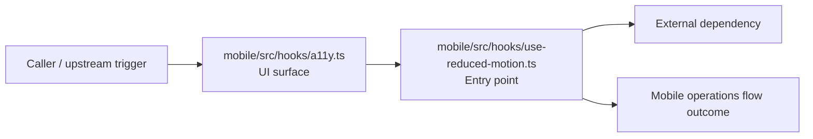
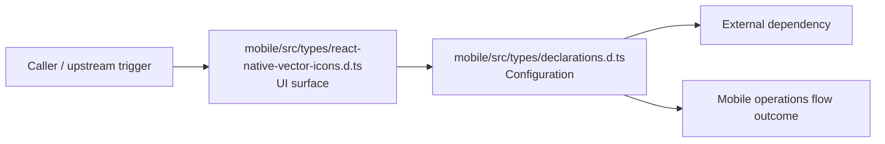
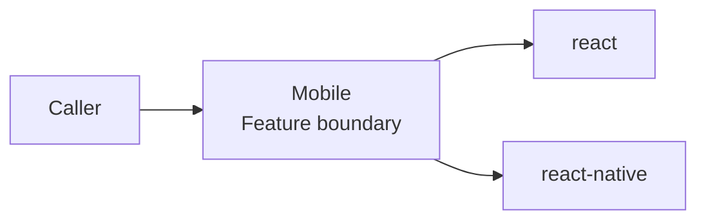
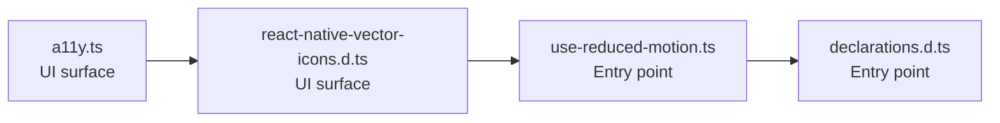

# Mobile

- Overview: [emplus Docs Wiki](../index.md)
- Feature catalog: [All features](index.md)
- Reference: [Reference Index](../reference/index.md)

## Overview

Provides 9 documented symbols in mobile/src/hooks/a11y.ts. A namespace with a single interface to manage environment variables for Expo. Mobile captures the main mobile behavior discovered in the codebase. Key flows include Mobile operations flow, Mobile oper…

## Actors & User Stories

### As user

- Goal: Mobile operations flow
- Benefit: Handle the main mobile operations use case exposed by this module.

#### Acceptance Criteria

- The user or operator enters the flow through mobile/src/hooks/a11y.ts, which surfaces the request handling interaction.
- mobile/src/hooks/use-reduced-motion.ts receives the request and turns it into an application-level request handling command.

## Business Flows

### Mobile operations flow

Handle the main mobile operations use case exposed by this module.

#### Steps

- The user or operator enters the flow through mobile/src/hooks/a11y.ts, which surfaces the request handling interaction.
- mobile/src/hooks/use-reduced-motion.ts receives the request and turns it into an application-level request handling command.

#### Flow Diagram

### Mobile operations flow

Handle the main mobile operations use case exposed by this module.

#### Steps

- The user or operator enters the flow through mobile/src/types/react-native-vector-icons.d.ts, which surfaces the request handling interaction.
- mobile/src/types/declarations.d.ts supplies runtime configuration that shapes how the flow behaves.

#### Flow Diagram

## Basic Design

Mobile captures the main mobile behavior discovered in the codebase. Key flows include Mobile operations flow, Mobile operations flow.

### Boundaries

- Workspaces: @emplus/mobile
- Entry points (FE): mobile/src/hooks/a11y.ts, mobile/src/types/react-native-vector-icons.d.ts, mobile/src/hooks/use-reduced-motion.ts, mobile/src/types/declarations.d.ts
- Entry points (BE): mobile/src/hooks/use-reduced-motion.ts, mobile/src/types/declarations.d.ts

### Context Diagram

## Detail Design

- Data stores: n/a
- Integrations: react, react-native

### Component Diagram

## API Contracts

No API contracts were linked to this feature.

## Edge Cases & Error Handling

No edge cases were inferred from the clustered code.

## Related Files

| File | Workspace | Role | Why It Belongs |
| --- | --- | --- | --- |
| [mobile/src/hooks/a11y.ts](../reference/files/mobile/src/hooks/a11y.ts.md) | @emplus/mobile | UI surface | Grouped with the feature through shared domain signals. |
| [mobile/src/types/react-native-vector-icons.d.ts](../reference/files/mobile/src/types/react-native-vector-icons.d.ts.md) | @emplus/mobile | UI surface | Grouped with the feature through shared domain signals. |
| [mobile/src/hooks/use-reduced-motion.ts](../reference/files/mobile/src/hooks/use-reduced-motion.ts.md) | @emplus/mobile | Entry point | Grouped with the feature through shared domain signals. |
| [mobile/src/types/declarations.d.ts](../reference/files/mobile/src/types/declarations.d.ts.md) | @emplus/mobile | Entry point | Grouped with the feature through shared domain signals. |