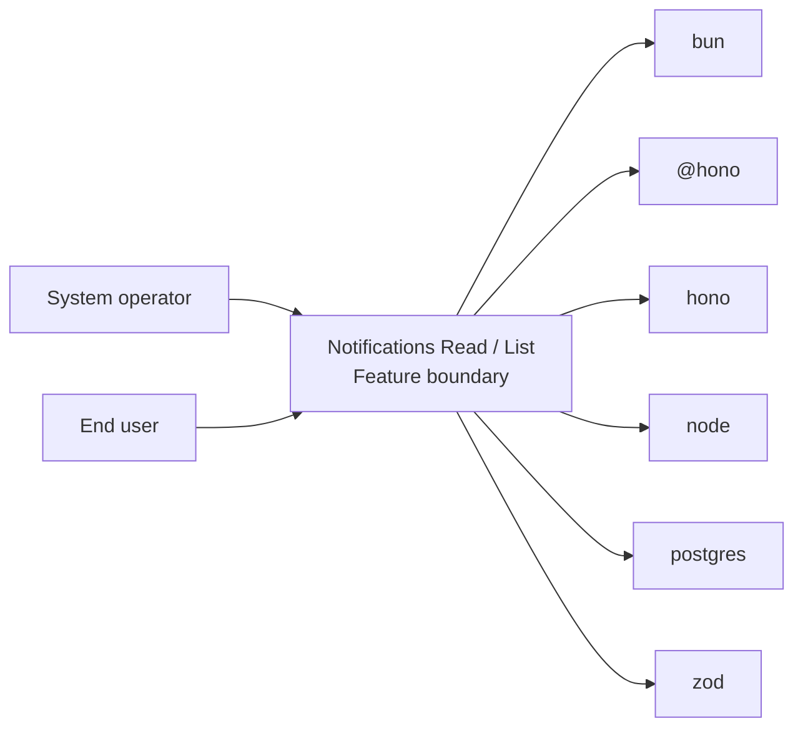

# Notifications Read / List

- Overview: [emplus Docs Wiki](../index.md)
- Feature catalog: [All features](index.md)
- Reference: [Reference Index](../reference/index.md)

## Overview

Unit tests for anniversary functionality. Environment configuration variables and functions for various StoreModes. Initialize the database connection and schema. Functionality to validate and format user input for various types of authentication and login pr…

## Actors & User Stories

- System operator
- End user
## Business Flows

No feature flows were inferred.

## Basic Design

Notifications Read / List captures the read / list workflow inside notifications. It spans 2 workspaces.

### Boundaries

- Workspaces: @emplus/api, @emplus/mobile
- Entry points (FE): mobile/src/features/timeline/components/TimelineImageViewer.tsx, mobile/src/theme/engine.tsx, mobile/src/utils/home-helpers.ts, api/src/__tests__/validation.test.ts, api/src/config/env.ts, api/src/db/migrate.ts, api/src/dto/notifications.dto.ts, api/src/engines/anniversary.ts
- Entry points (BE): api/src/__tests__/validation.test.ts, api/src/config/env.ts, api/src/db/migrate.ts, api/src/dto/notifications.dto.ts, api/src/engines/anniversary.ts, api/src/engines/emotional.ts, api/src/middleware/auth.ts, api/src/middleware/rate-limit.ts

### Context Diagram

## Detail Design

- Data stores: Primary database, Session / token state
- Integrations: bun, @hono, hono, node, postgres, zod, ioredis, @faker-js, nodemailer, minio, @, @expo-google-fonts, expo-font, expo-router, expo-splash-screen, expo-status-bar, react, react-native, react-native-safe-area-context, react-native-reanimated, expo-linear-gradient, react-native-gesture-handler, @react-native-async-storage, expo-image, @expo, @tanstack, clsx, tailwind-merge, expo-clipboard, expo-document-picker, expo-image-picker, expo-notifications

### Component Diagram

```mermaid
flowchart LR
  cmp_1["TimelineImageViewer.tsx\nUI surface"]
  cmp_2["engine.tsx\nUI surface"]
  cmp_3["home-helpers.ts\nUI surface"]
  cmp_4["validation.test.ts\nEntry point"]
  cmp_5["env.ts\nEntry point"]
  cmp_6["migrate.ts\nEntry point"]
  cmp_7["notifications.dto.ts\nEntry point"]
  cmp_8["anniversary.ts\nEntry point"]
  cmp_1 --> cmp_2
  cmp_2 --> cmp_3
  cmp_3 --> cmp_4
  cmp_4 --> cmp_5
  cmp_5 --> cmp_6
  cmp_6 --> cmp_7
  cmp_7 --> cmp_8
  data_store["State / persistence"]
  cmp_8 --> data_store
```

## API Contracts

No API contracts were linked to this feature.

## Edge Cases & Error Handling

No edge cases were inferred from the clustered code.

## Related Files

| File | Workspace | Role | Why It Belongs |
| --- | --- | --- | --- |
| [mobile/src/features/timeline/components/TimelineImageViewer.tsx](../reference/files/mobile/src/features/timeline/components/TimelineImageViewer.tsx.md) | @emplus/mobile | UI surface | Matches the read / list action heuristics for this feature. |
| [mobile/src/theme/engine.tsx](../reference/files/mobile/src/theme/engine.tsx.md) | @emplus/mobile | UI surface | Matches the read / list action heuristics for this feature. |
| [mobile/src/utils/home-helpers.ts](../reference/files/mobile/src/utils/home-helpers.ts.md) | @emplus/mobile | UI surface | Matches the read / list action heuristics for this feature. |
| [api/src/__tests__/validation.test.ts](../reference/files/api/src/__tests__/validation.test.ts.md) | @emplus/api | Entry point | Matches the read / list action heuristics for this feature. |
| [api/src/config/env.ts](../reference/files/api/src/config/env.ts.md) | @emplus/api | Entry point | Matches the read / list action heuristics for this feature. |
| [api/src/db/migrate.ts](../reference/files/api/src/db/migrate.ts.md) | @emplus/api | Entry point | Matches the read / list action heuristics for this feature. |
| [api/src/dto/notifications.dto.ts](../reference/files/api/src/dto/notifications.dto.ts.md) | @emplus/api | Entry point | Matches the read / list action heuristics for this feature. |
| [api/src/engines/anniversary.ts](../reference/files/api/src/engines/anniversary.ts.md) | @emplus/api | Entry point | Matches the read / list action heuristics for this feature. |
| [api/src/engines/emotional.ts](../reference/files/api/src/engines/emotional.ts.md) | @emplus/api | Entry point | Matches the read / list action heuristics for this feature. |
| [api/src/middleware/auth.ts](../reference/files/api/src/middleware/auth.ts.md) | @emplus/api | Entry point | Matches the read / list action heuristics for this feature. |
| [api/src/middleware/rate-limit.ts](../reference/files/api/src/middleware/rate-limit.ts.md) | @emplus/api | Entry point | Matches the read / list action heuristics for this feature. |
| [api/src/middleware/sanitize.ts](../reference/files/api/src/middleware/sanitize.ts.md) | @emplus/api | Entry point | Matches the read / list action heuristics for this feature. |
| [api/src/modules/care.ts](../reference/files/api/src/modules/care.ts.md) | @emplus/api | Entry point | Matches the read / list action heuristics for this feature. |
| [api/src/modules/demo-in-app-notifications.ts](../reference/files/api/src/modules/demo-in-app-notifications.ts.md) | @emplus/api | Entry point | Matches the read / list action heuristics for this feature. |
| [api/src/modules/index.ts](../reference/files/api/src/modules/index.ts.md) | @emplus/api | Entry point | Matches the read / list action heuristics for this feature. |
| [api/src/modules/live.ts](../reference/files/api/src/modules/live.ts.md) | @emplus/api | Entry point | Matches the read / list action heuristics for this feature. |
| [api/src/services/budget.service.ts](../reference/files/api/src/services/budget.service.ts.md) | @emplus/api | Entry point | Matches the read / list action heuristics for this feature. |
| [api/src/services/dependencies.ts](../reference/files/api/src/services/dependencies.ts.md) | @emplus/api | Entry point | Matches the read / list action heuristics for this feature. |
| [api/src/services/media-storage.ts](../reference/files/api/src/services/media-storage.ts.md) | @emplus/api | Entry point | Matches the read / list action heuristics for this feature. |
| [api/src/services/user.service.ts](../reference/files/api/src/services/user.service.ts.md) | @emplus/api | Entry point | Matches the read / list action heuristics for this feature. |
| [api/src/shared/token.ts](../reference/files/api/src/shared/token.ts.md) | @emplus/api | Entry point | Matches the read / list action heuristics for this feature. |
| [api/src/store/in-memory-store.ts](../reference/files/api/src/store/in-memory-store.ts.md) | @emplus/api | Entry point | Matches the read / list action heuristics for this feature. |
| [api/src/types.ts](../reference/files/api/src/types.ts.md) | @emplus/api | Entry point | Matches the read / list action heuristics for this feature. |
| [api/src/utils/http.ts](../reference/files/api/src/utils/http.ts.md) | @emplus/api | Entry point | Matches the read / list action heuristics for this feature. |
| [mobile/app/_layout.tsx](../reference/files/mobile/app/_layout.tsx.md) | @emplus/mobile | Entry point | Matches the read / list action heuristics for this feature. |
| [mobile/src/api.ts](../reference/files/mobile/src/api.ts.md) | @emplus/mobile | Entry point | Matches the read / list action heuristics for this feature. |
| [mobile/src/components/atoms/Toast.tsx](../reference/files/mobile/src/components/atoms/Toast.tsx.md) | @emplus/mobile | Entry point | Matches the read / list action heuristics for this feature. |
| [mobile/src/core/api/index.ts](../reference/files/mobile/src/core/api/index.ts.md) | @emplus/mobile | Entry point | Matches the read / list action heuristics for this feature. |
| [mobile/src/core/api/token-manager.ts](../reference/files/mobile/src/core/api/token-manager.ts.md) | @emplus/mobile | Entry point | Matches the read / list action heuristics for this feature. |
| [mobile/src/data/repositories/auth.repository.impl.ts](../reference/files/mobile/src/data/repositories/auth.repository.impl.ts.md) | @emplus/mobile | Entry point | Matches the read / list action heuristics for this feature. |
| [mobile/src/data/repositories/modules.repository.impl.ts](../reference/files/mobile/src/data/repositories/modules.repository.impl.ts.md) | @emplus/mobile | Entry point | Matches the read / list action heuristics for this feature. |
| [mobile/src/data/repositories/notifications.repository.impl.ts](../reference/files/mobile/src/data/repositories/notifications.repository.impl.ts.md) | @emplus/mobile | Entry point | Matches the read / list action heuristics for this feature. |
| [mobile/src/domain/usecases/modules/index.ts](../reference/files/mobile/src/domain/usecases/modules/index.ts.md) | @emplus/mobile | Entry point | Matches the read / list action heuristics for this feature. |
| [mobile/src/features/timeline/components/TimelineMemorySectionList.tsx](../reference/files/mobile/src/features/timeline/components/TimelineMemorySectionList.tsx.md) | @emplus/mobile | Entry point | Matches the read / list action heuristics for this feature. |
| [mobile/src/features/timeline/components/timelineQueries.ts](../reference/files/mobile/src/features/timeline/components/timelineQueries.ts.md) | @emplus/mobile | Entry point | Matches the read / list action heuristics for this feature. |
| [mobile/src/features/timeline/screens/TimelineAuthenticatedBody.tsx](../reference/files/mobile/src/features/timeline/screens/TimelineAuthenticatedBody.tsx.md) | @emplus/mobile | Entry point | Matches the read / list action heuristics for this feature. |
| [mobile/src/presentation/hooks/notifications/useNotifications.ts](../reference/files/mobile/src/presentation/hooks/notifications/useNotifications.ts.md) | @emplus/mobile | Entry point | Matches the read / list action heuristics for this feature. |
| [mobile/src/utils/timeline-helpers.ts](../reference/files/mobile/src/utils/timeline-helpers.ts.md) | @emplus/mobile | Entry point | Matches the read / list action heuristics for this feature. |
| [mobile/src/domain/usecases/auth/index.ts](../reference/files/mobile/src/domain/usecases/auth/index.ts.md) | @emplus/mobile | Service / use case | Matches the read / list action heuristics for this feature. |
| [mobile/src/domain/usecases/base.ts](../reference/files/mobile/src/domain/usecases/base.ts.md) | @emplus/mobile | Service / use case | Supports the feature as service / use case. |
| [mobile/src/features/timeline/hooks/useTimelineData.ts](../reference/files/mobile/src/features/timeline/hooks/useTimelineData.ts.md) | @emplus/mobile | Service / use case | Supports the feature as service / use case. |
| [mobile/src/theme/theme-mode-context.tsx](../reference/files/mobile/src/theme/theme-mode-context.tsx.md) | @emplus/mobile | Service / use case | Supports the feature as service / use case. |
| [mobile/src/framework/di/dependencies.ts](../reference/files/mobile/src/framework/di/dependencies.ts.md) | @emplus/mobile | Repository / persistence | Supports the feature as repository / persistence. |
| [mobile/src/features/timeline/components/TimelineDateGroupHeader.tsx](../reference/files/mobile/src/features/timeline/components/TimelineDateGroupHeader.tsx.md) | @emplus/mobile | Model / contract | Supports the feature as model / contract. |
| [mobile/src/theme/theme-builder.ts](../reference/files/mobile/src/theme/theme-builder.ts.md) | @emplus/mobile | Model / contract | Supports the feature as model / contract. |
| [mobile/src/features/notifications/push-notifications-preference.ts](../reference/files/mobile/src/features/notifications/push-notifications-preference.ts.md) | @emplus/mobile | Configuration | Matches the read / list action heuristics for this feature. |
| [mobile/src/utils/expo-helpers.ts](../reference/files/mobile/src/utils/expo-helpers.ts.md) | @emplus/mobile | Utility | Matches the read / list action heuristics for this feature. |