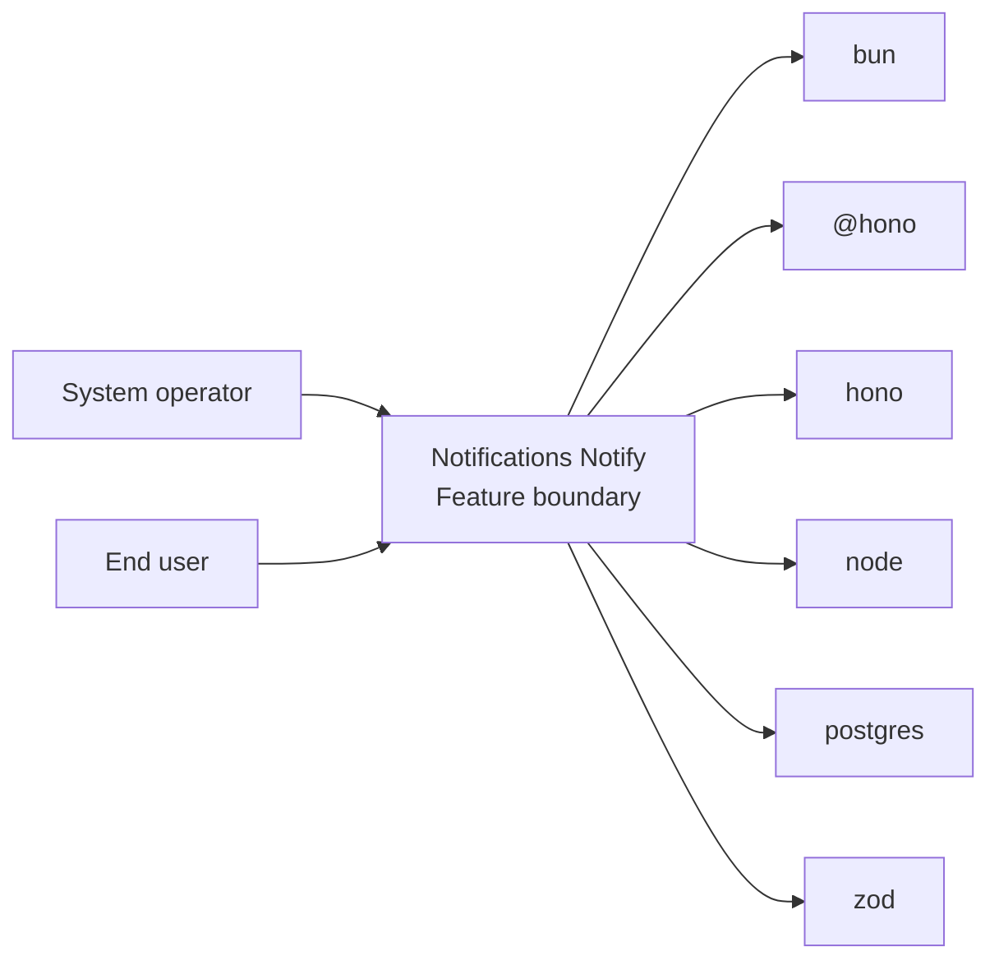

# Notifications Notify

- Overview: [emplus Docs Wiki](../index.md)
- Feature catalog: [All features](index.md)
- Reference: [Reference Index](../reference/index.md)

## Overview

Unit tests for anniversary functionality. Initialize the database connection and schema. Functionality to validate and format user input for various types of authentication and login processes. /api/auth.middleware.requireAuth JS API for the admin module. Ide…

## Actors & User Stories

- System operator
- End user
## Business Flows

No feature flows were inferred.

## Basic Design

Notifications Notify captures the notify workflow inside notifications. It spans 2 workspaces.

### Boundaries

- Workspaces: @emplus/api, @emplus/mobile
- Entry points (FE): mobile/src/alert-dialog-context.tsx, mobile/src/features/auth/components/VerifyOtpHeroSection.tsx, mobile/src/toast-context.tsx, api/src/__tests__/app.test.ts, api/src/__tests__/validation.test.ts, api/src/db/seed.ts, api/src/dto/auth.dto.ts, api/src/dto/user.dto.ts
- Entry points (BE): api/src/__tests__/app.test.ts, api/src/__tests__/validation.test.ts, api/src/db/seed.ts, api/src/dto/auth.dto.ts, api/src/dto/user.dto.ts, api/src/middleware/rate-limit.ts, api/src/modules/live.ts, api/src/oauth/verify.ts

### Context Diagram

## Detail Design

- Data stores: Primary database, Session / token state
- Integrations: bun, @hono, hono, node, postgres, zod, ioredis, @faker-js, google-auth-library, jose, nodemailer, minio, @, @expo-google-fonts, expo-font, expo-router, expo-splash-screen, expo-status-bar, react, react-native, react-native-safe-area-context, react-native-reanimated, expo-linear-gradient, react-native-gesture-handler, @react-native-async-storage, expo-secure-store, react-native-keyboard-aware-scroll-view, clsx, tailwind-merge, expo-clipboard, expo-document-picker, expo-image-picker, expo-notifications

### Component Diagram

```mermaid
flowchart LR
  cmp_1["alert-dialog-context.tsx\nUI surface"]
  cmp_2["VerifyOtpHeroSection.tsx\nUI surface"]
  cmp_3["toast-context.tsx\nUI surface"]
  cmp_4["app.test.ts\nEntry point"]
  cmp_5["validation.test.ts\nEntry point"]
  cmp_6["seed.ts\nEntry point"]
  cmp_7["auth.dto.ts\nEntry point"]
  cmp_8["user.dto.ts\nEntry point"]
  cmp_1 --> cmp_2
  cmp_2 --> cmp_3
  cmp_3 --> cmp_4
  cmp_4 --> cmp_5
  cmp_5 --> cmp_6
  cmp_6 --> cmp_7
  cmp_7 --> cmp_8
  data_store["State / persistence"]
  cmp_8 --> data_store
```

## API Contracts

No API contracts were linked to this feature.

## Edge Cases & Error Handling

No edge cases were inferred from the clustered code.

## Related Files

| File | Workspace | Role | Why It Belongs |
| --- | --- | --- | --- |
| [mobile/src/alert-dialog-context.tsx](../reference/files/mobile/src/alert-dialog-context.tsx.md) | @emplus/mobile | UI surface | Matches the notify action heuristics for this feature. |
| [mobile/src/features/auth/components/VerifyOtpHeroSection.tsx](../reference/files/mobile/src/features/auth/components/VerifyOtpHeroSection.tsx.md) | @emplus/mobile | UI surface | Matches the notify action heuristics for this feature. |
| [mobile/src/toast-context.tsx](../reference/files/mobile/src/toast-context.tsx.md) | @emplus/mobile | UI surface | Matches the notify action heuristics for this feature. |
| [api/src/__tests__/app.test.ts](../reference/files/api/src/__tests__/app.test.ts.md) | @emplus/api | Entry point | Matches the notify action heuristics for this feature. |
| [api/src/__tests__/validation.test.ts](../reference/files/api/src/__tests__/validation.test.ts.md) | @emplus/api | Entry point | Matches the notify action heuristics for this feature. |
| [api/src/db/seed.ts](../reference/files/api/src/db/seed.ts.md) | @emplus/api | Entry point | Matches the notify action heuristics for this feature. |
| [api/src/dto/auth.dto.ts](../reference/files/api/src/dto/auth.dto.ts.md) | @emplus/api | Entry point | Matches the notify action heuristics for this feature. |
| [api/src/dto/user.dto.ts](../reference/files/api/src/dto/user.dto.ts.md) | @emplus/api | Entry point | Matches the notify action heuristics for this feature. |
| [api/src/middleware/rate-limit.ts](../reference/files/api/src/middleware/rate-limit.ts.md) | @emplus/api | Entry point | Matches the notify action heuristics for this feature. |
| [api/src/modules/live.ts](../reference/files/api/src/modules/live.ts.md) | @emplus/api | Entry point | Matches the notify action heuristics for this feature. |
| [api/src/oauth/verify.ts](../reference/files/api/src/oauth/verify.ts.md) | @emplus/api | Entry point | Matches the notify action heuristics for this feature. |
| [api/src/services/auth.service.ts](../reference/files/api/src/services/auth.service.ts.md) | @emplus/api | Entry point | Matches the notify action heuristics for this feature. |
| [api/src/services/mail.ts](../reference/files/api/src/services/mail.ts.md) | @emplus/api | Entry point | Matches the notify action heuristics for this feature. |
| [api/src/services/notification.service.ts](../reference/files/api/src/services/notification.service.ts.md) | @emplus/api | Entry point | Matches the notify action heuristics for this feature. |
| [api/src/services/push.ts](../reference/files/api/src/services/push.ts.md) | @emplus/api | Entry point | Matches the notify action heuristics for this feature. |
| [api/src/services/user.service.ts](../reference/files/api/src/services/user.service.ts.md) | @emplus/api | Entry point | Matches the notify action heuristics for this feature. |
| [api/src/shared/validators/zod.ts](../reference/files/api/src/shared/validators/zod.ts.md) | @emplus/api | Entry point | Matches the notify action heuristics for this feature. |
| [api/src/store/in-memory-store.ts](../reference/files/api/src/store/in-memory-store.ts.md) | @emplus/api | Entry point | Matches the notify action heuristics for this feature. |
| [api/src/types.ts](../reference/files/api/src/types.ts.md) | @emplus/api | Entry point | Matches the notify action heuristics for this feature. |
| [api/src/utils/http.ts](../reference/files/api/src/utils/http.ts.md) | @emplus/api | Entry point | Matches the notify action heuristics for this feature. |
| [api/src/utils/logger.ts](../reference/files/api/src/utils/logger.ts.md) | @emplus/api | Entry point | Matches the notify action heuristics for this feature. |
| [mobile/app/reset-password.tsx](../reference/files/mobile/app/reset-password.tsx.md) | @emplus/mobile | Entry point | Matches the notify action heuristics for this feature. |
| [mobile/src/api.ts](../reference/files/mobile/src/api.ts.md) | @emplus/mobile | Entry point | Matches the notify action heuristics for this feature. |
| [mobile/src/components/atoms/Toast.tsx](../reference/files/mobile/src/components/atoms/Toast.tsx.md) | @emplus/mobile | Entry point | Matches the notify action heuristics for this feature. |
| [mobile/src/core/api/api-error.ts](../reference/files/mobile/src/core/api/api-error.ts.md) | @emplus/mobile | Entry point | Matches the notify action heuristics for this feature. |
| [mobile/src/core/api/api-types.ts](../reference/files/mobile/src/core/api/api-types.ts.md) | @emplus/mobile | Entry point | Matches the notify action heuristics for this feature. |
| [mobile/src/core/api/index.ts](../reference/files/mobile/src/core/api/index.ts.md) | @emplus/mobile | Entry point | Matches the notify action heuristics for this feature. |
| [mobile/src/core/api/to-display-error.ts](../reference/files/mobile/src/core/api/to-display-error.ts.md) | @emplus/mobile | Entry point | Matches the notify action heuristics for this feature. |
| [mobile/src/core/api/to-message-response.ts](../reference/files/mobile/src/core/api/to-message-response.ts.md) | @emplus/mobile | Entry point | Matches the notify action heuristics for this feature. |
| [mobile/src/features/auth/components/VerifyOtpForm.tsx](../reference/files/mobile/src/features/auth/components/VerifyOtpForm.tsx.md) | @emplus/mobile | Entry point | Matches the notify action heuristics for this feature. |
| [mobile/src/utils/session-api-feedback.ts](../reference/files/mobile/src/utils/session-api-feedback.ts.md) | @emplus/mobile | Entry point | Matches the notify action heuristics for this feature. |
| [mobile/src/forms.ts](../reference/files/mobile/src/forms.ts.md) | @emplus/mobile | Guard / middleware | Matches the notify action heuristics for this feature. |
| [mobile/src/animations/hooks.ts](../reference/files/mobile/src/animations/hooks.ts.md) | @emplus/mobile | Service / use case | Matches the notify action heuristics for this feature. |
| [mobile/src/domain/usecases/auth/index.ts](../reference/files/mobile/src/domain/usecases/auth/index.ts.md) | @emplus/mobile | Service / use case | Supports the feature as service / use case. |
| [mobile/src/features/live/live-channel-context.tsx](../reference/files/mobile/src/features/live/live-channel-context.tsx.md) | @emplus/mobile | Service / use case | Matches the notify action heuristics for this feature. |
| [mobile/src/framework/di/dependencies.ts](../reference/files/mobile/src/framework/di/dependencies.ts.md) | @emplus/mobile | Repository / persistence | Supports the feature as repository / persistence. |
| [mobile/src/core/common/is-record.ts](../reference/files/mobile/src/core/common/is-record.ts.md) | @emplus/mobile | Model / contract | Supports the feature as model / contract. |
| [mobile/src/core/common/messages.ts](../reference/files/mobile/src/core/common/messages.ts.md) | @emplus/mobile | Configuration | Matches the notify action heuristics for this feature. |