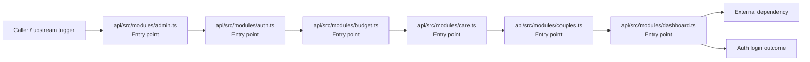
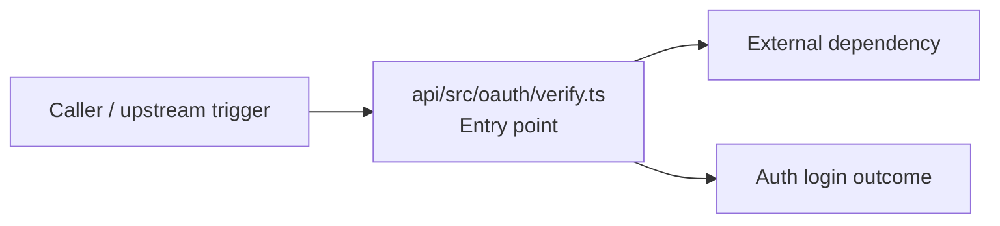
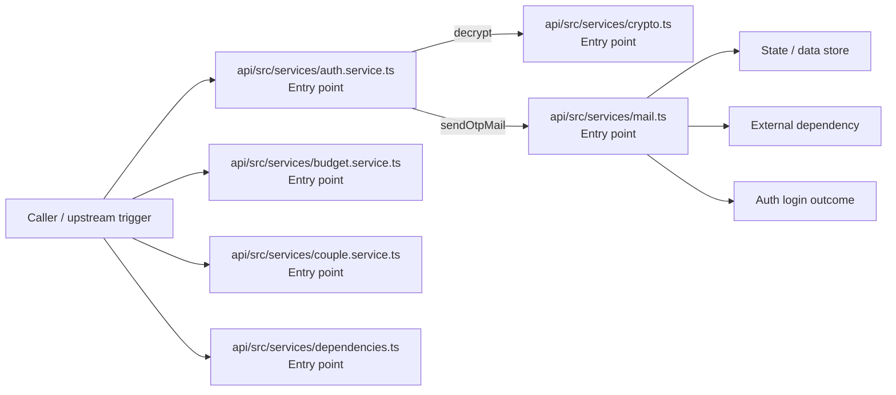
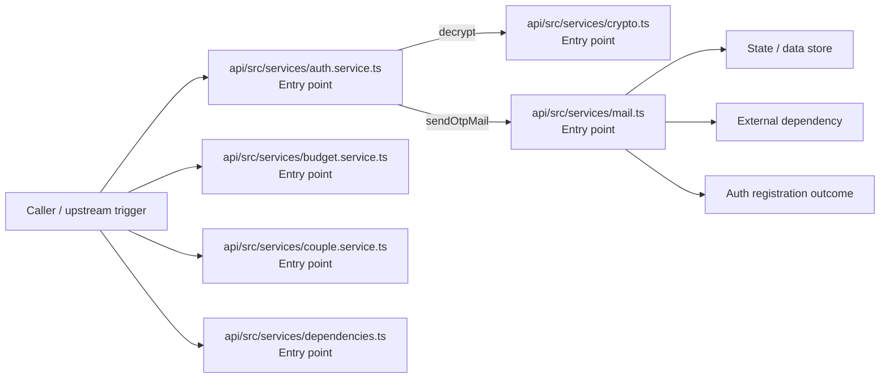
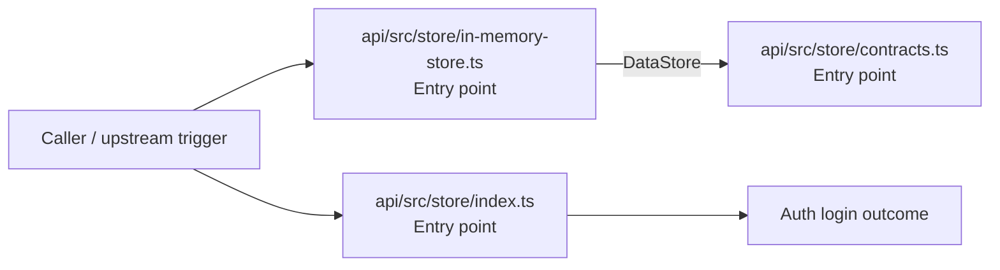
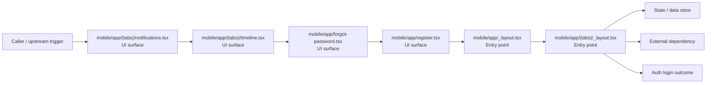
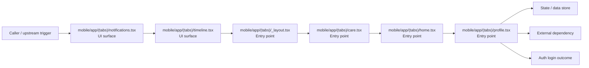
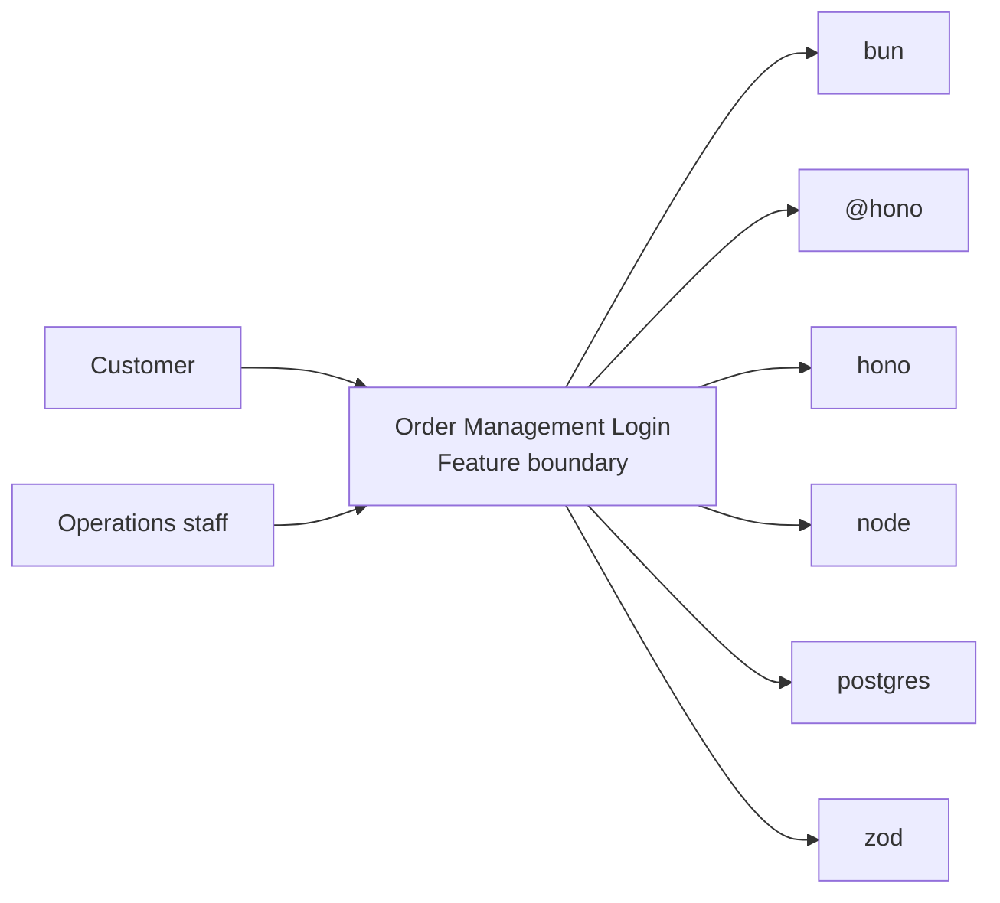

# Order Management Login

- Overview: [emplus Docs Wiki](../index.md)
- Feature catalog: [All features](index.md)
- Reference: [Reference Index](../reference/index.md)

## Overview

Unit tests for anniversary functionality. Functionality to validate and format user input for various types of authentication and login processes. /api/auth.middleware.requireAuth JS API for the admin module. Identifies an identity from an OAuth token and pro…

## Actors & User Stories

### As Customer

- Goal: Auth login
- Benefit: Authenticate the caller, validate credentials, and establish a usable session or token.

#### Acceptance Criteria

- api/src/modules/admin.ts receives the request and turns it into an application-level login command. It then hands off to app-env.ts, auth.ts, store.ts.
- api/src/modules/auth.ts receives the request and turns it into an application-level login command. It then hands off to app-env.ts, auth.dto.ts, auth.ts.
- api/src/modules/budget.ts receives the request and turns it into an application-level login command. It then hands off to app-env.ts, budget.dto.ts, auth.ts.

## Business Flows

### Auth login

Authenticate the caller, validate credentials, and establish a usable session or token.

#### Steps

- api/src/modules/admin.ts receives the request and turns it into an application-level login command. It then hands off to app-env.ts, auth.ts, store.ts.
- api/src/modules/auth.ts receives the request and turns it into an application-level login command. It then hands off to app-env.ts, auth.dto.ts, auth.ts.
- api/src/modules/budget.ts receives the request and turns it into an application-level login command. It then hands off to app-env.ts, budget.dto.ts, auth.ts.
- api/src/modules/care.ts receives the request and turns it into an application-level login command. It then hands off to store.ts, User, AppError.
- api/src/modules/couples.ts receives the request and turns it into an application-level login command. It then hands off to app-env.ts, couples.dto.ts, auth.ts.
- api/src/modules/dashboard.ts receives the request and turns it into an application-level login command. It then hands off to app-env.ts, env.ts, anniversary.ts.

#### Flow Diagram

### Auth login

Authenticate the caller, validate credentials, and establish a usable session or token.

#### Steps

- api/src/oauth/verify.ts receives the request and turns it into an application-level login command. It then hands off to StoreMode, AuthProvider, AppError.

#### Flow Diagram

### Auth login

Authenticate the caller, validate credentials, and establish a usable session or token.

#### Steps

- api/src/services/auth.service.ts receives the request and turns it into an application-level login command. It then hands off to index.ts, generateNumericCode, generateTokens.
- api/src/services/budget.service.ts receives the request and turns it into an application-level login command. It then hands off to StoreMode, mapDisplayStatusToInternal, store.ts.
- api/src/services/couple.service.ts receives the request and turns it into an application-level login command. It then hands off to index.ts, formatDate, store.ts.
- api/src/services/crypto.ts receives the request and turns it into an application-level login command.
- api/src/services/dependencies.ts receives the request and turns it into an application-level login command. It then hands off to StoreMode, env.ts.
- api/src/services/mail.ts receives the request and turns it into an application-level login command. It then hands off to StoreMode, env.ts.

#### Flow Diagram

### Auth registration

Execute the module's registration use case inside authentication and access control.

#### Steps

- api/src/services/auth.service.ts receives the request and turns it into an application-level registration command. It then hands off to index.ts, generateNumericCode, generateTokens.
- api/src/services/budget.service.ts receives the request and turns it into an application-level registration command. It then hands off to StoreMode, mapDisplayStatusToInternal, store.ts.
- api/src/services/couple.service.ts receives the request and turns it into an application-level registration command. It then hands off to index.ts, formatDate, store.ts.
- api/src/services/crypto.ts receives the request and turns it into an application-level registration command.
- api/src/services/dependencies.ts receives the request and turns it into an application-level registration command. It then hands off to StoreMode, env.ts.
- api/src/services/mail.ts receives the request and turns it into an application-level registration command. It then hands off to StoreMode, env.ts.

#### Flow Diagram

### Auth login

Authenticate the caller, validate credentials, and establish a usable session or token.

#### Steps

- api/src/store/contracts.ts receives the request and turns it into an application-level login command. It then hands off to Anniversary, types.ts.
- api/src/store/in-memory-store.ts receives the request and turns it into an application-level login command. It then hands off to generateInviteCode, Anniversary, DataStore.
- api/src/store/index.ts receives the request and turns it into an application-level login command.

#### Flow Diagram

### Auth login

Authenticate the caller, validate credentials, and establish a usable session or token.

#### Steps

- The user or operator enters the flow through mobile/app/(tabs)/notifications.tsx, which surfaces the login interaction.
- The user or operator enters the flow through mobile/app/(tabs)/timeline.tsx, which surfaces the login interaction.
- The user or operator enters the flow through mobile/app/forgot-password.tsx, which surfaces the login interaction.
- The user or operator enters the flow through mobile/app/register.tsx, which surfaces the login interaction.
- mobile/app/_layout.tsx receives the request and turns it into an application-level login command.
- mobile/app/(tabs)/_layout.tsx receives the request and turns it into an application-level login command.

#### Flow Diagram

### Auth login

Authenticate the caller, validate credentials, and establish a usable session or token.

#### Steps

- The user or operator enters the flow through mobile/app/(tabs)/notifications.tsx, which surfaces the login interaction.
- The user or operator enters the flow through mobile/app/(tabs)/timeline.tsx, which surfaces the login interaction.
- mobile/app/(tabs)/_layout.tsx receives the request and turns it into an application-level login command.
- mobile/app/(tabs)/care.tsx receives the request and turns it into an application-level login command.
- mobile/app/(tabs)/home.tsx receives the request and turns it into an application-level login command.
- mobile/app/(tabs)/profile.tsx receives the request and turns it into an application-level login command.

#### Flow Diagram

### Files Storage login

Execute the module's login use case inside files and storage.

#### Steps

- mobile/assets/lottie/care-heart.json provides helper logic used during the flow.
- mobile/assets/lottie/empty.json provides helper logic used during the flow.
- mobile/assets/lottie/error.json provides helper logic used during the flow.
- mobile/assets/lottie/home-counter-bird-pair-sky.json provides helper logic used during the flow.
- mobile/assets/lottie/loader.json provides helper logic used during the flow.
- mobile/assets/lottie/login-cat-love.json provides helper logic used during the flow.

#### Flow Diagram

```mermaid
flowchart LR
  caller["Caller / upstream trigger"]
  n1_care_heart_json["mobile/assets/lottie/care-heart.json\nUtility"]
  n2_empty_json["mobile/assets/lottie/empty.json\nUtility"]
  n3_error_json["mobile/assets/lottie/error.json\nUtility"]
  n4_home_counter_bird_pair_sky_json["mobile/assets/lottie/home-counter-bird-pair-sky.json\nUtility"]
  n5_loader_json["mobile/assets/lottie/loader.json\nUtility"]
  n6_login_cat_love_json["mobile/assets/lottie/login-cat-love.json\nUtility"]
  caller --> n1_care_heart_json
  n1_care_heart_json --> n2_empty_json
  n2_empty_json --> n3_error_json
  n3_error_json --> n4_home_counter_bird_pair_sky_json
  n4_home_counter_bird_pair_sky_json --> n5_loader_json
  n5_loader_json --> n6_login_cat_love_json
  outcome["Files Storage login outcome"]
  n6_login_cat_love_json --> outcome
```

## Basic Design

Order Management Login captures the login workflow inside order management. It spans 2 workspaces. Key flows include Auth login, Auth login, Auth login.

### Boundaries

- Workspaces: @emplus/api, @emplus/mobile
- Entry points (FE): mobile/app/(tabs)/notifications.tsx, mobile/src/features/auth/components/LoginDreamHero.tsx, mobile/src/features/auth/components/LoginHeroSection.tsx, mobile/src/features/auth/components/LoginScreenLoading.tsx, mobile/src/features/auth/components/LoginTopDecor.tsx, mobile/src/features/auth/components/RegisterHeroSection.tsx, mobile/src/features/auth/components/VerifyOtpHeroSection.tsx, api/src/dto/auth.dto.ts
- Entry points (BE): api/src/dto/auth.dto.ts, api/src/dto/live.dto.ts, api/src/middleware/auth.ts, api/src/modules/admin.ts, api/src/modules/auth.ts, api/src/modules/budget.ts, api/src/modules/care.ts, api/src/modules/couples.ts

### Context Diagram

## Detail Design

- Data stores: Primary database, Session / token state
- Integrations: bun, @hono, hono, node, postgres, zod, ioredis, @faker-js, google-auth-library, jose, nodemailer, minio, @, @expo-google-fonts, expo-font, expo-router, expo-splash-screen, expo-status-bar, @expo, @react-navigation, expo-blur, expo-haptics, expo-linear-gradient, react, react-native, react-native-keyboard-aware-scroll-view, react-native-safe-area-context, @tanstack

### Component Diagram

```mermaid
flowchart LR
  cmp_1["notifications.tsx\nUI surface"]
  cmp_2["LoginDreamHero.tsx\nUI surface"]
  cmp_3["LoginHeroSection.tsx\nUI surface"]
  cmp_4["LoginScreenLoading.tsx\nUI surface"]
  cmp_5["LoginTopDecor.tsx\nUI surface"]
  cmp_6["RegisterHeroSection.tsx\nUI surface"]
  cmp_7["VerifyOtpHeroSection.tsx\nUI surface"]
  cmp_8["auth.dto.ts\nEntry point"]
  cmp_1 --> cmp_2
  cmp_2 --> cmp_3
  cmp_3 --> cmp_4
  cmp_4 --> cmp_5
  cmp_5 --> cmp_6
  cmp_6 --> cmp_7
  cmp_7 --> cmp_8
  data_store["State / persistence"]
  cmp_8 --> data_store
```

## API Contracts

No API contracts were linked to this feature.

## Edge Cases & Error Handling

No edge cases were inferred from the clustered code.

## Related Files

| File | Workspace | Role | Why It Belongs |
| --- | --- | --- | --- |
| [mobile/app/(tabs)/notifications.tsx](../reference/files/mobile/app/tabs--7761ed0d/notifications.tsx.md) | @emplus/mobile | UI surface | Matches the login action heuristics for this feature. |
| [mobile/src/features/auth/components/LoginDreamHero.tsx](../reference/files/mobile/src/features/auth/components/LoginDreamHero.tsx.md) | @emplus/mobile | UI surface | Matches the login action heuristics for this feature. |
| [mobile/src/features/auth/components/LoginHeroSection.tsx](../reference/files/mobile/src/features/auth/components/LoginHeroSection.tsx.md) | @emplus/mobile | UI surface | Matches the login action heuristics for this feature. |
| [mobile/src/features/auth/components/LoginScreenLoading.tsx](../reference/files/mobile/src/features/auth/components/LoginScreenLoading.tsx.md) | @emplus/mobile | UI surface | Matches the login action heuristics for this feature. |
| [mobile/src/features/auth/components/LoginTopDecor.tsx](../reference/files/mobile/src/features/auth/components/LoginTopDecor.tsx.md) | @emplus/mobile | UI surface | Matches the login action heuristics for this feature. |
| [mobile/src/features/auth/components/RegisterHeroSection.tsx](../reference/files/mobile/src/features/auth/components/RegisterHeroSection.tsx.md) | @emplus/mobile | UI surface | Matches the login action heuristics for this feature. |
| [mobile/src/features/auth/components/VerifyOtpHeroSection.tsx](../reference/files/mobile/src/features/auth/components/VerifyOtpHeroSection.tsx.md) | @emplus/mobile | UI surface | Matches the login action heuristics for this feature. |
| [api/src/dto/auth.dto.ts](../reference/files/api/src/dto/auth.dto.ts.md) | @emplus/api | Entry point | Matches the login action heuristics for this feature. |
| [api/src/dto/live.dto.ts](../reference/files/api/src/dto/live.dto.ts.md) | @emplus/api | Entry point | Matches the login action heuristics for this feature. |
| [api/src/middleware/auth.ts](../reference/files/api/src/middleware/auth.ts.md) | @emplus/api | Entry point | Matches the login action heuristics for this feature. |
| [api/src/modules/admin.ts](../reference/files/api/src/modules/admin.ts.md) | @emplus/api | Entry point | Matches the login action heuristics for this feature. |
| [api/src/modules/auth.ts](../reference/files/api/src/modules/auth.ts.md) | @emplus/api | Entry point | Matches the login action heuristics for this feature. |
| [api/src/modules/budget.ts](../reference/files/api/src/modules/budget.ts.md) | @emplus/api | Entry point | Matches the login action heuristics for this feature. |
| [api/src/modules/care.ts](../reference/files/api/src/modules/care.ts.md) | @emplus/api | Entry point | Matches the login action heuristics for this feature. |
| [api/src/modules/couples.ts](../reference/files/api/src/modules/couples.ts.md) | @emplus/api | Entry point | Matches the login action heuristics for this feature. |
| [api/src/modules/dashboard.ts](../reference/files/api/src/modules/dashboard.ts.md) | @emplus/api | Entry point | Matches the login action heuristics for this feature. |
| [api/src/modules/debug.ts](../reference/files/api/src/modules/debug.ts.md) | @emplus/api | Entry point | Matches the login action heuristics for this feature. |
| [api/src/modules/live.ts](../reference/files/api/src/modules/live.ts.md) | @emplus/api | Entry point | Matches the login action heuristics for this feature. |
| [api/src/modules/media.ts](../reference/files/api/src/modules/media.ts.md) | @emplus/api | Entry point | Matches the login action heuristics for this feature. |
| [api/src/modules/notifications.ts](../reference/files/api/src/modules/notifications.ts.md) | @emplus/api | Entry point | Matches the login action heuristics for this feature. |
| [api/src/modules/system.ts](../reference/files/api/src/modules/system.ts.md) | @emplus/api | Entry point | Matches the login action heuristics for this feature. |
| [api/src/modules/timeline.ts](../reference/files/api/src/modules/timeline.ts.md) | @emplus/api | Entry point | Matches the login action heuristics for this feature. |
| [api/src/modules/user.ts](../reference/files/api/src/modules/user.ts.md) | @emplus/api | Entry point | Matches the login action heuristics for this feature. |
| [api/src/oauth/verify.ts](../reference/files/api/src/oauth/verify.ts.md) | @emplus/api | Entry point | Matches the login action heuristics for this feature. |
| [api/src/services/auth.service.ts](../reference/files/api/src/services/auth.service.ts.md) | @emplus/api | Entry point | Matches the login action heuristics for this feature. |
| [api/src/store/in-memory-store.ts](../reference/files/api/src/store/in-memory-store.ts.md) | @emplus/api | Entry point | Matches the login action heuristics for this feature. |
| [api/src/types.ts](../reference/files/api/src/types.ts.md) | @emplus/api | Entry point | Matches the login action heuristics for this feature. |
| [mobile/app/(tabs)/care.tsx](../reference/files/mobile/app/tabs--7761ed0d/care.tsx.md) | @emplus/mobile | Entry point | Matches the login action heuristics for this feature. |
| [mobile/app/(tabs)/home.tsx](../reference/files/mobile/app/tabs--7761ed0d/home.tsx.md) | @emplus/mobile | Entry point | Matches the login action heuristics for this feature. |
| [mobile/app/(tabs)/profile.tsx](../reference/files/mobile/app/tabs--7761ed0d/profile.tsx.md) | @emplus/mobile | Entry point | Matches the login action heuristics for this feature. |
| [mobile/app/verify-otp.tsx](../reference/files/mobile/app/verify-otp.tsx.md) | @emplus/mobile | Entry point | Matches the login action heuristics for this feature. |
| [mobile/src/features/timeline/screens/TimelineAuthenticatedBody.tsx](../reference/files/mobile/src/features/timeline/screens/TimelineAuthenticatedBody.tsx.md) | @emplus/mobile | Entry point | Matches the login action heuristics for this feature. |
| [mobile/src/features/timeline/hooks/useTimelineData.ts](../reference/files/mobile/src/features/timeline/hooks/useTimelineData.ts.md) | @emplus/mobile | Service / use case | Supports the feature as service / use case. |
| [mobile/assets/lottie/login-cat-love.json](../reference/files/mobile/assets/lottie/login-cat-love.json.md) | @emplus/mobile | Utility | Matches the login action heuristics for this feature. |
| [mobile/assets/lottie/verify-otp-password-auth.json](../reference/files/mobile/assets/lottie/verify-otp-password-auth.json.md) | @emplus/mobile | Utility | Matches the login action heuristics for this feature. |
| [mobile/src/lottie/inventory.ts](../reference/files/mobile/src/lottie/inventory.ts.md) | @emplus/mobile | Utility | Matches the login action heuristics for this feature. |