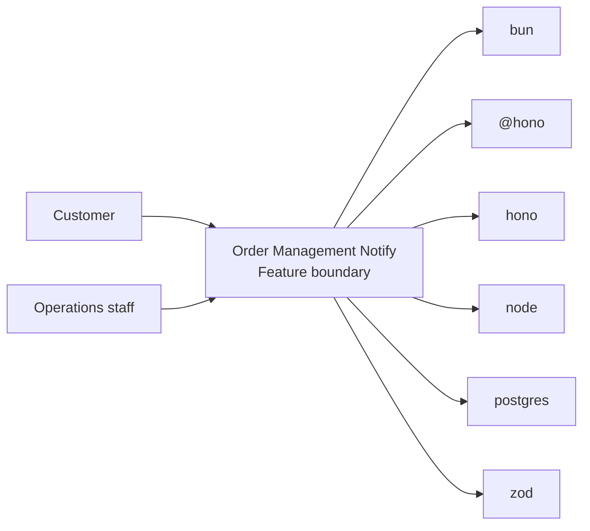

# Order Management Notify

- Overview: [emplus Docs Wiki](../index.md)
- Feature catalog: [All features](index.md)
- Reference: [Reference Index](../reference/index.md)

## Overview

Unit tests for anniversary functionality. Initialize the database connection and schema. Functionality to validate and format user input for various types of authentication and login processes. /api/auth.middleware.requireAuth JS API for the admin module. Ide…

## Actors & User Stories

- Customer
- Operations staff
## Business Flows

No feature flows were inferred.

## Basic Design

Order Management Notify captures the notify workflow inside order management. It spans 2 workspaces.

### Boundaries

- Workspaces: @emplus/api, @emplus/mobile
- Entry points (FE): mobile/src/features/auth/components/VerifyOtpHeroSection.tsx, api/src/__tests__/app.test.ts, api/src/__tests__/validation.test.ts, api/src/db/seed.ts, api/src/dto/auth.dto.ts, api/src/dto/user.dto.ts, api/src/middleware/rate-limit.ts, api/src/modules/live.ts
- Entry points (BE): api/src/__tests__/app.test.ts, api/src/__tests__/validation.test.ts, api/src/db/seed.ts, api/src/dto/auth.dto.ts, api/src/dto/user.dto.ts, api/src/middleware/rate-limit.ts, api/src/modules/live.ts, api/src/oauth/verify.ts

### Context Diagram

## Detail Design

- Data stores: Primary database, Session / token state
- Integrations: bun, @hono, hono, node, postgres, zod, ioredis, @faker-js, google-auth-library, jose, nodemailer, minio, @, expo-status-bar, react, react-native, react-native-keyboard-aware-scroll-view, react-native-safe-area-context

### Component Diagram

```mermaid
flowchart LR
  cmp_1["VerifyOtpHeroSection.tsx\nUI surface"]
  cmp_2["app.test.ts\nEntry point"]
  cmp_3["validation.test.ts\nEntry point"]
  cmp_4["seed.ts\nEntry point"]
  cmp_5["auth.dto.ts\nEntry point"]
  cmp_6["user.dto.ts\nEntry point"]
  cmp_7["rate-limit.ts\nEntry point"]
  cmp_8["live.ts\nEntry point"]
  cmp_1 --> cmp_2
  cmp_2 --> cmp_3
  cmp_3 --> cmp_4
  cmp_4 --> cmp_5
  cmp_5 --> cmp_6
  cmp_6 --> cmp_7
  cmp_7 --> cmp_8
  data_store["State / persistence"]
  cmp_8 --> data_store
```

## API Contracts

No API contracts were linked to this feature.

## Edge Cases & Error Handling

No edge cases were inferred from the clustered code.

## Related Files

| File | Workspace | Role | Why It Belongs |
| --- | --- | --- | --- |
| [mobile/src/features/auth/components/VerifyOtpHeroSection.tsx](../reference/files/mobile/src/features/auth/components/VerifyOtpHeroSection.tsx.md) | @emplus/mobile | UI surface | Matches the notify action heuristics for this feature. |
| [api/src/__tests__/app.test.ts](../reference/files/api/src/__tests__/app.test.ts.md) | @emplus/api | Entry point | Matches the notify action heuristics for this feature. |
| [api/src/__tests__/validation.test.ts](../reference/files/api/src/__tests__/validation.test.ts.md) | @emplus/api | Entry point | Matches the notify action heuristics for this feature. |
| [api/src/db/seed.ts](../reference/files/api/src/db/seed.ts.md) | @emplus/api | Entry point | Matches the notify action heuristics for this feature. |
| [api/src/dto/auth.dto.ts](../reference/files/api/src/dto/auth.dto.ts.md) | @emplus/api | Entry point | Matches the notify action heuristics for this feature. |
| [api/src/dto/user.dto.ts](../reference/files/api/src/dto/user.dto.ts.md) | @emplus/api | Entry point | Matches the notify action heuristics for this feature. |
| [api/src/middleware/rate-limit.ts](../reference/files/api/src/middleware/rate-limit.ts.md) | @emplus/api | Entry point | Matches the notify action heuristics for this feature. |
| [api/src/modules/live.ts](../reference/files/api/src/modules/live.ts.md) | @emplus/api | Entry point | Matches the notify action heuristics for this feature. |
| [api/src/oauth/verify.ts](../reference/files/api/src/oauth/verify.ts.md) | @emplus/api | Entry point | Matches the notify action heuristics for this feature. |
| [api/src/services/auth.service.ts](../reference/files/api/src/services/auth.service.ts.md) | @emplus/api | Entry point | Matches the notify action heuristics for this feature. |
| [api/src/services/mail.ts](../reference/files/api/src/services/mail.ts.md) | @emplus/api | Entry point | Matches the notify action heuristics for this feature. |
| [api/src/services/notification.service.ts](../reference/files/api/src/services/notification.service.ts.md) | @emplus/api | Entry point | Matches the notify action heuristics for this feature. |
| [api/src/services/push.ts](../reference/files/api/src/services/push.ts.md) | @emplus/api | Entry point | Matches the notify action heuristics for this feature. |
| [api/src/services/user.service.ts](../reference/files/api/src/services/user.service.ts.md) | @emplus/api | Entry point | Matches the notify action heuristics for this feature. |
| [api/src/shared/validators/zod.ts](../reference/files/api/src/shared/validators/zod.ts.md) | @emplus/api | Entry point | Matches the notify action heuristics for this feature. |
| [api/src/store/in-memory-store.ts](../reference/files/api/src/store/in-memory-store.ts.md) | @emplus/api | Entry point | Matches the notify action heuristics for this feature. |
| [api/src/types.ts](../reference/files/api/src/types.ts.md) | @emplus/api | Entry point | Matches the notify action heuristics for this feature. |
| [api/src/utils/http.ts](../reference/files/api/src/utils/http.ts.md) | @emplus/api | Entry point | Matches the notify action heuristics for this feature. |