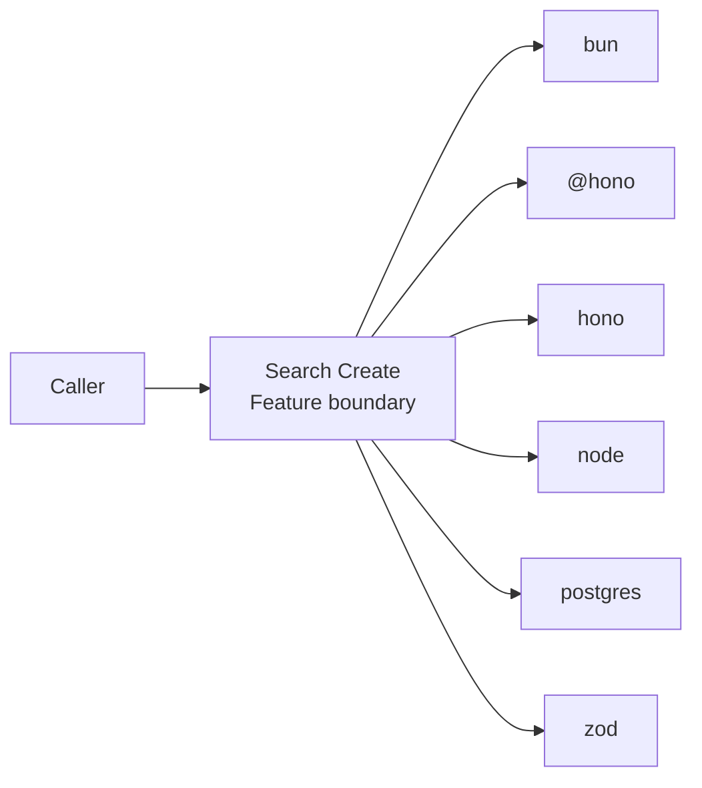

# Search Create

- Overview: [emplus Docs Wiki](../index.md)
- Feature catalog: [All features](index.md)
- Reference: [Reference Index](../reference/index.md)

## Overview

Unit tests for anniversary functionality. Initialize the database connection and schema. Functionality to validate and format user input for various types of authentication and login processes. Authentication Service API Code generation functions for numeric …

## Actors & User Stories

- n/a
## Business Flows

No feature flows were inferred.

## Basic Design

Search Create captures the create workflow inside search. It spans 2 workspaces.

### Boundaries

- Workspaces: @emplus/api, @emplus/mobile
- Entry points (FE): mobile/src/components/molecules/TabBarGridAnimatedBackground.tsx, mobile/src/core/factory.tsx, mobile/src/core/variants.ts, mobile/src/features/budget/components/BudgetActionMenu.tsx, api/src/db/bootstrap.ts, api/src/db/seed.ts, api/src/dto/budget.dto.ts, api/src/dto/care.dto.ts
- Entry points (BE): api/src/db/bootstrap.ts, api/src/db/seed.ts, api/src/dto/budget.dto.ts, api/src/dto/care.dto.ts, api/src/dto/timeline.dto.ts, api/src/services/auth.service.ts, api/src/services/budget.service.ts, api/src/services/notification.service.ts

### Context Diagram

## Detail Design

- Data stores: Primary database, Session / token state
- Integrations: bun, @hono, hono, node, postgres, zod, ioredis, nodemailer, minio, @, @expo-google-fonts, expo-font, expo-router, expo-splash-screen, expo-status-bar, @expo, @react-navigation, expo-blur, expo-haptics, expo-linear-gradient, react, react-native, react-native-safe-area-context, react-native-reanimated, react-native-gesture-handler, @react-native-async-storage, expo-secure-store, @tanstack

### Component Diagram

```mermaid
flowchart LR
  cmp_1["TabBarGridAnimatedBackground.tsx\nUI surface"]
  cmp_2["factory.tsx\nUI surface"]
  cmp_3["variants.ts\nUI surface"]
  cmp_4["BudgetActionMenu.tsx\nUI surface"]
  cmp_5["bootstrap.ts\nEntry point"]
  cmp_6["seed.ts\nEntry point"]
  cmp_7["budget.dto.ts\nEntry point"]
  cmp_8["care.dto.ts\nEntry point"]
  cmp_1 --> cmp_2
  cmp_2 --> cmp_3
  cmp_3 --> cmp_4
  cmp_4 --> cmp_5
  cmp_5 --> cmp_6
  cmp_6 --> cmp_7
  cmp_7 --> cmp_8
  data_store["State / persistence"]
  cmp_8 --> data_store
```

## API Contracts

No API contracts were linked to this feature.

## Edge Cases & Error Handling

No edge cases were inferred from the clustered code.

## Related Files

| File | Workspace | Role | Why It Belongs |
| --- | --- | --- | --- |
| [mobile/src/components/molecules/TabBarGridAnimatedBackground.tsx](../reference/files/mobile/src/components/molecules/TabBarGridAnimatedBackground.tsx.md) | @emplus/mobile | UI surface | Matches the create action heuristics for this feature. |
| [mobile/src/core/factory.tsx](../reference/files/mobile/src/core/factory.tsx.md) | @emplus/mobile | UI surface | Matches the create action heuristics for this feature. |
| [mobile/src/core/variants.ts](../reference/files/mobile/src/core/variants.ts.md) | @emplus/mobile | UI surface | Matches the create action heuristics for this feature. |
| [mobile/src/features/budget/components/BudgetActionMenu.tsx](../reference/files/mobile/src/features/budget/components/BudgetActionMenu.tsx.md) | @emplus/mobile | UI surface | Matches the create action heuristics for this feature. |
| [api/src/db/bootstrap.ts](../reference/files/api/src/db/bootstrap.ts.md) | @emplus/api | Entry point | Matches the create action heuristics for this feature. |
| [api/src/db/seed.ts](../reference/files/api/src/db/seed.ts.md) | @emplus/api | Entry point | Matches the create action heuristics for this feature. |
| [api/src/dto/budget.dto.ts](../reference/files/api/src/dto/budget.dto.ts.md) | @emplus/api | Entry point | Matches the create action heuristics for this feature. |
| [api/src/dto/care.dto.ts](../reference/files/api/src/dto/care.dto.ts.md) | @emplus/api | Entry point | Matches the create action heuristics for this feature. |
| [api/src/dto/timeline.dto.ts](../reference/files/api/src/dto/timeline.dto.ts.md) | @emplus/api | Entry point | Matches the create action heuristics for this feature. |
| [api/src/services/auth.service.ts](../reference/files/api/src/services/auth.service.ts.md) | @emplus/api | Entry point | Matches the create action heuristics for this feature. |
| [api/src/services/budget.service.ts](../reference/files/api/src/services/budget.service.ts.md) | @emplus/api | Entry point | Matches the create action heuristics for this feature. |
| [api/src/services/notification.service.ts](../reference/files/api/src/services/notification.service.ts.md) | @emplus/api | Entry point | Matches the create action heuristics for this feature. |
| [api/src/shared/date.ts](../reference/files/api/src/shared/date.ts.md) | @emplus/api | Entry point | Matches the create action heuristics for this feature. |
| [api/src/store.ts](../reference/files/api/src/store.ts.md) | @emplus/api | Entry point | Matches the create action heuristics for this feature. |
| [api/src/store/in-memory-store.ts](../reference/files/api/src/store/in-memory-store.ts.md) | @emplus/api | Entry point | Matches the create action heuristics for this feature. |
| [mobile/app/(tabs)/care.tsx](../reference/files/mobile/app/tabs--7761ed0d/care.tsx.md) | @emplus/mobile | Entry point | Matches the create action heuristics for this feature. |
| [mobile/app/(tabs)/profile.tsx](../reference/files/mobile/app/tabs--7761ed0d/profile.tsx.md) | @emplus/mobile | Entry point | Matches the create action heuristics for this feature. |
| [mobile/app/add-expense.tsx](../reference/files/mobile/app/add-expense.tsx.md) | @emplus/mobile | Entry point | Matches the create action heuristics for this feature. |
| [mobile/app/add-memory.tsx](../reference/files/mobile/app/add-memory.tsx.md) | @emplus/mobile | Entry point | Matches the create action heuristics for this feature. |
| [mobile/app/profile-details/notifications.tsx](../reference/files/mobile/app/profile-details/notifications.tsx.md) | @emplus/mobile | Entry point | Matches the create action heuristics for this feature. |
| [mobile/app/profile-details/personal-info.tsx](../reference/files/mobile/app/profile-details/personal-info.tsx.md) | @emplus/mobile | Entry point | Matches the create action heuristics for this feature. |
| [mobile/app/profile-details/privacy.tsx](../reference/files/mobile/app/profile-details/privacy.tsx.md) | @emplus/mobile | Entry point | Matches the create action heuristics for this feature. |
| [mobile/src/api.ts](../reference/files/mobile/src/api.ts.md) | @emplus/mobile | Entry point | Matches the create action heuristics for this feature. |
| [mobile/src/components/atoms/Toast.tsx](../reference/files/mobile/src/components/atoms/Toast.tsx.md) | @emplus/mobile | Entry point | Matches the create action heuristics for this feature. |
| [mobile/src/core/api/index.ts](../reference/files/mobile/src/core/api/index.ts.md) | @emplus/mobile | Entry point | Matches the create action heuristics for this feature. |
| [mobile/src/data/repositories/modules.repository.impl.ts](../reference/files/mobile/src/data/repositories/modules.repository.impl.ts.md) | @emplus/mobile | Entry point | Matches the create action heuristics for this feature. |
| [mobile/src/domain/usecases/modules/index.ts](../reference/files/mobile/src/domain/usecases/modules/index.ts.md) | @emplus/mobile | Entry point | Matches the create action heuristics for this feature. |
| [mobile/src/domain/usecases/auth/index.ts](../reference/files/mobile/src/domain/usecases/auth/index.ts.md) | @emplus/mobile | Service / use case | Supports the feature as service / use case. |
| [mobile/src/domain/usecases/base.ts](../reference/files/mobile/src/domain/usecases/base.ts.md) | @emplus/mobile | Service / use case | Supports the feature as service / use case. |
| [mobile/src/framework/di/dependencies.ts](../reference/files/mobile/src/framework/di/dependencies.ts.md) | @emplus/mobile | Repository / persistence | Supports the feature as repository / persistence. |
| [mobile/src/theme/theme-builder.ts](../reference/files/mobile/src/theme/theme-builder.ts.md) | @emplus/mobile | Model / contract | Matches the create action heuristics for this feature. |
| [mobile/src/components/molecules/pickers/calendar-utils.ts](../reference/files/mobile/src/components/molecules/pickers/calendar-utils.ts.md) | @emplus/mobile | Utility | Matches the create action heuristics for this feature. |