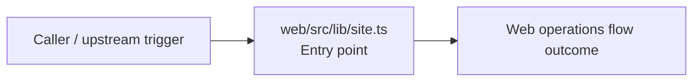
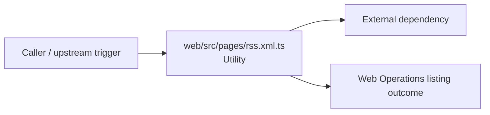
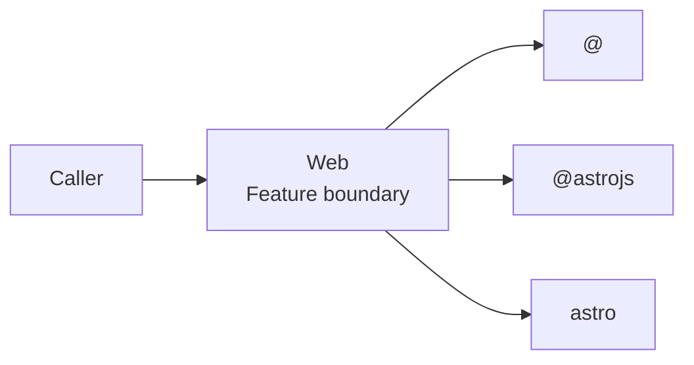
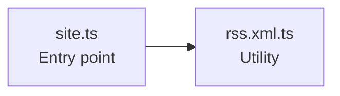

# Web

- Overview: [emplus Docs Wiki](../index.md)
- Feature catalog: [All features](index.md)
- Reference: [Reference Index](../reference/index.md)

## Overview

Site URL resolver function Defines a promise-bound fetch request to retrieve RSS data. Web captures the main web behavior discovered in the codebase. Key flows include Web operations flow, Web Operations listing.

## Actors & User Stories

### As user

- Goal: Web operations flow
- Benefit: Handle the main web operations use case exposed by this module.

#### Acceptance Criteria

- web/src/lib/site.ts receives the request and turns it into an application-level request handling command.

## Business Flows

### Web operations flow

Handle the main web operations use case exposed by this module.

#### Steps

- web/src/lib/site.ts receives the request and turns it into an application-level request handling command.

#### Flow Diagram

### Web Operations listing

Execute the module's listing use case inside web operations.

#### Steps

- web/src/pages/rss.xml.ts provides helper logic used during the flow.

#### Flow Diagram

## Basic Design

Web captures the main web behavior discovered in the codebase. Key flows include Web operations flow, Web Operations listing.

### Boundaries

- Workspaces: @emplus/web
- Entry points (FE): web/src/lib/site.ts
- Entry points (BE): web/src/lib/site.ts

### Context Diagram

## Detail Design

- Data stores: n/a
- Integrations: @, @astrojs, astro

### Component Diagram

## API Contracts

No API contracts were linked to this feature.

## Edge Cases & Error Handling

No edge cases were inferred from the clustered code.

## Related Files

| File | Workspace | Role | Why It Belongs |
| --- | --- | --- | --- |
| [web/src/lib/site.ts](../reference/files/web/src/lib/site.ts.md) | @emplus/web | Entry point | Grouped with the feature through shared domain signals. |
| [web/src/pages/rss.xml.ts](../reference/files/web/src/pages/rss.xml.ts.md) | @emplus/web | Utility | Grouped with the feature through shared domain signals. |