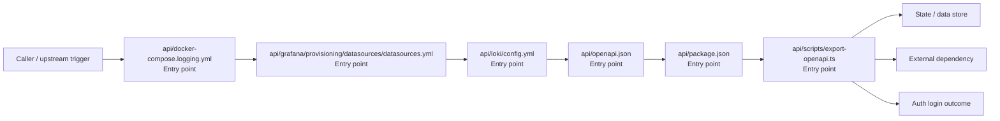

# Module api

- Overview: [emplus Docs Wiki](../../index.md)
- Summary: [SUMMARY](../../SUMMARY.md)
- Feature catalog: [All features](../../features/index.md)
- Module index: [All modules](index.md)
- Workspace index: [All workspaces](../../workspaces/index.md)

## Snapshot

- Path: `api`
- Descendant files: 83
- Descendant symbols: 326
- Languages: `JSON`, `TypeScript`, `YAML`
- Workspace: [@emplus/api](../../workspaces/api.md)

## Related Features

- [Authentication Login](../../features/auth-login.md) - Authentication Login captures the login workflow inside authentication. It spans 2 workspaces. Key flows include Auth login, Auth registration, Auth login.
- [Authentication Read / List](../../features/auth-list.md) - Authentication Read / List captures the read / list workflow inside authentication. It spans 3 workspaces.
- [User Management Login](../../features/user-login.md) - User Management Login captures the login workflow inside user management. It spans 2 workspaces. Key flows include Auth login, Auth registration, Auth login.
- [Search Read / List](../../features/search-list.md) - Search Read / List captures the read / list workflow inside search. It spans 3 workspaces.
- [Search Login](../../features/search-login.md) - Search Login captures the login workflow inside search. It spans 2 workspaces. Key flows include Auth login, Auth registration, Auth login.
- [Notifications Read / List](../../features/notification-list.md) - Notifications Read / List captures the read / list workflow inside notifications. It spans 2 workspaces.
- [Storage Read / List](../../features/storage-list.md) - Storage Read / List captures the read / list workflow inside storage. It spans 4 workspaces.
- [Integrations Read / List](../../features/integration-list.md) - Integrations Read / List captures the read / list workflow inside integrations. It spans 3 workspaces.
- [User Management Read / List](../../features/user-list.md) - User Management Read / List captures the read / list workflow inside user management. It spans 3 workspaces.
- [Notifications Notify](../../features/notification-notify.md) - Notifications Notify captures the notify workflow inside notifications. It spans 2 workspaces.
- [Order Management Login](../../features/order-login.md) - Order Management Login captures the login workflow inside order management. It spans 2 workspaces. Key flows include Auth login, Auth login, Auth login.
- [Notifications Login](../../features/notification-login.md) - Notifications Login captures the login workflow inside notifications. It spans 2 workspaces. Key flows include Auth login, Auth registration, Auth login.
- [Reporting Read / List](../../features/reporting-list.md) - Reporting Read / List captures the read / list workflow inside reporting. It spans 2 workspaces.
- [Search Notify](../../features/search-notify.md) - Search Notify captures the notify workflow inside search. It spans 2 workspaces.
- [Storage Login](../../features/storage-login.md) - Storage Login captures the login workflow inside storage. It spans 2 workspaces. Key flows include Auth login, Auth registration, Auth login.
- [Administration Read / List](../../features/admin-list.md) - Administration Read / List captures the read / list workflow inside administration. It spans 2 workspaces.
- [Authentication Verification](../../features/auth-verify.md) - Authentication Verification captures the verification workflow inside authentication. It spans 2 workspaces. Key flows include Credential validation, Auth login, Auth login.
- [Integrations Login](../../features/integration-login.md) - Integrations Login captures the login workflow inside integrations. It spans 2 workspaces. Key flows include Auth login, Auth registration, Auth login.
- [Integrations Notify](../../features/integration-notify.md) - Integrations Notify captures the notify workflow inside integrations. It spans 2 workspaces.
- [Search Create](../../features/search-create.md) - Search Create captures the create workflow inside search. It spans 2 workspaces.
- [User Management Notify](../../features/user-notify.md) - User Management Notify captures the notify workflow inside user management. It spans 2 workspaces.
- [Administration Login](../../features/admin-login.md) - Administration Login captures the login workflow inside administration. It spans 2 workspaces. Key flows include Auth login, Auth registration, Auth login.
- [Authentication Password Reset](../../features/auth-reset.md) - Authentication Password Reset captures the password reset workflow inside authentication. It spans 3 workspaces. Key flows include Password reset, Password reset, Password reset.
- [Storage Notify](../../features/storage-notify.md) - Storage Notify captures the notify workflow inside storage. It spans 2 workspaces.
- [User Management Create](../../features/user-create.md) - User Management Create captures the create workflow inside user management. It spans 2 workspaces.
- [Order Management Read / List](../../features/order-list.md) - Order Management Read / List captures the read / list workflow inside order management. It spans 2 workspaces.
- [Reporting Login](../../features/reporting-login.md) - Reporting Login captures the login workflow inside reporting. It spans 2 workspaces. Key flows include Auth login, Auth registration, Auth login.
- [Notifications Verification](../../features/notification-verify.md) - Notifications Verification captures the verification workflow inside notifications. It spans 2 workspaces. Key flows include Credential validation, Auth login, Auth login.
- [Storage Verification](../../features/storage-verify.md) - Storage Verification captures the verification workflow inside storage. It spans 2 workspaces. Key flows include Credential validation, Auth login, Auth login.
- [Administration Notify](../../features/admin-notify.md) - Administration Notify captures the notify workflow inside administration. It spans 2 workspaces.
- [Administration Verification](../../features/admin-verify.md) - Administration Verification captures the verification workflow inside administration. It spans 2 workspaces. Key flows include Credential validation, Auth login, Auth login.
- [Integrations Verification](../../features/integration-verify.md) - Integrations Verification captures the verification workflow inside integrations. It spans 2 workspaces. Key flows include Credential validation, Auth login, Auth login.
- [Reporting Verification](../../features/reporting-verify.md) - Reporting Verification captures the verification workflow inside reporting. It spans 2 workspaces. Key flows include Credential validation, Auth login, Auth login.
- [Order Management Verification](../../features/order-verify.md) - Order Management Verification captures the verification workflow inside order management. It spans 2 workspaces. Key flows include Credential validation, Auth login, Auth login.
- [Order Management Notify](../../features/order-notify.md) - Order Management Notify captures the notify workflow inside order management. It spans 2 workspaces.

## Business Capability

Logging configuration for Docker Compose services.

## Basic Design

Api is inferred as a authentication and access control area. The visible implementation layers are Entry point. State is likely persisted in primary database, session / token state. The module also integrates with bun, node, @hono, hono, postgres, zod.

### Boundaries

- Entry points: `api/docker-compose.logging.yml`, `api/grafana/provisioning/datasources/datasources.yml`, `api/loki/config.yml`, `api/openapi.json`, `api/package.json`, `api/scripts/export-openapi.ts`
- Data stores: Primary database, Session / token state
- External interfaces: `bun`, `node`, `@hono`, `hono`, `postgres`, `zod`

## Detail Design

Primary flow coverage includes Auth login. Representative files are api/docker-compose.logging.yml, api/grafana/provisioning/datasources/datasources.yml, api/loki/config.yml, api/openapi.json, api/package.json. Observed behavior hints: API Datasource configuration for Loki source in Grafana

### Components

- Entry point: api/docker-compose.logging.yml
- Entry point: api/grafana/provisioning/datasources/datasources.yml
- Entry point: api/loki/config.yml
- Entry point: api/openapi.json
- Entry point: api/package.json
- Entry point: api/scripts/export-openapi.ts
- Entry point: api/src/__tests__/anniversary.test.ts
- Entry point: api/src/__tests__/app.test.ts

## Inferred Business Flows

### Auth login

Authenticate the caller, validate credentials, and establish a usable session or token.

#### Steps

- api/docker-compose.logging.yml receives the request and turns it into an application-level login command.
- api/grafana/provisioning/datasources/datasources.yml receives the request and turns it into an application-level login command.
- api/loki/config.yml receives the request and turns it into an application-level login command.
- api/openapi.json receives the request and turns it into an application-level login command.
- api/package.json receives the request and turns it into an application-level login command.
- api/scripts/export-openapi.ts receives the request and turns it into an application-level login command.

#### Flow Diagram

## Child Modules

- [api/grafana](api/grafana.md) - 1 file, 1 symbol
- [api/loki](api/loki.md) - 1 file, 1 symbol
- [api/scripts](api/scripts.md) - 1 file, 0 symbols
- [api/src](api/src.md) - 76 files, 320 symbols

## Direct Files

- [api/docker-compose.logging.yml](../files/api/docker-compose.logging.yml.md) — Logging configuration for Docker Compose services.
- [api/openapi.json](../files/api/openapi.json.md) — Em+ API structure
- [api/package.json](../files/api/package.json.md) — @emplus/api
- [api/tsconfig.json](../files/api/tsconfig.json.md) — TSConfigFile JSON Structure
