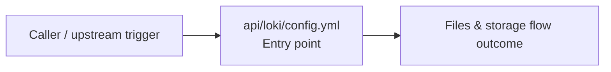

# Module api/loki

- Overview: [emplus Docs Wiki](../../../index.md)
- Summary: [SUMMARY](../../../SUMMARY.md)
- Feature catalog: [All features](../../../features/index.md)
- Module index: [All modules](../index.md)
- Workspace index: [All workspaces](../../../workspaces/index.md)

## Snapshot

- Path: `api/loki`
- Descendant files: 1
- Descendant symbols: 1
- Languages: `YAML`
- Workspace: [@emplus/api](../../../workspaces/api.md)

## Business Capability

LOKI configuration file syntax and usage

## Basic Design

Loki is inferred as a files and storage area. The visible implementation layers are Entry point.

### Boundaries

- Entry points: `api/loki/config.yml`

## Detail Design

Primary flow coverage includes Files &amp; storage flow. Representative files are api/loki/config.yml.

### Components

- Entry point: api/loki/config.yml

## Inferred Business Flows

### Files &amp; storage flow

Handle the main files and storage use case exposed by this module.

#### Steps

- api/loki/config.yml receives the request and turns it into an application-level request handling command.

#### Flow Diagram

## Child Modules

No child modules.

## Direct Files

- [api/loki/config.yml](../../files/api/loki/config.yml.md) — LOKI configuration file syntax and usage
