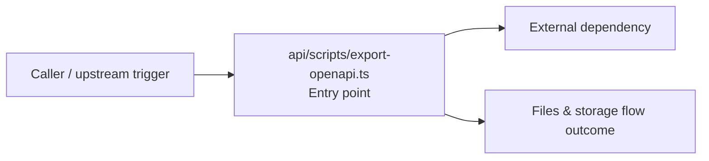

# Module api/scripts

- Overview: [emplus Docs Wiki](../../../index.md)
- Summary: [SUMMARY](../../../SUMMARY.md)
- Feature catalog: [All features](../../../features/index.md)
- Module index: [All modules](../index.md)
- Workspace index: [All workspaces](../../../workspaces/index.md)

## Snapshot

- Path: `api/scripts`
- Descendant files: 1
- Descendant symbols: 0
- Languages: `TypeScript`
- Workspace: [@emplus/api](../../../workspaces/api.md)

## Business Capability

File containing OpenAPI exporter script syntax for TypeScript.

## Basic Design

Scripts is inferred as a files and storage area. The visible implementation layers are Entry point. The module also integrates with bun, node.

### Boundaries

- Entry points: `api/scripts/export-openapi.ts`
- External interfaces: `bun`, `node`

## Detail Design

Primary flow coverage includes Files &amp; storage flow. Representative files are api/scripts/export-openapi.ts.

### Components

- Entry point: api/scripts/export-openapi.ts

## Inferred Business Flows

### Files &amp; storage flow

Handle the main files and storage use case exposed by this module.

#### Steps

- api/scripts/export-openapi.ts receives the request and turns it into an application-level request handling command.

#### Flow Diagram

## Child Modules

No child modules.

## Direct Files

- [api/scripts/export-openapi.ts](../../files/api/scripts/export-openapi.ts.md) — File containing OpenAPI exporter script syntax for TypeScript.
