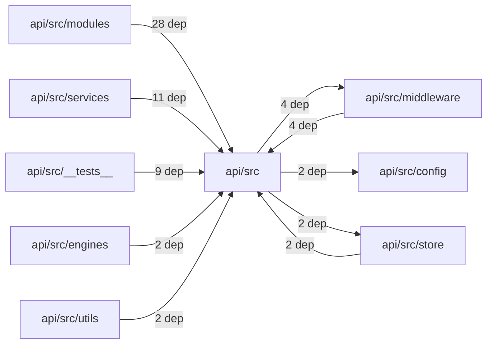
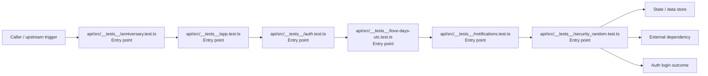

# Module api/src

- Overview: [emplus Docs Wiki](../../../index.md)
- Summary: [SUMMARY](../../../SUMMARY.md)
- Feature catalog: [All features](../../../features/index.md)
- Module index: [All modules](../index.md)
- Workspace index: [All workspaces](../../../workspaces/index.md)

## Snapshot

- Path: `api/src`
- Descendant files: 76
- Descendant symbols: 320
- Languages: `TypeScript`
- Workspace: [@emplus/api](../../../workspaces/api.md)

## Related Features

- [Authentication Login](../../../features/auth-login.md) - Authentication Login captures the login workflow inside authentication. It spans 2 workspaces. Key flows include Auth login, Auth registration, Auth login.
- [Authentication Read / List](../../../features/auth-list.md) - Authentication Read / List captures the read / list workflow inside authentication. It spans 3 workspaces.
- [User Management Login](../../../features/user-login.md) - User Management Login captures the login workflow inside user management. It spans 2 workspaces. Key flows include Auth login, Auth registration, Auth login.
- [Search Read / List](../../../features/search-list.md) - Search Read / List captures the read / list workflow inside search. It spans 3 workspaces.
- [Search Login](../../../features/search-login.md) - Search Login captures the login workflow inside search. It spans 2 workspaces. Key flows include Auth login, Auth registration, Auth login.
- [Notifications Read / List](../../../features/notification-list.md) - Notifications Read / List captures the read / list workflow inside notifications. It spans 2 workspaces.
- [Storage Read / List](../../../features/storage-list.md) - Storage Read / List captures the read / list workflow inside storage. It spans 4 workspaces.
- [Integrations Read / List](../../../features/integration-list.md) - Integrations Read / List captures the read / list workflow inside integrations. It spans 3 workspaces.
- [User Management Read / List](../../../features/user-list.md) - User Management Read / List captures the read / list workflow inside user management. It spans 3 workspaces.
- [Notifications Notify](../../../features/notification-notify.md) - Notifications Notify captures the notify workflow inside notifications. It spans 2 workspaces.
- [Order Management Login](../../../features/order-login.md) - Order Management Login captures the login workflow inside order management. It spans 2 workspaces. Key flows include Auth login, Auth login, Auth login.
- [Notifications Login](../../../features/notification-login.md) - Notifications Login captures the login workflow inside notifications. It spans 2 workspaces. Key flows include Auth login, Auth registration, Auth login.
- [Reporting Read / List](../../../features/reporting-list.md) - Reporting Read / List captures the read / list workflow inside reporting. It spans 2 workspaces.
- [Search Notify](../../../features/search-notify.md) - Search Notify captures the notify workflow inside search. It spans 2 workspaces.
- [Storage Login](../../../features/storage-login.md) - Storage Login captures the login workflow inside storage. It spans 2 workspaces. Key flows include Auth login, Auth registration, Auth login.
- [Administration Read / List](../../../features/admin-list.md) - Administration Read / List captures the read / list workflow inside administration. It spans 2 workspaces.
- [Authentication Verification](../../../features/auth-verify.md) - Authentication Verification captures the verification workflow inside authentication. It spans 2 workspaces. Key flows include Credential validation, Auth login, Auth login.
- [Integrations Login](../../../features/integration-login.md) - Integrations Login captures the login workflow inside integrations. It spans 2 workspaces. Key flows include Auth login, Auth registration, Auth login.
- [Integrations Notify](../../../features/integration-notify.md) - Integrations Notify captures the notify workflow inside integrations. It spans 2 workspaces.
- [Search Create](../../../features/search-create.md) - Search Create captures the create workflow inside search. It spans 2 workspaces.
- [User Management Notify](../../../features/user-notify.md) - User Management Notify captures the notify workflow inside user management. It spans 2 workspaces.
- [Administration Login](../../../features/admin-login.md) - Administration Login captures the login workflow inside administration. It spans 2 workspaces. Key flows include Auth login, Auth registration, Auth login.
- [Authentication Password Reset](../../../features/auth-reset.md) - Authentication Password Reset captures the password reset workflow inside authentication. It spans 3 workspaces. Key flows include Password reset, Password reset, Password reset.
- [Storage Notify](../../../features/storage-notify.md) - Storage Notify captures the notify workflow inside storage. It spans 2 workspaces.
- [User Management Create](../../../features/user-create.md) - User Management Create captures the create workflow inside user management. It spans 2 workspaces.
- [Order Management Read / List](../../../features/order-list.md) - Order Management Read / List captures the read / list workflow inside order management. It spans 2 workspaces.
- [Reporting Login](../../../features/reporting-login.md) - Reporting Login captures the login workflow inside reporting. It spans 2 workspaces. Key flows include Auth login, Auth registration, Auth login.
- [Notifications Verification](../../../features/notification-verify.md) - Notifications Verification captures the verification workflow inside notifications. It spans 2 workspaces. Key flows include Credential validation, Auth login, Auth login.
- [Storage Verification](../../../features/storage-verify.md) - Storage Verification captures the verification workflow inside storage. It spans 2 workspaces. Key flows include Credential validation, Auth login, Auth login.
- [Administration Notify](../../../features/admin-notify.md) - Administration Notify captures the notify workflow inside administration. It spans 2 workspaces.
- [Administration Verification](../../../features/admin-verify.md) - Administration Verification captures the verification workflow inside administration. It spans 2 workspaces. Key flows include Credential validation, Auth login, Auth login.
- [Integrations Verification](../../../features/integration-verify.md) - Integrations Verification captures the verification workflow inside integrations. It spans 2 workspaces. Key flows include Credential validation, Auth login, Auth login.
- [Reporting Verification](../../../features/reporting-verify.md) - Reporting Verification captures the verification workflow inside reporting. It spans 2 workspaces. Key flows include Credential validation, Auth login, Auth login.
- [Order Management Verification](../../../features/order-verify.md) - Order Management Verification captures the verification workflow inside order management. It spans 2 workspaces. Key flows include Credential validation, Auth login, Auth login.
- [Order Management Notify](../../../features/order-notify.md) - Order Management Notify captures the notify workflow inside order management. It spans 2 workspaces.

## Business Capability

Unit tests for anniversary functionality.

## Basic Design

Src is inferred as a authentication and access control area. The visible implementation layers are Entry point. State is likely persisted in primary database, session / token state. The module also integrates with bun, @hono, hono, node, postgres, zod.

### Boundaries

- Entry points: `api/src/__tests__/anniversary.test.ts`, `api/src/__tests__/app.test.ts`, `api/src/__tests__/auth.test.ts`, `api/src/__tests__/love-days-utc.test.ts`, `api/src/__tests__/notifications.test.ts`, `api/src/__tests__/security_random.test.ts`
- Data stores: Primary database, Session / token state
- External interfaces: `bun`, `@hono`, `hono`, `node`, `postgres`, `zod`

## Detail Design

Primary flow coverage includes Auth login. Representative files are api/src/__tests__/anniversary.test.ts, api/src/__tests__/app.test.ts, api/src/__tests__/auth.test.ts, api/src/__tests__/love-days-utc.test.ts, api/src/__tests__/notifications.test.ts. Observed behavior hints: Registers a new user with a profile and returns an access token.

### Components

- Entry point: api/src/__tests__/anniversary.test.ts
- Entry point: api/src/__tests__/app.test.ts
- Entry point: api/src/__tests__/auth.test.ts
- Entry point: api/src/__tests__/love-days-utc.test.ts
- Entry point: api/src/__tests__/notifications.test.ts
- Entry point: api/src/__tests__/security_random.test.ts
- Entry point: api/src/__tests__/system.test.ts
- Entry point: api/src/__tests__/validation.test.ts

## Module Interactions

- `api/src/modules` -> `api/src` (28 dependencies)
- `api/src/services` -> `api/src` (11 dependencies)
- `api/src/__tests__` -> `api/src` (9 dependencies)
- `api/src` -> `api/src/middleware` (4 dependencies)
- `api/src/middleware` -> `api/src` (4 dependencies)
- `api/src` -> `api/src/config` (2 dependencies)
- `api/src` -> `api/src/store` (2 dependencies)
- `api/src/engines` -> `api/src` (2 dependencies)
- `api/src/store` -> `api/src` (2 dependencies)
- `api/src/utils` -> `api/src` (2 dependencies)

### Interaction Diagram

## Inferred Business Flows

### Auth login

Authenticate the caller, validate credentials, and establish a usable session or token.

#### Steps

- api/src/__tests__/anniversary.test.ts receives the request and turns it into an application-level login command. It then hands off to anniversary.ts, date.ts, types.ts.
- api/src/__tests__/app.test.ts receives the request and turns it into an application-level login command. It then hands off to app.ts, store.ts.
- api/src/__tests__/auth.test.ts receives the request and turns it into an application-level login command. It then hands off to app.ts.
- api/src/__tests__/love-days-utc.test.ts receives the request and turns it into an application-level login command. It then hands off to diffDays, date.ts.
- api/src/__tests__/notifications.test.ts receives the request and turns it into an application-level login command. It then hands off to app.ts, store.ts.
- api/src/__tests__/security_random.test.ts receives the request and turns it into an application-level login command. It then hands off to code.ts.

#### Flow Diagram

## Child Modules

- [api/src/__tests__](src/__tests__.md) - 8 files, 5 symbols
- [api/src/config](src/config.md) - 1 file, 6 symbols
- [api/src/constants](src/constants.md) - 1 file, 0 symbols
- [api/src/db](src/db.md) - 4 files, 26 symbols
- [api/src/dto](src/dto.md) - 8 files, 48 symbols
- [api/src/engines](src/engines.md) - 2 files, 10 symbols
- [api/src/middleware](src/middleware.md) - 5 files, 13 symbols
- [api/src/modules](src/modules.md) - 16 files, 21 symbols
- [api/src/oauth](src/oauth.md) - 1 file, 6 symbols
- [api/src/services](src/services.md) - 11 files, 56 symbols
- [api/src/shared](src/shared.md) - 5 files, 25 symbols
- [api/src/store](src/store.md) - 3 files, 64 symbols
- [api/src/utils](src/utils.md) - 6 files, 22 symbols

## Direct Files

- [api/src/app-env.ts](../../files/api/src/app-env.ts.md) — app-env.ts metadata and types about environment variables used by the application.
- [api/src/app.ts](../../files/api/src/app.ts.md) — TS source file for the application logic in API/src/app
- [api/src/index.ts](../../files/api/src/index.ts.md) — The main file for an API, providing initial import and configuration.
- [api/src/store.ts](../../files/api/src/store.ts.md) — Creates a new DataStore instance based on environment settings.
- [api/src/types.ts](../../files/api/src/types.ts.md) — API type and interface documentation.
