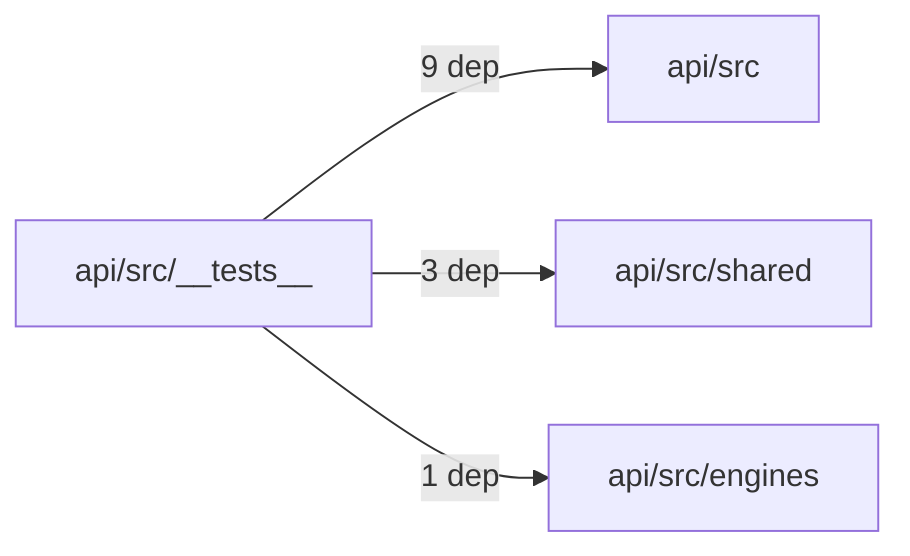

# Module api/src/__tests__

- Overview: [emplus Docs Wiki](../../../../index.md)
- Summary: [SUMMARY](../../../../SUMMARY.md)
- Feature catalog: [All features](../../../../features/index.md)
- Module index: [All modules](../../index.md)
- Workspace index: [All workspaces](../../../../workspaces/index.md)

## Snapshot

- Path: `api/src/__tests__`
- Descendant files: 8
- Descendant symbols: 5
- Languages: `TypeScript`
- Workspace: [@emplus/api](../../../../workspaces/api.md)

## Related Features

- [Authentication Login](../../../../features/auth-login.md) - Authentication Login captures the login workflow inside authentication. It spans 2 workspaces. Key flows include Auth login, Auth registration, Auth login.
- [Authentication Read / List](../../../../features/auth-list.md) - Authentication Read / List captures the read / list workflow inside authentication. It spans 3 workspaces.
- [User Management Login](../../../../features/user-login.md) - User Management Login captures the login workflow inside user management. It spans 2 workspaces. Key flows include Auth login, Auth registration, Auth login.
- [Search Read / List](../../../../features/search-list.md) - Search Read / List captures the read / list workflow inside search. It spans 3 workspaces.
- [Search Login](../../../../features/search-login.md) - Search Login captures the login workflow inside search. It spans 2 workspaces. Key flows include Auth login, Auth registration, Auth login.
- [Notifications Read / List](../../../../features/notification-list.md) - Notifications Read / List captures the read / list workflow inside notifications. It spans 2 workspaces.
- [Storage Read / List](../../../../features/storage-list.md) - Storage Read / List captures the read / list workflow inside storage. It spans 4 workspaces.
- [Integrations Read / List](../../../../features/integration-list.md) - Integrations Read / List captures the read / list workflow inside integrations. It spans 3 workspaces.
- [User Management Read / List](../../../../features/user-list.md) - User Management Read / List captures the read / list workflow inside user management. It spans 3 workspaces.
- [Notifications Notify](../../../../features/notification-notify.md) - Notifications Notify captures the notify workflow inside notifications. It spans 2 workspaces.
- [Notifications Login](../../../../features/notification-login.md) - Notifications Login captures the login workflow inside notifications. It spans 2 workspaces. Key flows include Auth login, Auth registration, Auth login.
- [Reporting Read / List](../../../../features/reporting-list.md) - Reporting Read / List captures the read / list workflow inside reporting. It spans 2 workspaces.
- [Search Notify](../../../../features/search-notify.md) - Search Notify captures the notify workflow inside search. It spans 2 workspaces.
- [Storage Login](../../../../features/storage-login.md) - Storage Login captures the login workflow inside storage. It spans 2 workspaces. Key flows include Auth login, Auth registration, Auth login.
- [Administration Read / List](../../../../features/admin-list.md) - Administration Read / List captures the read / list workflow inside administration. It spans 2 workspaces.
- [Authentication Verification](../../../../features/auth-verify.md) - Authentication Verification captures the verification workflow inside authentication. It spans 2 workspaces. Key flows include Credential validation, Auth login, Auth login.
- [Integrations Login](../../../../features/integration-login.md) - Integrations Login captures the login workflow inside integrations. It spans 2 workspaces. Key flows include Auth login, Auth registration, Auth login.
- [Integrations Notify](../../../../features/integration-notify.md) - Integrations Notify captures the notify workflow inside integrations. It spans 2 workspaces.
- [User Management Notify](../../../../features/user-notify.md) - User Management Notify captures the notify workflow inside user management. It spans 2 workspaces.
- [Administration Login](../../../../features/admin-login.md) - Administration Login captures the login workflow inside administration. It spans 2 workspaces. Key flows include Auth login, Auth registration, Auth login.
- [Authentication Password Reset](../../../../features/auth-reset.md) - Authentication Password Reset captures the password reset workflow inside authentication. It spans 3 workspaces. Key flows include Password reset, Password reset, Password reset.
- [Storage Notify](../../../../features/storage-notify.md) - Storage Notify captures the notify workflow inside storage. It spans 2 workspaces.
- [Order Management Read / List](../../../../features/order-list.md) - Order Management Read / List captures the read / list workflow inside order management. It spans 2 workspaces.
- [Reporting Login](../../../../features/reporting-login.md) - Reporting Login captures the login workflow inside reporting. It spans 2 workspaces. Key flows include Auth login, Auth registration, Auth login.
- [Notifications Verification](../../../../features/notification-verify.md) - Notifications Verification captures the verification workflow inside notifications. It spans 2 workspaces. Key flows include Credential validation, Auth login, Auth login.
- [Storage Verification](../../../../features/storage-verify.md) - Storage Verification captures the verification workflow inside storage. It spans 2 workspaces. Key flows include Credential validation, Auth login, Auth login.
- [Administration Notify](../../../../features/admin-notify.md) - Administration Notify captures the notify workflow inside administration. It spans 2 workspaces.
- [Administration Verification](../../../../features/admin-verify.md) - Administration Verification captures the verification workflow inside administration. It spans 2 workspaces. Key flows include Credential validation, Auth login, Auth login.
- [Integrations Verification](../../../../features/integration-verify.md) - Integrations Verification captures the verification workflow inside integrations. It spans 2 workspaces. Key flows include Credential validation, Auth login, Auth login.
- [Reporting Verification](../../../../features/reporting-verify.md) - Reporting Verification captures the verification workflow inside reporting. It spans 2 workspaces. Key flows include Credential validation, Auth login, Auth login.
- [Order Management Verification](../../../../features/order-verify.md) - Order Management Verification captures the verification workflow inside order management. It spans 2 workspaces. Key flows include Credential validation, Auth login, Auth login.
- [Order Management Notify](../../../../features/order-notify.md) - Order Management Notify captures the notify workflow inside order management. It spans 2 workspaces.

## Business Capability

Unit tests for anniversary functionality.

## Basic Design

Tests is inferred as a authentication and access control area. The visible implementation layers are Entry point. The module also integrates with bun.

### Boundaries

- Entry points: `api/src/__tests__/anniversary.test.ts`, `api/src/__tests__/app.test.ts`, `api/src/__tests__/auth.test.ts`, `api/src/__tests__/love-days-utc.test.ts`, `api/src/__tests__/notifications.test.ts`, `api/src/__tests__/security_random.test.ts`
- External interfaces: `bun`

## Detail Design

Primary flow coverage includes Password reset, Auth registration. Representative files are api/src/__tests__/anniversary.test.ts, api/src/__tests__/app.test.ts, api/src/__tests__/auth.test.ts, api/src/__tests__/love-days-utc.test.ts, api/src/__tests__/notifications.test.ts. Observed behavior hints: Registers a new user with a profile and returns an access token.

### Components

- Entry point: api/src/__tests__/anniversary.test.ts
- Entry point: api/src/__tests__/app.test.ts
- Entry point: api/src/__tests__/auth.test.ts
- Entry point: api/src/__tests__/love-days-utc.test.ts
- Entry point: api/src/__tests__/notifications.test.ts
- Entry point: api/src/__tests__/security_random.test.ts
- Entry point: api/src/__tests__/system.test.ts
- Entry point: api/src/__tests__/validation.test.ts

## Module Interactions

- `api/src/__tests__` -> `api/src` (9 dependencies)
- `api/src/__tests__` -> `api/src/shared` (3 dependencies)
- `api/src/__tests__` -> `api/src/engines` (1 dependencies)

### Interaction Diagram

## Inferred Business Flows

### Password reset

Execute the module's password reset use case inside authentication and access control.

#### Steps

- api/src/__tests__/anniversary.test.ts receives the request and turns it into an application-level password reset command. It then hands off to anniversary.ts, date.ts, types.ts.
- api/src/__tests__/app.test.ts receives the request and turns it into an application-level password reset command. It then hands off to app.ts, store.ts.
- api/src/__tests__/auth.test.ts receives the request and turns it into an application-level password reset command. It then hands off to app.ts.
- api/src/__tests__/love-days-utc.test.ts receives the request and turns it into an application-level password reset command. It then hands off to diffDays, date.ts.
- api/src/__tests__/notifications.test.ts receives the request and turns it into an application-level password reset command. It then hands off to app.ts, store.ts.
- api/src/__tests__/security_random.test.ts receives the request and turns it into an application-level password reset command. It then hands off to code.ts.

#### Flow Diagram

```mermaid
flowchart LR
  caller["Caller / upstream trigger"]
  n1_anniversary_test_ts["api/src/__tests__/anniversary.test.ts\nEntry point"]
  n2_app_test_ts["api/src/__tests__/app.test.ts\nEntry point"]
  n3_auth_test_ts["api/src/__tests__/auth.test.ts\nEntry point"]
  n4_love_days_utc_test_ts["api/src/__tests__/love-days-utc.test.ts\nEntry point"]
  n5_notifications_test_ts["api/src/__tests__/notifications.test.ts\nEntry point"]
  n6_security_random_test_ts["api/src/__tests__/security_random.test.ts\nEntry point"]
  caller --> n1_anniversary_test_ts
  n1_anniversary_test_ts --> n2_app_test_ts
  n2_app_test_ts --> n3_auth_test_ts
  n3_auth_test_ts --> n4_love_days_utc_test_ts
  n4_love_days_utc_test_ts --> n5_notifications_test_ts
  n5_notifications_test_ts --> n6_security_random_test_ts
  ext["External dependency"]
  n6_security_random_test_ts --> ext
  outcome["Password reset outcome"]
  n6_security_random_test_ts --> outcome
```

### Auth registration

Execute the module's registration use case inside authentication and access control.

#### Steps

- api/src/__tests__/anniversary.test.ts receives the request and turns it into an application-level registration command. It then hands off to anniversary.ts, date.ts, types.ts.
- api/src/__tests__/app.test.ts receives the request and turns it into an application-level registration command. It then hands off to app.ts, store.ts.
- api/src/__tests__/auth.test.ts receives the request and turns it into an application-level registration command. It then hands off to app.ts.
- api/src/__tests__/love-days-utc.test.ts receives the request and turns it into an application-level registration command. It then hands off to diffDays, date.ts.
- api/src/__tests__/notifications.test.ts receives the request and turns it into an application-level registration command. It then hands off to app.ts, store.ts.
- api/src/__tests__/security_random.test.ts receives the request and turns it into an application-level registration command. It then hands off to code.ts.

#### Flow Diagram

## Child Modules

No child modules.

## Direct Files

- [api/src/__tests__/anniversary.test.ts](../../../files/api/src/__tests__/anniversary.test.ts.md) — Unit tests for anniversary functionality.
- [api/src/__tests__/app.test.ts](../../../files/api/src/__tests__/app.test.ts.md) — Registers a new user with a profile and returns an access token.
- [api/src/__tests__/auth.test.ts](../../../files/api/src/__tests__/auth.test.ts.md) — Unit test for authentication functions in API/src/__tests__/auth.ts
- [api/src/__tests__/love-days-utc.test.ts](../../../files/api/src/__tests__/love-days-utc.test.ts.md) — Calculates the number of days in a love day period from a start date to a current date that is UTC.
- [api/src/__tests__/notifications.test.ts](../../../files/api/src/__tests__/notifications.test.ts.md) — Source file containing test cases for notifications functionality in an API
- [api/src/__tests__/security_random.test.ts](../../../files/api/src/__tests__/security_random.test.ts.md) — security_random.test.ts file tests the securityRandom function in src/api
- [api/src/__tests__/system.test.ts](../../../files/api/src/__tests__/system.test.ts.md) — System configuration file for testing purposes.
- [api/src/__tests__/validation.test.ts](../../../files/api/src/__tests__/validation.test.ts.md) — Registers a user and retrieves an access token.
