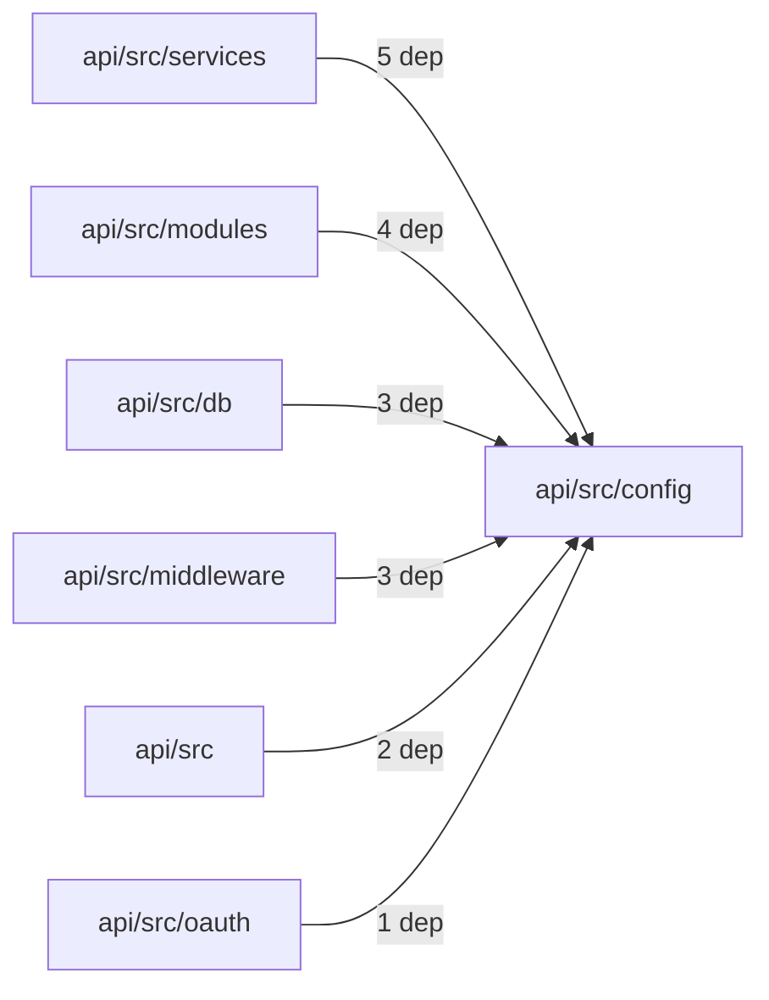
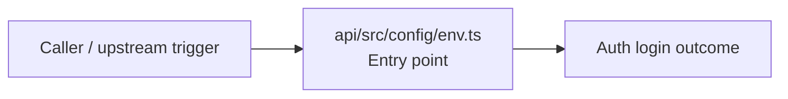

# Module api/src/config

- Overview: [emplus Docs Wiki](../../../../index.md)
- Summary: [SUMMARY](../../../../SUMMARY.md)
- Feature catalog: [All features](../../../../features/index.md)
- Module index: [All modules](../../index.md)
- Workspace index: [All workspaces](../../../../workspaces/index.md)

## Snapshot

- Path: `api/src/config`
- Descendant files: 1
- Descendant symbols: 6
- Languages: `TypeScript`
- Workspace: [@emplus/api](../../../../workspaces/api.md)

## Related Features

- [Authentication Read / List](../../../../features/auth-list.md) - Authentication Read / List captures the read / list workflow inside authentication. It spans 3 workspaces.
- [Search Read / List](../../../../features/search-list.md) - Search Read / List captures the read / list workflow inside search. It spans 3 workspaces.
- [Notifications Read / List](../../../../features/notification-list.md) - Notifications Read / List captures the read / list workflow inside notifications. It spans 2 workspaces.
- [Storage Read / List](../../../../features/storage-list.md) - Storage Read / List captures the read / list workflow inside storage. It spans 4 workspaces.
- [Integrations Read / List](../../../../features/integration-list.md) - Integrations Read / List captures the read / list workflow inside integrations. It spans 3 workspaces.
- [User Management Read / List](../../../../features/user-list.md) - User Management Read / List captures the read / list workflow inside user management. It spans 3 workspaces.
- [Reporting Read / List](../../../../features/reporting-list.md) - Reporting Read / List captures the read / list workflow inside reporting. It spans 2 workspaces.
- [Administration Read / List](../../../../features/admin-list.md) - Administration Read / List captures the read / list workflow inside administration. It spans 2 workspaces.
- [Order Management Read / List](../../../../features/order-list.md) - Order Management Read / List captures the read / list workflow inside order management. It spans 2 workspaces.

## Business Capability

Environment configuration variables and functions for various StoreModes.

## Basic Design

Config is inferred as a authentication and access control area. The visible implementation layers are Entry point.

### Boundaries

- Entry points: `api/src/config/env.ts`

## Detail Design

Primary flow coverage includes Auth login. Representative files are api/src/config/env.ts.

### Components

- Entry point: api/src/config/env.ts

## Module Interactions

- `api/src/services` -> `api/src/config` (5 dependencies)
- `api/src/modules` -> `api/src/config` (4 dependencies)
- `api/src/db` -> `api/src/config` (3 dependencies)
- `api/src/middleware` -> `api/src/config` (3 dependencies)
- `api/src` -> `api/src/config` (2 dependencies)
- `api/src/oauth` -> `api/src/config` (1 dependencies)

### Interaction Diagram

## Inferred Business Flows

### Auth login

Authenticate the caller, validate credentials, and establish a usable session or token.

#### Steps

- api/src/config/env.ts receives the request and turns it into an application-level login command.

#### Flow Diagram

## Child Modules

No child modules.

## Direct Files

- [api/src/config/env.ts](../../../files/api/src/config/env.ts.md) — Environment configuration variables and functions for various StoreModes.
