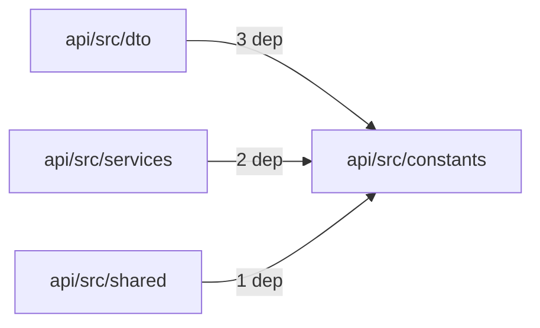
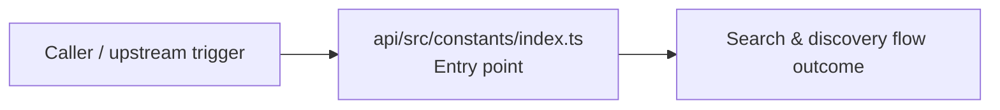

# Module api/src/constants

- Overview: [emplus Docs Wiki](../../../../index.md)
- Summary: [SUMMARY](../../../../SUMMARY.md)
- Feature catalog: [All features](../../../../features/index.md)
- Module index: [All modules](../../index.md)
- Workspace index: [All workspaces](../../../../workspaces/index.md)

## Snapshot

- Path: `api/src/constants`
- Descendant files: 1
- Descendant symbols: 0
- Languages: `TypeScript`
- Workspace: [@emplus/api](../../../../workspaces/api.md)

## Business Capability

Constant definitions for the application.

## Basic Design

Constants is inferred as a search and discovery area. The visible implementation layers are Entry point.

### Boundaries

- Entry points: `api/src/constants/index.ts`

## Detail Design

Primary flow coverage includes Search &amp; discovery flow. Representative files are api/src/constants/index.ts.

### Components

- Entry point: api/src/constants/index.ts

## Module Interactions

- `api/src/dto` -> `api/src/constants` (3 dependencies)
- `api/src/services` -> `api/src/constants` (2 dependencies)
- `api/src/shared` -> `api/src/constants` (1 dependencies)

### Interaction Diagram

## Inferred Business Flows

### Search &amp; discovery flow

Handle the main search and discovery use case exposed by this module.

#### Steps

- api/src/constants/index.ts receives the request and turns it into an application-level request handling command.

#### Flow Diagram

## Child Modules

No child modules.

## Direct Files

- [api/src/constants/index.ts](../../../files/api/src/constants/index.ts.md) — Constant definitions for the application.
