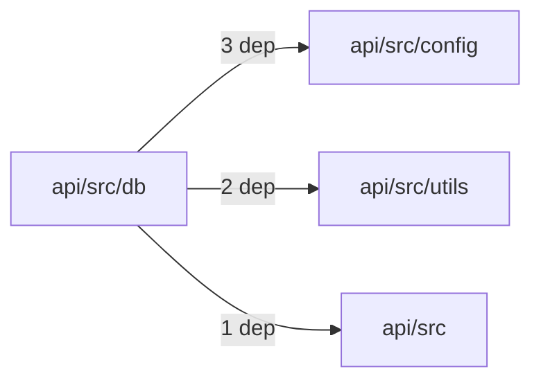
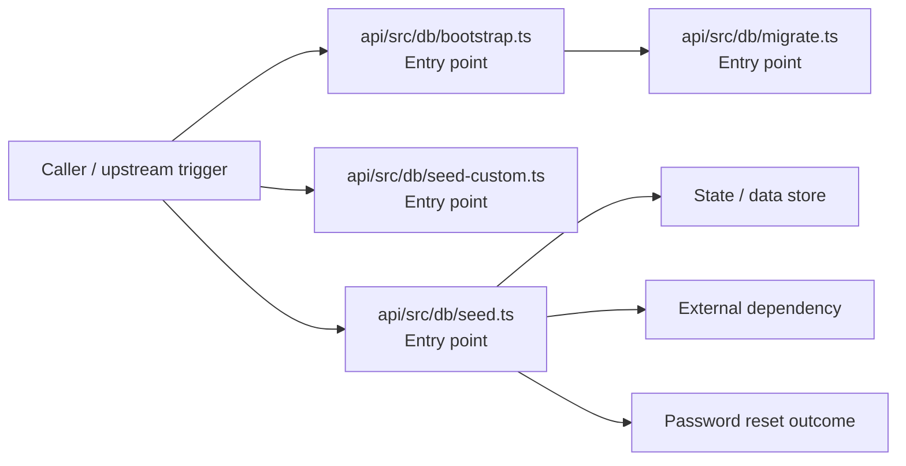

# Module api/src/db

- Overview: [emplus Docs Wiki](../../../../index.md)
- Summary: [SUMMARY](../../../../SUMMARY.md)
- Feature catalog: [All features](../../../../features/index.md)
- Module index: [All modules](../../index.md)
- Workspace index: [All workspaces](../../../../workspaces/index.md)

## Snapshot

- Path: `api/src/db`
- Descendant files: 4
- Descendant symbols: 26
- Languages: `TypeScript`
- Workspace: [@emplus/api](../../../../workspaces/api.md)

## Related Features

- [Authentication Read / List](../../../../features/auth-list.md) - Authentication Read / List captures the read / list workflow inside authentication. It spans 3 workspaces.
- [Search Read / List](../../../../features/search-list.md) - Search Read / List captures the read / list workflow inside search. It spans 3 workspaces.
- [Notifications Read / List](../../../../features/notification-list.md) - Notifications Read / List captures the read / list workflow inside notifications. It spans 2 workspaces.
- [Storage Read / List](../../../../features/storage-list.md) - Storage Read / List captures the read / list workflow inside storage. It spans 4 workspaces.
- [Integrations Read / List](../../../../features/integration-list.md) - Integrations Read / List captures the read / list workflow inside integrations. It spans 3 workspaces.
- [User Management Read / List](../../../../features/user-list.md) - User Management Read / List captures the read / list workflow inside user management. It spans 3 workspaces.
- [Notifications Notify](../../../../features/notification-notify.md) - Notifications Notify captures the notify workflow inside notifications. It spans 2 workspaces.
- [Reporting Read / List](../../../../features/reporting-list.md) - Reporting Read / List captures the read / list workflow inside reporting. It spans 2 workspaces.
- [Search Notify](../../../../features/search-notify.md) - Search Notify captures the notify workflow inside search. It spans 2 workspaces.
- [Administration Read / List](../../../../features/admin-list.md) - Administration Read / List captures the read / list workflow inside administration. It spans 2 workspaces.
- [Integrations Notify](../../../../features/integration-notify.md) - Integrations Notify captures the notify workflow inside integrations. It spans 2 workspaces.
- [Search Create](../../../../features/search-create.md) - Search Create captures the create workflow inside search. It spans 2 workspaces.
- [User Management Notify](../../../../features/user-notify.md) - User Management Notify captures the notify workflow inside user management. It spans 2 workspaces.
- [Authentication Password Reset](../../../../features/auth-reset.md) - Authentication Password Reset captures the password reset workflow inside authentication. It spans 3 workspaces. Key flows include Password reset, Password reset, Password reset.
- [Storage Notify](../../../../features/storage-notify.md) - Storage Notify captures the notify workflow inside storage. It spans 2 workspaces.
- [User Management Create](../../../../features/user-create.md) - User Management Create captures the create workflow inside user management. It spans 2 workspaces.
- [Order Management Read / List](../../../../features/order-list.md) - Order Management Read / List captures the read / list workflow inside order management. It spans 2 workspaces.
- [Administration Notify](../../../../features/admin-notify.md) - Administration Notify captures the notify workflow inside administration. It spans 2 workspaces.
- [Order Management Notify](../../../../features/order-notify.md) - Order Management Notify captures the notify workflow inside order management. It spans 2 workspaces.

## Business Capability

Initialize the database connection and schema.

## Basic Design

Db is inferred as a authentication and access control area. The visible implementation layers are Entry point. State is likely persisted in primary database. The module also integrates with node, postgres.

### Boundaries

- Entry points: `api/src/db/bootstrap.ts`, `api/src/db/migrate.ts`, `api/src/db/seed-custom.ts`, `api/src/db/seed.ts`
- Data stores: Primary database
- External interfaces: `node`, `postgres`

## Detail Design

Primary flow coverage includes Password reset. Representative files are api/src/db/bootstrap.ts, api/src/db/migrate.ts, api/src/db/seed-custom.ts, api/src/db/seed.ts. Observed behavior hints: A migration configuration system for PostgreSQL.

### Components

- Entry point: api/src/db/bootstrap.ts
- Entry point: api/src/db/migrate.ts
- Entry point: api/src/db/seed-custom.ts
- Entry point: api/src/db/seed.ts

## Module Interactions

- `api/src/db` -> `api/src/config` (3 dependencies)
- `api/src/db` -> `api/src/utils` (2 dependencies)
- `api/src/db` -> `api/src` (1 dependencies)

### Interaction Diagram

## Inferred Business Flows

### Password reset

Execute the module's password reset use case inside authentication and access control.

#### Steps

- api/src/db/bootstrap.ts receives the request and turns it into an application-level password reset command. It then hands off to migrate.ts.
- api/src/db/migrate.ts receives the request and turns it into an application-level password reset command. It then hands off to StoreMode, env.ts.
- api/src/db/seed-custom.ts receives the request and turns it into an application-level password reset command. It then hands off to StoreMode, hashPassword, env.ts.
- api/src/db/seed.ts receives the request and turns it into an application-level password reset command. It then hands off to StoreMode, Gender, hashPassword.

#### Flow Diagram

## Child Modules

No child modules.

## Direct Files

- [api/src/db/bootstrap.ts](../../../files/api/src/db/bootstrap.ts.md) — Initialize the database connection and schema.
- [api/src/db/migrate.ts](../../../files/api/src/db/migrate.ts.md) — A migration configuration system for PostgreSQL.
- [api/src/db/seed-custom.ts](../../../files/api/src/db/seed-custom.ts.md) — Seeds custom user accounts with hardcoded credentials.
- [api/src/db/seed.ts](../../../files/api/src/db/seed.ts.md) — seed db function to generate and save seeds for couples.
