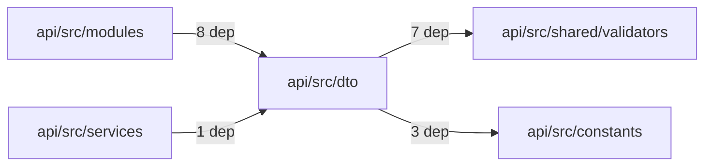
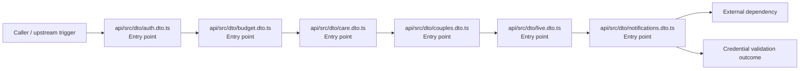

# Module api/src/dto

- Overview: [emplus Docs Wiki](../../../../index.md)
- Summary: [SUMMARY](../../../../SUMMARY.md)
- Feature catalog: [All features](../../../../features/index.md)
- Module index: [All modules](../../index.md)
- Workspace index: [All workspaces](../../../../workspaces/index.md)

## Snapshot

- Path: `api/src/dto`
- Descendant files: 8
- Descendant symbols: 48
- Languages: `TypeScript`
- Workspace: [@emplus/api](../../../../workspaces/api.md)

## Related Features

- [Authentication Login](../../../../features/auth-login.md) - Authentication Login captures the login workflow inside authentication. It spans 2 workspaces. Key flows include Auth login, Auth registration, Auth login.
- [Authentication Read / List](../../../../features/auth-list.md) - Authentication Read / List captures the read / list workflow inside authentication. It spans 3 workspaces.
- [User Management Login](../../../../features/user-login.md) - User Management Login captures the login workflow inside user management. It spans 2 workspaces. Key flows include Auth login, Auth registration, Auth login.
- [Search Read / List](../../../../features/search-list.md) - Search Read / List captures the read / list workflow inside search. It spans 3 workspaces.
- [Search Login](../../../../features/search-login.md) - Search Login captures the login workflow inside search. It spans 2 workspaces. Key flows include Auth login, Auth registration, Auth login.
- [Notifications Read / List](../../../../features/notification-list.md) - Notifications Read / List captures the read / list workflow inside notifications. It spans 2 workspaces.
- [Storage Read / List](../../../../features/storage-list.md) - Storage Read / List captures the read / list workflow inside storage. It spans 4 workspaces.
- [Integrations Read / List](../../../../features/integration-list.md) - Integrations Read / List captures the read / list workflow inside integrations. It spans 3 workspaces.
- [User Management Read / List](../../../../features/user-list.md) - User Management Read / List captures the read / list workflow inside user management. It spans 3 workspaces.
- [Notifications Notify](../../../../features/notification-notify.md) - Notifications Notify captures the notify workflow inside notifications. It spans 2 workspaces.
- [Order Management Login](../../../../features/order-login.md) - Order Management Login captures the login workflow inside order management. It spans 2 workspaces. Key flows include Auth login, Auth login, Auth login.
- [Notifications Login](../../../../features/notification-login.md) - Notifications Login captures the login workflow inside notifications. It spans 2 workspaces. Key flows include Auth login, Auth registration, Auth login.
- [Reporting Read / List](../../../../features/reporting-list.md) - Reporting Read / List captures the read / list workflow inside reporting. It spans 2 workspaces.
- [Search Notify](../../../../features/search-notify.md) - Search Notify captures the notify workflow inside search. It spans 2 workspaces.
- [Storage Login](../../../../features/storage-login.md) - Storage Login captures the login workflow inside storage. It spans 2 workspaces. Key flows include Auth login, Auth registration, Auth login.
- [Administration Read / List](../../../../features/admin-list.md) - Administration Read / List captures the read / list workflow inside administration. It spans 2 workspaces.
- [Authentication Verification](../../../../features/auth-verify.md) - Authentication Verification captures the verification workflow inside authentication. It spans 2 workspaces. Key flows include Credential validation, Auth login, Auth login.
- [Integrations Login](../../../../features/integration-login.md) - Integrations Login captures the login workflow inside integrations. It spans 2 workspaces. Key flows include Auth login, Auth registration, Auth login.
- [Integrations Notify](../../../../features/integration-notify.md) - Integrations Notify captures the notify workflow inside integrations. It spans 2 workspaces.
- [Search Create](../../../../features/search-create.md) - Search Create captures the create workflow inside search. It spans 2 workspaces.
- [User Management Notify](../../../../features/user-notify.md) - User Management Notify captures the notify workflow inside user management. It spans 2 workspaces.
- [Administration Login](../../../../features/admin-login.md) - Administration Login captures the login workflow inside administration. It spans 2 workspaces. Key flows include Auth login, Auth registration, Auth login.
- [Authentication Password Reset](../../../../features/auth-reset.md) - Authentication Password Reset captures the password reset workflow inside authentication. It spans 3 workspaces. Key flows include Password reset, Password reset, Password reset.
- [Storage Notify](../../../../features/storage-notify.md) - Storage Notify captures the notify workflow inside storage. It spans 2 workspaces.
- [User Management Create](../../../../features/user-create.md) - User Management Create captures the create workflow inside user management. It spans 2 workspaces.
- [Order Management Read / List](../../../../features/order-list.md) - Order Management Read / List captures the read / list workflow inside order management. It spans 2 workspaces.
- [Reporting Login](../../../../features/reporting-login.md) - Reporting Login captures the login workflow inside reporting. It spans 2 workspaces. Key flows include Auth login, Auth registration, Auth login.
- [Notifications Verification](../../../../features/notification-verify.md) - Notifications Verification captures the verification workflow inside notifications. It spans 2 workspaces. Key flows include Credential validation, Auth login, Auth login.
- [Storage Verification](../../../../features/storage-verify.md) - Storage Verification captures the verification workflow inside storage. It spans 2 workspaces. Key flows include Credential validation, Auth login, Auth login.
- [Administration Notify](../../../../features/admin-notify.md) - Administration Notify captures the notify workflow inside administration. It spans 2 workspaces.
- [Administration Verification](../../../../features/admin-verify.md) - Administration Verification captures the verification workflow inside administration. It spans 2 workspaces. Key flows include Credential validation, Auth login, Auth login.
- [Integrations Verification](../../../../features/integration-verify.md) - Integrations Verification captures the verification workflow inside integrations. It spans 2 workspaces. Key flows include Credential validation, Auth login, Auth login.
- [Reporting Verification](../../../../features/reporting-verify.md) - Reporting Verification captures the verification workflow inside reporting. It spans 2 workspaces. Key flows include Credential validation, Auth login, Auth login.
- [Order Management Verification](../../../../features/order-verify.md) - Order Management Verification captures the verification workflow inside order management. It spans 2 workspaces. Key flows include Credential validation, Auth login, Auth login.
- [Order Management Notify](../../../../features/order-notify.md) - Order Management Notify captures the notify workflow inside order management. It spans 2 workspaces.

## Business Capability

Functionality to validate and format user input for various types of authentication and login processes.

## Basic Design

Dto is inferred as a authentication and access control area. The visible implementation layers are Entry point. The module also integrates with zod.

### Boundaries

- Entry points: `api/src/dto/auth.dto.ts`, `api/src/dto/budget.dto.ts`, `api/src/dto/care.dto.ts`, `api/src/dto/couples.dto.ts`, `api/src/dto/live.dto.ts`, `api/src/dto/notifications.dto.ts`
- External interfaces: `zod`

## Detail Design

Primary flow coverage includes Credential validation. Representative files are api/src/dto/auth.dto.ts, api/src/dto/budget.dto.ts, api/src/dto/care.dto.ts, api/src/dto/couples.dto.ts, api/src/dto/live.dto.ts. Observed behavior hints: Description of the BudgetDTO classes and their interfaces.

### Components

- Entry point: api/src/dto/auth.dto.ts
- Entry point: api/src/dto/budget.dto.ts
- Entry point: api/src/dto/care.dto.ts
- Entry point: api/src/dto/couples.dto.ts
- Entry point: api/src/dto/live.dto.ts
- Entry point: api/src/dto/notifications.dto.ts
- Entry point: api/src/dto/timeline.dto.ts
- Entry point: api/src/dto/user.dto.ts

## Module Interactions

- `api/src/modules` -> `api/src/dto` (8 dependencies)
- `api/src/dto` -> `api/src/shared/validators` (7 dependencies)
- `api/src/dto` -> `api/src/constants` (3 dependencies)
- `api/src/services` -> `api/src/dto` (1 dependencies)

### Interaction Diagram

## Inferred Business Flows

### Credential validation

Execute the module's verification use case inside authentication and access control.

#### Steps

- api/src/dto/auth.dto.ts receives the request and turns it into an application-level verification command. It then hands off to parseWithSchema, index.ts, zod.ts.
- api/src/dto/budget.dto.ts receives the request and turns it into an application-level verification command. It then hands off to index.ts, parseWithSchema, zod.ts.
- api/src/dto/care.dto.ts receives the request and turns it into an application-level verification command. It then hands off to parseWithSchema, zod.ts.
- api/src/dto/couples.dto.ts receives the request and turns it into an application-level verification command. It then hands off to parseWithSchema, zod.ts.
- api/src/dto/live.dto.ts receives the request and turns it into an application-level verification command. It then hands off to parseWithSchema, zod.ts.
- api/src/dto/notifications.dto.ts receives the request and turns it into an application-level verification command.

#### Flow Diagram

## Child Modules

No child modules.

## Direct Files

- [api/src/dto/auth.dto.ts](../../../files/api/src/dto/auth.dto.ts.md) — Functionality to validate and format user input for various types of authentication and login processes.
- [api/src/dto/budget.dto.ts](../../../files/api/src/dto/budget.dto.ts.md) — Description of the BudgetDTO classes and their interfaces.
- [api/src/dto/care.dto.ts](../../../files/api/src/dto/care.dto.ts.md) — SaveCycleDto and SaveMoodDto Data Transfer Objects (DTOs)
- [api/src/dto/couples.dto.ts](../../../files/api/src/dto/couples.dto.ts.md) — Validates the input data for a couple relationship.
- [api/src/dto/live.dto.ts](../../../files/api/src/dto/live.dto.ts.md) — Provides 2 documented symbols in api/src/dto/live.dto.ts.
- [api/src/dto/notifications.dto.ts](../../../files/api/src/dto/notifications.dto.ts.md) — ListNotificationsQuery definition, responsible for parsing a JSON object into its constituent parts and extracting lists of notifications.
- [api/src/dto/timeline.dto.ts](../../../files/api/src/dto/timeline.dto.ts.md) — TimelineQueryDto structure definitions.
- [api/src/dto/user.dto.ts](../../../files/api/src/dto/user.dto.ts.md) — User Data Transfer Object (DTO) definitions for API endpoints
