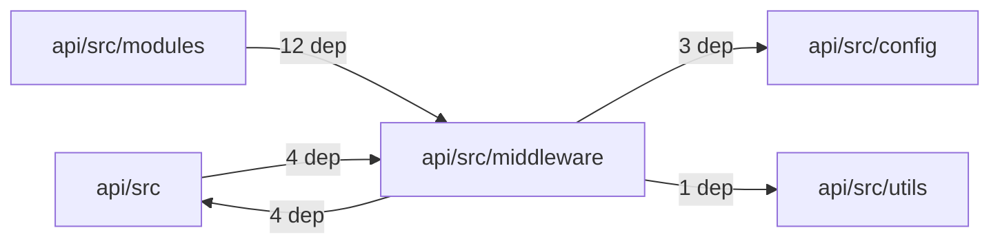
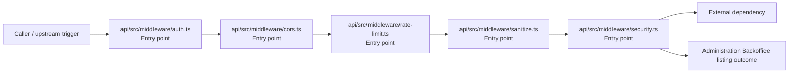

# Module api/src/middleware

- Overview: [emplus Docs Wiki](../../../../index.md)
- Summary: [SUMMARY](../../../../SUMMARY.md)
- Feature catalog: [All features](../../../../features/index.md)
- Module index: [All modules](../../index.md)
- Workspace index: [All workspaces](../../../../workspaces/index.md)

## Snapshot

- Path: `api/src/middleware`
- Descendant files: 5
- Descendant symbols: 13
- Languages: `TypeScript`
- Workspace: [@emplus/api](../../../../workspaces/api.md)

## Related Features

- [Authentication Login](../../../../features/auth-login.md) - Authentication Login captures the login workflow inside authentication. It spans 2 workspaces. Key flows include Auth login, Auth registration, Auth login.
- [Authentication Read / List](../../../../features/auth-list.md) - Authentication Read / List captures the read / list workflow inside authentication. It spans 3 workspaces.
- [User Management Login](../../../../features/user-login.md) - User Management Login captures the login workflow inside user management. It spans 2 workspaces. Key flows include Auth login, Auth registration, Auth login.
- [Search Read / List](../../../../features/search-list.md) - Search Read / List captures the read / list workflow inside search. It spans 3 workspaces.
- [Search Login](../../../../features/search-login.md) - Search Login captures the login workflow inside search. It spans 2 workspaces. Key flows include Auth login, Auth registration, Auth login.
- [Notifications Read / List](../../../../features/notification-list.md) - Notifications Read / List captures the read / list workflow inside notifications. It spans 2 workspaces.
- [Storage Read / List](../../../../features/storage-list.md) - Storage Read / List captures the read / list workflow inside storage. It spans 4 workspaces.
- [Integrations Read / List](../../../../features/integration-list.md) - Integrations Read / List captures the read / list workflow inside integrations. It spans 3 workspaces.
- [User Management Read / List](../../../../features/user-list.md) - User Management Read / List captures the read / list workflow inside user management. It spans 3 workspaces.
- [Notifications Notify](../../../../features/notification-notify.md) - Notifications Notify captures the notify workflow inside notifications. It spans 2 workspaces.
- [Order Management Login](../../../../features/order-login.md) - Order Management Login captures the login workflow inside order management. It spans 2 workspaces. Key flows include Auth login, Auth login, Auth login.
- [Notifications Login](../../../../features/notification-login.md) - Notifications Login captures the login workflow inside notifications. It spans 2 workspaces. Key flows include Auth login, Auth registration, Auth login.
- [Reporting Read / List](../../../../features/reporting-list.md) - Reporting Read / List captures the read / list workflow inside reporting. It spans 2 workspaces.
- [Search Notify](../../../../features/search-notify.md) - Search Notify captures the notify workflow inside search. It spans 2 workspaces.
- [Storage Login](../../../../features/storage-login.md) - Storage Login captures the login workflow inside storage. It spans 2 workspaces. Key flows include Auth login, Auth registration, Auth login.
- [Administration Read / List](../../../../features/admin-list.md) - Administration Read / List captures the read / list workflow inside administration. It spans 2 workspaces.
- [Authentication Verification](../../../../features/auth-verify.md) - Authentication Verification captures the verification workflow inside authentication. It spans 2 workspaces. Key flows include Credential validation, Auth login, Auth login.
- [Integrations Login](../../../../features/integration-login.md) - Integrations Login captures the login workflow inside integrations. It spans 2 workspaces. Key flows include Auth login, Auth registration, Auth login.
- [Integrations Notify](../../../../features/integration-notify.md) - Integrations Notify captures the notify workflow inside integrations. It spans 2 workspaces.
- [User Management Notify](../../../../features/user-notify.md) - User Management Notify captures the notify workflow inside user management. It spans 2 workspaces.
- [Administration Login](../../../../features/admin-login.md) - Administration Login captures the login workflow inside administration. It spans 2 workspaces. Key flows include Auth login, Auth registration, Auth login.
- [Authentication Password Reset](../../../../features/auth-reset.md) - Authentication Password Reset captures the password reset workflow inside authentication. It spans 3 workspaces. Key flows include Password reset, Password reset, Password reset.
- [Storage Notify](../../../../features/storage-notify.md) - Storage Notify captures the notify workflow inside storage. It spans 2 workspaces.
- [Order Management Read / List](../../../../features/order-list.md) - Order Management Read / List captures the read / list workflow inside order management. It spans 2 workspaces.
- [Reporting Login](../../../../features/reporting-login.md) - Reporting Login captures the login workflow inside reporting. It spans 2 workspaces. Key flows include Auth login, Auth registration, Auth login.
- [Notifications Verification](../../../../features/notification-verify.md) - Notifications Verification captures the verification workflow inside notifications. It spans 2 workspaces. Key flows include Credential validation, Auth login, Auth login.
- [Storage Verification](../../../../features/storage-verify.md) - Storage Verification captures the verification workflow inside storage. It spans 2 workspaces. Key flows include Credential validation, Auth login, Auth login.
- [Administration Notify](../../../../features/admin-notify.md) - Administration Notify captures the notify workflow inside administration. It spans 2 workspaces.
- [Administration Verification](../../../../features/admin-verify.md) - Administration Verification captures the verification workflow inside administration. It spans 2 workspaces. Key flows include Credential validation, Auth login, Auth login.
- [Integrations Verification](../../../../features/integration-verify.md) - Integrations Verification captures the verification workflow inside integrations. It spans 2 workspaces. Key flows include Credential validation, Auth login, Auth login.
- [Reporting Verification](../../../../features/reporting-verify.md) - Reporting Verification captures the verification workflow inside reporting. It spans 2 workspaces. Key flows include Credential validation, Auth login, Auth login.
- [Order Management Verification](../../../../features/order-verify.md) - Order Management Verification captures the verification workflow inside order management. It spans 2 workspaces. Key flows include Credential validation, Auth login, Auth login.
- [Order Management Notify](../../../../features/order-notify.md) - Order Management Notify captures the notify workflow inside order management. It spans 2 workspaces.

## Business Capability

/api/auth.middleware.requireAuth

## Basic Design

Middleware is inferred as a administration and backoffice area. The visible implementation layers are Entry point. The module also integrates with hono, ioredis.

### Boundaries

- Entry points: `api/src/middleware/auth.ts`, `api/src/middleware/cors.ts`, `api/src/middleware/rate-limit.ts`, `api/src/middleware/sanitize.ts`, `api/src/middleware/security.ts`
- External interfaces: `hono`, `ioredis`

## Detail Design

Primary flow coverage includes Administration Backoffice listing. Representative files are api/src/middleware/auth.ts, api/src/middleware/cors.ts, api/src/middleware/rate-limit.ts, api/src/middleware/sanitize.ts, api/src/middleware/security.ts. Observed behavior hints: Check if the provided origin is localhost or 127.0.0.1 using its hostname

### Components

- Entry point: api/src/middleware/auth.ts
- Entry point: api/src/middleware/cors.ts
- Entry point: api/src/middleware/rate-limit.ts
- Entry point: api/src/middleware/sanitize.ts
- Entry point: api/src/middleware/security.ts

## Module Interactions

- `api/src/modules` -> `api/src/middleware` (12 dependencies)
- `api/src` -> `api/src/middleware` (4 dependencies)
- `api/src/middleware` -> `api/src` (4 dependencies)
- `api/src/middleware` -> `api/src/config` (3 dependencies)
- `api/src/middleware` -> `api/src/utils` (1 dependencies)

### Interaction Diagram

## Inferred Business Flows

### Administration Backoffice listing

Execute the module's listing use case inside administration and backoffice.

#### Steps

- api/src/middleware/auth.ts receives the request and turns it into an application-level listing command. It then hands off to store.ts, AppError, http.ts.
- api/src/middleware/cors.ts receives the request and turns it into an application-level listing command. It then hands off to env.ts.
- api/src/middleware/rate-limit.ts receives the request and turns it into an application-level listing command. It then hands off to AppEnv, StoreMode, app-env.ts.
- api/src/middleware/sanitize.ts receives the request and turns it into an application-level listing command. It then hands off to app-env.ts.
- api/src/middleware/security.ts receives the request and turns it into an application-level listing command. It then hands off to app-env.ts, env.ts.

#### Flow Diagram

## Child Modules

No child modules.

## Direct Files

- [api/src/middleware/auth.ts](../../../files/api/src/middleware/auth.ts.md) — /api/auth.middleware.requireAuth
- [api/src/middleware/cors.ts](../../../files/api/src/middleware/cors.ts.md) — Check if the provided origin is localhost or 127.0.0.1 using its hostname
- [api/src/middleware/rate-limit.ts](../../../files/api/src/middleware/rate-limit.ts.md) — Rate_limitMiddleware class.
- [api/src/middleware/sanitize.ts](../../../files/api/src/middleware/sanitize.ts.md) — String sanitization handler for API requests.
- [api/src/middleware/security.ts](../../../files/api/src/middleware/security.ts.md) — Security middleware implementation.
