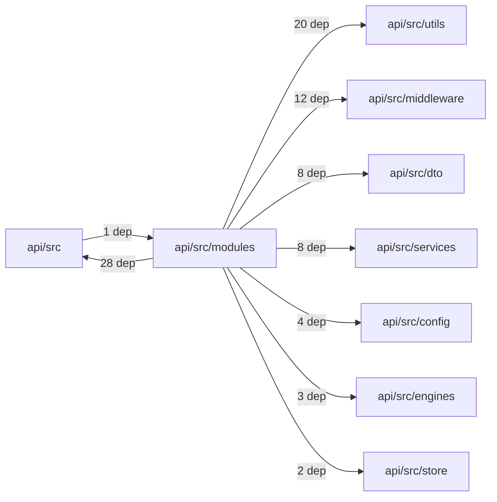
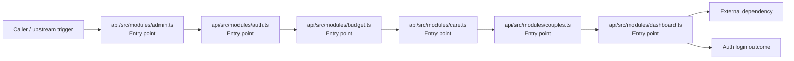

# Module api/src/modules

- Overview: [emplus Docs Wiki](../../../../index.md)
- Summary: [SUMMARY](../../../../SUMMARY.md)
- Feature catalog: [All features](../../../../features/index.md)
- Module index: [All modules](../../index.md)
- Workspace index: [All workspaces](../../../../workspaces/index.md)

## Snapshot

- Path: `api/src/modules`
- Descendant files: 16
- Descendant symbols: 21
- Languages: `TypeScript`
- Workspace: [@emplus/api](../../../../workspaces/api.md)

## Related Features

- [Authentication Login](../../../../features/auth-login.md) - Authentication Login captures the login workflow inside authentication. It spans 2 workspaces. Key flows include Auth login, Auth registration, Auth login.
- [Authentication Read / List](../../../../features/auth-list.md) - Authentication Read / List captures the read / list workflow inside authentication. It spans 3 workspaces.
- [User Management Login](../../../../features/user-login.md) - User Management Login captures the login workflow inside user management. It spans 2 workspaces. Key flows include Auth login, Auth registration, Auth login.
- [Search Read / List](../../../../features/search-list.md) - Search Read / List captures the read / list workflow inside search. It spans 3 workspaces.
- [Search Login](../../../../features/search-login.md) - Search Login captures the login workflow inside search. It spans 2 workspaces. Key flows include Auth login, Auth registration, Auth login.
- [Notifications Read / List](../../../../features/notification-list.md) - Notifications Read / List captures the read / list workflow inside notifications. It spans 2 workspaces.
- [Storage Read / List](../../../../features/storage-list.md) - Storage Read / List captures the read / list workflow inside storage. It spans 4 workspaces.
- [Integrations Read / List](../../../../features/integration-list.md) - Integrations Read / List captures the read / list workflow inside integrations. It spans 3 workspaces.
- [User Management Read / List](../../../../features/user-list.md) - User Management Read / List captures the read / list workflow inside user management. It spans 3 workspaces.
- [Notifications Notify](../../../../features/notification-notify.md) - Notifications Notify captures the notify workflow inside notifications. It spans 2 workspaces.
- [Order Management Login](../../../../features/order-login.md) - Order Management Login captures the login workflow inside order management. It spans 2 workspaces. Key flows include Auth login, Auth login, Auth login.
- [Notifications Login](../../../../features/notification-login.md) - Notifications Login captures the login workflow inside notifications. It spans 2 workspaces. Key flows include Auth login, Auth registration, Auth login.
- [Reporting Read / List](../../../../features/reporting-list.md) - Reporting Read / List captures the read / list workflow inside reporting. It spans 2 workspaces.
- [Search Notify](../../../../features/search-notify.md) - Search Notify captures the notify workflow inside search. It spans 2 workspaces.
- [Storage Login](../../../../features/storage-login.md) - Storage Login captures the login workflow inside storage. It spans 2 workspaces. Key flows include Auth login, Auth registration, Auth login.
- [Administration Read / List](../../../../features/admin-list.md) - Administration Read / List captures the read / list workflow inside administration. It spans 2 workspaces.
- [Integrations Login](../../../../features/integration-login.md) - Integrations Login captures the login workflow inside integrations. It spans 2 workspaces. Key flows include Auth login, Auth registration, Auth login.
- [Integrations Notify](../../../../features/integration-notify.md) - Integrations Notify captures the notify workflow inside integrations. It spans 2 workspaces.
- [User Management Notify](../../../../features/user-notify.md) - User Management Notify captures the notify workflow inside user management. It spans 2 workspaces.
- [Administration Login](../../../../features/admin-login.md) - Administration Login captures the login workflow inside administration. It spans 2 workspaces. Key flows include Auth login, Auth registration, Auth login.
- [Authentication Password Reset](../../../../features/auth-reset.md) - Authentication Password Reset captures the password reset workflow inside authentication. It spans 3 workspaces. Key flows include Password reset, Password reset, Password reset.
- [Storage Notify](../../../../features/storage-notify.md) - Storage Notify captures the notify workflow inside storage. It spans 2 workspaces.
- [Order Management Read / List](../../../../features/order-list.md) - Order Management Read / List captures the read / list workflow inside order management. It spans 2 workspaces.
- [Reporting Login](../../../../features/reporting-login.md) - Reporting Login captures the login workflow inside reporting. It spans 2 workspaces. Key flows include Auth login, Auth registration, Auth login.
- [Administration Notify](../../../../features/admin-notify.md) - Administration Notify captures the notify workflow inside administration. It spans 2 workspaces.
- [Order Management Notify](../../../../features/order-notify.md) - Order Management Notify captures the notify workflow inside order management. It spans 2 workspaces.

## Business Capability

JS API for the admin module.

## Basic Design

Modules is inferred as a authentication and access control area. The visible implementation layers are Entry point. The module also integrates with hono, @faker-js.

### Boundaries

- Entry points: `api/src/modules/admin.ts`, `api/src/modules/auth.ts`, `api/src/modules/budget.ts`, `api/src/modules/care.ts`, `api/src/modules/couples.ts`, `api/src/modules/dashboard.ts`
- External interfaces: `hono`, `@faker-js`

## Detail Design

Primary flow coverage includes Auth login. Representative files are api/src/modules/admin.ts, api/src/modules/auth.ts, api/src/modules/budget.ts, api/src/modules/care.ts, api/src/modules/couples.ts. Observed behavior hints: Auth module for authentication-related operations.

### Components

- Entry point: api/src/modules/admin.ts
- Entry point: api/src/modules/auth.ts
- Entry point: api/src/modules/budget.ts
- Entry point: api/src/modules/care.ts
- Entry point: api/src/modules/couples.ts
- Entry point: api/src/modules/dashboard.ts
- Entry point: api/src/modules/debug.ts
- Entry point: api/src/modules/demo-in-app-notifications.ts

## Module Interactions

- `api/src/modules` -> `api/src` (28 dependencies)
- `api/src/modules` -> `api/src/utils` (20 dependencies)
- `api/src/modules` -> `api/src/middleware` (12 dependencies)
- `api/src/modules` -> `api/src/dto` (8 dependencies)
- `api/src/modules` -> `api/src/services` (8 dependencies)
- `api/src/modules` -> `api/src/config` (4 dependencies)
- `api/src/modules` -> `api/src/engines` (3 dependencies)
- `api/src/modules` -> `api/src/store` (2 dependencies)
- `api/src` -> `api/src/modules` (1 dependencies)

### Interaction Diagram

## Inferred Business Flows

### Auth login

Authenticate the caller, validate credentials, and establish a usable session or token.

#### Steps

- api/src/modules/admin.ts receives the request and turns it into an application-level login command. It then hands off to app-env.ts, auth.ts, store.ts.
- api/src/modules/auth.ts receives the request and turns it into an application-level login command. It then hands off to app-env.ts, auth.dto.ts, auth.ts.
- api/src/modules/budget.ts receives the request and turns it into an application-level login command. It then hands off to app-env.ts, budget.dto.ts, auth.ts.
- api/src/modules/care.ts receives the request and turns it into an application-level login command. It then hands off to store.ts, User, AppError.
- api/src/modules/couples.ts receives the request and turns it into an application-level login command. It then hands off to app-env.ts, couples.dto.ts, auth.ts.
- api/src/modules/dashboard.ts receives the request and turns it into an application-level login command. It then hands off to app-env.ts, env.ts, anniversary.ts.

#### Flow Diagram

## Child Modules

No child modules.

## Direct Files

- [api/src/modules/admin.ts](../../../files/api/src/modules/admin.ts.md) — JS API for the admin module.
- [api/src/modules/auth.ts](../../../files/api/src/modules/auth.ts.md) — Auth module for authentication-related operations.
- [api/src/modules/budget.ts](../../../files/api/src/modules/budget.ts.md) — Provides 0 documented symbols in api/src/modules/budget.ts.
- [api/src/modules/care.ts](../../../files/api/src/modules/care.ts.md) — Function to retrieve a partner from the system.
- [api/src/modules/couples.ts](../../../files/api/src/modules/couples.ts.md) — Module that interacts with couples API
- [api/src/modules/dashboard.ts](../../../files/api/src/modules/dashboard.ts.md) — Function to retrieve the number of users in the dashboard data source.
- [api/src/modules/debug.ts](../../../files/api/src/modules/debug.ts.md) — File contents for the debug module.
- [api/src/modules/demo-in-app-notifications.ts](../../../files/api/src/modules/demo-in-app-notifications.ts.md) — Provides 2 documented symbols in api/src/modules/demo-in-app-notifications.ts.
- [api/src/modules/demo-timeline-memories.ts](../../../files/api/src/modules/demo-timeline-memories.ts.md) — File: api/src/modules/demo-timeline-memories.ts
- [api/src/modules/index.ts](../../../files/api/src/modules/index.ts.md) — Entry point module for the application, typically used as a starting point for other modules.
- [api/src/modules/live.ts](../../../files/api/src/modules/live.ts.md) — Provides 11 documented symbols in api/src/modules/live.ts.
- [api/src/modules/media.ts](../../../files/api/src/modules/media.ts.md) — Determines the file extension of a given MIME type for image formats.
- [api/src/modules/notifications.ts](../../../files/api/src/modules/notifications.ts.md) — Module for handling notifications in the application.
- [api/src/modules/system.ts](../../../files/api/src/modules/system.ts.md) — Provides 0 documented symbols in api/src/modules/system.ts.
- [api/src/modules/timeline.ts](../../../files/api/src/modules/timeline.ts.md) — Timeline module
- [api/src/modules/user.ts](../../../files/api/src/modules/user.ts.md) — User module implementation.
