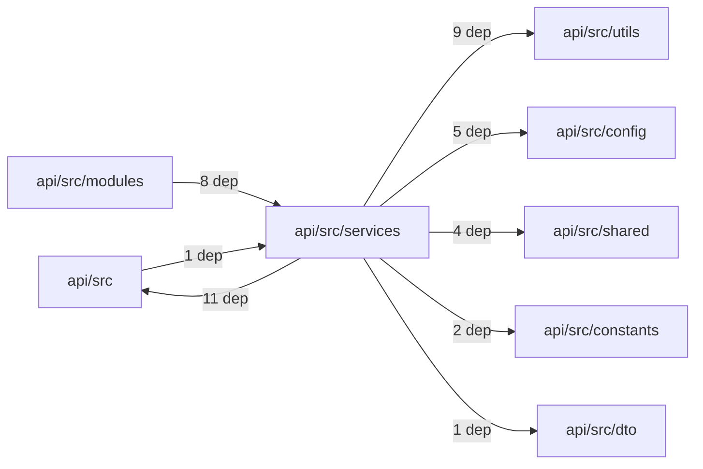
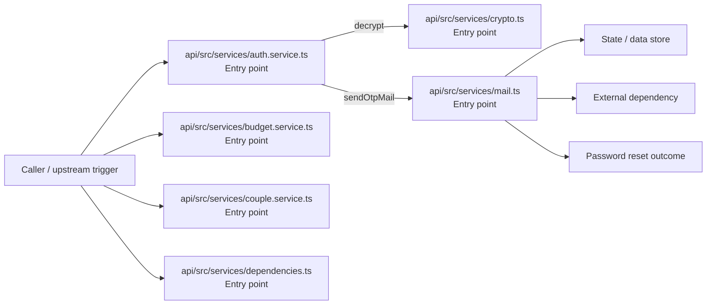
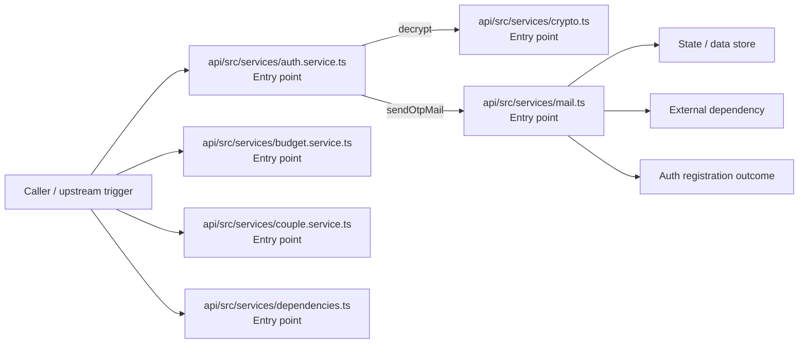

# Module api/src/services

- Overview: [emplus Docs Wiki](../../../../index.md)
- Summary: [SUMMARY](../../../../SUMMARY.md)
- Feature catalog: [All features](../../../../features/index.md)
- Module index: [All modules](../../index.md)
- Workspace index: [All workspaces](../../../../workspaces/index.md)

## Snapshot

- Path: `api/src/services`
- Descendant files: 11
- Descendant symbols: 56
- Languages: `TypeScript`
- Workspace: [@emplus/api](../../../../workspaces/api.md)

## Related Features

- [Authentication Login](../../../../features/auth-login.md) - Authentication Login captures the login workflow inside authentication. It spans 2 workspaces. Key flows include Auth login, Auth registration, Auth login.
- [Authentication Read / List](../../../../features/auth-list.md) - Authentication Read / List captures the read / list workflow inside authentication. It spans 3 workspaces.
- [User Management Login](../../../../features/user-login.md) - User Management Login captures the login workflow inside user management. It spans 2 workspaces. Key flows include Auth login, Auth registration, Auth login.
- [Search Read / List](../../../../features/search-list.md) - Search Read / List captures the read / list workflow inside search. It spans 3 workspaces.
- [Search Login](../../../../features/search-login.md) - Search Login captures the login workflow inside search. It spans 2 workspaces. Key flows include Auth login, Auth registration, Auth login.
- [Notifications Read / List](../../../../features/notification-list.md) - Notifications Read / List captures the read / list workflow inside notifications. It spans 2 workspaces.
- [Storage Read / List](../../../../features/storage-list.md) - Storage Read / List captures the read / list workflow inside storage. It spans 4 workspaces.
- [Integrations Read / List](../../../../features/integration-list.md) - Integrations Read / List captures the read / list workflow inside integrations. It spans 3 workspaces.
- [User Management Read / List](../../../../features/user-list.md) - User Management Read / List captures the read / list workflow inside user management. It spans 3 workspaces.
- [Notifications Notify](../../../../features/notification-notify.md) - Notifications Notify captures the notify workflow inside notifications. It spans 2 workspaces.
- [Order Management Login](../../../../features/order-login.md) - Order Management Login captures the login workflow inside order management. It spans 2 workspaces. Key flows include Auth login, Auth login, Auth login.
- [Notifications Login](../../../../features/notification-login.md) - Notifications Login captures the login workflow inside notifications. It spans 2 workspaces. Key flows include Auth login, Auth registration, Auth login.
- [Reporting Read / List](../../../../features/reporting-list.md) - Reporting Read / List captures the read / list workflow inside reporting. It spans 2 workspaces.
- [Search Notify](../../../../features/search-notify.md) - Search Notify captures the notify workflow inside search. It spans 2 workspaces.
- [Storage Login](../../../../features/storage-login.md) - Storage Login captures the login workflow inside storage. It spans 2 workspaces. Key flows include Auth login, Auth registration, Auth login.
- [Administration Read / List](../../../../features/admin-list.md) - Administration Read / List captures the read / list workflow inside administration. It spans 2 workspaces.
- [Authentication Verification](../../../../features/auth-verify.md) - Authentication Verification captures the verification workflow inside authentication. It spans 2 workspaces. Key flows include Credential validation, Auth login, Auth login.
- [Integrations Login](../../../../features/integration-login.md) - Integrations Login captures the login workflow inside integrations. It spans 2 workspaces. Key flows include Auth login, Auth registration, Auth login.
- [Integrations Notify](../../../../features/integration-notify.md) - Integrations Notify captures the notify workflow inside integrations. It spans 2 workspaces.
- [Search Create](../../../../features/search-create.md) - Search Create captures the create workflow inside search. It spans 2 workspaces.
- [User Management Notify](../../../../features/user-notify.md) - User Management Notify captures the notify workflow inside user management. It spans 2 workspaces.
- [Administration Login](../../../../features/admin-login.md) - Administration Login captures the login workflow inside administration. It spans 2 workspaces. Key flows include Auth login, Auth registration, Auth login.
- [Authentication Password Reset](../../../../features/auth-reset.md) - Authentication Password Reset captures the password reset workflow inside authentication. It spans 3 workspaces. Key flows include Password reset, Password reset, Password reset.
- [Storage Notify](../../../../features/storage-notify.md) - Storage Notify captures the notify workflow inside storage. It spans 2 workspaces.
- [User Management Create](../../../../features/user-create.md) - User Management Create captures the create workflow inside user management. It spans 2 workspaces.
- [Order Management Read / List](../../../../features/order-list.md) - Order Management Read / List captures the read / list workflow inside order management. It spans 2 workspaces.
- [Reporting Login](../../../../features/reporting-login.md) - Reporting Login captures the login workflow inside reporting. It spans 2 workspaces. Key flows include Auth login, Auth registration, Auth login.
- [Notifications Verification](../../../../features/notification-verify.md) - Notifications Verification captures the verification workflow inside notifications. It spans 2 workspaces. Key flows include Credential validation, Auth login, Auth login.
- [Storage Verification](../../../../features/storage-verify.md) - Storage Verification captures the verification workflow inside storage. It spans 2 workspaces. Key flows include Credential validation, Auth login, Auth login.
- [Administration Notify](../../../../features/admin-notify.md) - Administration Notify captures the notify workflow inside administration. It spans 2 workspaces.
- [Administration Verification](../../../../features/admin-verify.md) - Administration Verification captures the verification workflow inside administration. It spans 2 workspaces. Key flows include Credential validation, Auth login, Auth login.
- [Integrations Verification](../../../../features/integration-verify.md) - Integrations Verification captures the verification workflow inside integrations. It spans 2 workspaces. Key flows include Credential validation, Auth login, Auth login.
- [Reporting Verification](../../../../features/reporting-verify.md) - Reporting Verification captures the verification workflow inside reporting. It spans 2 workspaces. Key flows include Credential validation, Auth login, Auth login.
- [Order Management Verification](../../../../features/order-verify.md) - Order Management Verification captures the verification workflow inside order management. It spans 2 workspaces. Key flows include Credential validation, Auth login, Auth login.
- [Order Management Notify](../../../../features/order-notify.md) - Order Management Notify captures the notify workflow inside order management. It spans 2 workspaces.

## Business Capability

Authentication Service API

## Basic Design

Services is inferred as a authentication and access control area. The visible implementation layers are Entry point. State is likely persisted in session / token state, primary database. The module also integrates with node, ioredis, postgres, nodemailer, minio.

### Boundaries

- Entry points: `api/src/services/auth.service.ts`, `api/src/services/budget.service.ts`, `api/src/services/couple.service.ts`, `api/src/services/crypto.ts`, `api/src/services/dependencies.ts`, `api/src/services/mail.ts`
- Data stores: Session / token state, Primary database
- External interfaces: `node`, `ioredis`, `postgres`, `nodemailer`, `minio`

## Detail Design

Primary flow coverage includes Auth login, Password reset, Auth registration. Representative files are api/src/services/auth.service.ts, api/src/services/budget.service.ts, api/src/services/couple.service.ts, api/src/services/crypto.ts, api/src/services/dependencies.ts. Observed behavior hints: Budget Service Interface Summary

### Components

- Entry point: api/src/services/auth.service.ts
- Entry point: api/src/services/budget.service.ts
- Entry point: api/src/services/couple.service.ts
- Entry point: api/src/services/crypto.ts
- Entry point: api/src/services/dependencies.ts
- Entry point: api/src/services/mail.ts
- Entry point: api/src/services/media-storage.ts
- Entry point: api/src/services/notification.service.ts

## Module Interactions

- `api/src/services` -> `api/src` (11 dependencies)
- `api/src/services` -> `api/src/utils` (9 dependencies)
- `api/src/modules` -> `api/src/services` (8 dependencies)
- `api/src/services` -> `api/src/config` (5 dependencies)
- `api/src/services` -> `api/src/shared` (4 dependencies)
- `api/src/services` -> `api/src/constants` (2 dependencies)
- `api/src` -> `api/src/services` (1 dependencies)
- `api/src/services` -> `api/src/dto` (1 dependencies)

### Interaction Diagram

## Inferred Business Flows

### Auth login

Authenticate the caller, validate credentials, and establish a usable session or token.

#### Steps

- api/src/services/auth.service.ts receives the request and turns it into an application-level login command. It then hands off to index.ts, generateNumericCode, generateTokens.
- api/src/services/budget.service.ts receives the request and turns it into an application-level login command. It then hands off to StoreMode, mapDisplayStatusToInternal, store.ts.
- api/src/services/couple.service.ts receives the request and turns it into an application-level login command. It then hands off to index.ts, formatDate, store.ts.
- api/src/services/crypto.ts receives the request and turns it into an application-level login command.
- api/src/services/dependencies.ts receives the request and turns it into an application-level login command. It then hands off to StoreMode, env.ts.
- api/src/services/mail.ts receives the request and turns it into an application-level login command. It then hands off to StoreMode, env.ts.

#### Flow Diagram

```mermaid
flowchart LR
  caller["Caller / upstream trigger"]
  n1_auth_service_ts["api/src/services/auth.service.ts\nEntry point"]
  n2_budget_service_ts["api/src/services/budget.service.ts\nEntry point"]
  n3_couple_service_ts["api/src/services/couple.service.ts\nEntry point"]
  n4_crypto_ts["api/src/services/crypto.ts\nEntry point"]
  n5_dependencies_ts["api/src/services/dependencies.ts\nEntry point"]
  n6_mail_ts["api/src/services/mail.ts\nEntry point"]
  caller --> n1_auth_service_ts
  caller --> n2_budget_service_ts
  caller --> n3_couple_service_ts
  caller --> n5_dependencies_ts
  n1_auth_service_ts -->|"decrypt"| n4_crypto_ts
  n1_auth_service_ts -->|"sendOtpMail"| n6_mail_ts
  store["State / data store"]
  n6_mail_ts --> store
  ext["External dependency"]
  n6_mail_ts --> ext
  outcome["Auth login outcome"]
  n6_mail_ts --> outcome
```

### Password reset

Execute the module's password reset use case inside authentication and access control.

#### Steps

- api/src/services/auth.service.ts receives the request and turns it into an application-level password reset command. It then hands off to index.ts, generateNumericCode, generateTokens.
- api/src/services/budget.service.ts receives the request and turns it into an application-level password reset command. It then hands off to StoreMode, mapDisplayStatusToInternal, store.ts.
- api/src/services/couple.service.ts receives the request and turns it into an application-level password reset command. It then hands off to index.ts, formatDate, store.ts.
- api/src/services/crypto.ts receives the request and turns it into an application-level password reset command.
- api/src/services/dependencies.ts receives the request and turns it into an application-level password reset command. It then hands off to StoreMode, env.ts.
- api/src/services/mail.ts receives the request and turns it into an application-level password reset command. It then hands off to StoreMode, env.ts.

#### Flow Diagram

### Auth registration

Execute the module's registration use case inside authentication and access control.

#### Steps

- api/src/services/auth.service.ts receives the request and turns it into an application-level registration command. It then hands off to index.ts, generateNumericCode, generateTokens.
- api/src/services/budget.service.ts receives the request and turns it into an application-level registration command. It then hands off to StoreMode, mapDisplayStatusToInternal, store.ts.
- api/src/services/couple.service.ts receives the request and turns it into an application-level registration command. It then hands off to index.ts, formatDate, store.ts.
- api/src/services/crypto.ts receives the request and turns it into an application-level registration command.
- api/src/services/dependencies.ts receives the request and turns it into an application-level registration command. It then hands off to StoreMode, env.ts.
- api/src/services/mail.ts receives the request and turns it into an application-level registration command. It then hands off to StoreMode, env.ts.

#### Flow Diagram

## Child Modules

No child modules.

## Direct Files

- [api/src/services/auth.service.ts](../../../files/api/src/services/auth.service.ts.md) — Authentication Service API
- [api/src/services/budget.service.ts](../../../files/api/src/services/budget.service.ts.md) — Budget Service Interface Summary
- [api/src/services/couple.service.ts](../../../files/api/src/services/couple.service.ts.md) — An endpoint to generate an invite for joining a couple.
- [api/src/services/crypto.ts](../../../files/api/src/services/crypto.ts.md) — Encryption Key and Mode Resolution
- [api/src/services/dependencies.ts](../../../files/api/src/services/dependencies.ts.md) — Dependency services for monitoring database, Redis and Minio health
- [api/src/services/mail.ts](../../../files/api/src/services/mail.ts.md) — API function to send email notifications.
- [api/src/services/media-storage.ts](../../../files/api/src/services/media-storage.ts.md) — Minio Client and Public Object URL Builder
- [api/src/services/notification.service.ts](../../../files/api/src/services/notification.service.ts.md) — The `notify` function is an asynchronous API endpoint that creates and sends push or email notifications to users.
- [api/src/services/push.ts](../../../files/api/src/services/push.ts.md) — The sendExpoPush function sends Expo push notifications.
- [api/src/services/session-cleanup.ts](../../../files/api/src/services/session-cleanup.ts.md) — Session cleanup function.
- [api/src/services/user.service.ts](../../../files/api/src/services/user.service.ts.md) — Provides 3 documented symbols in api/src/services/user.service.ts.
