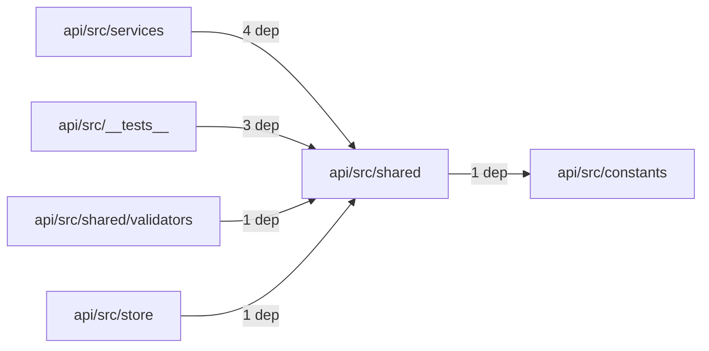
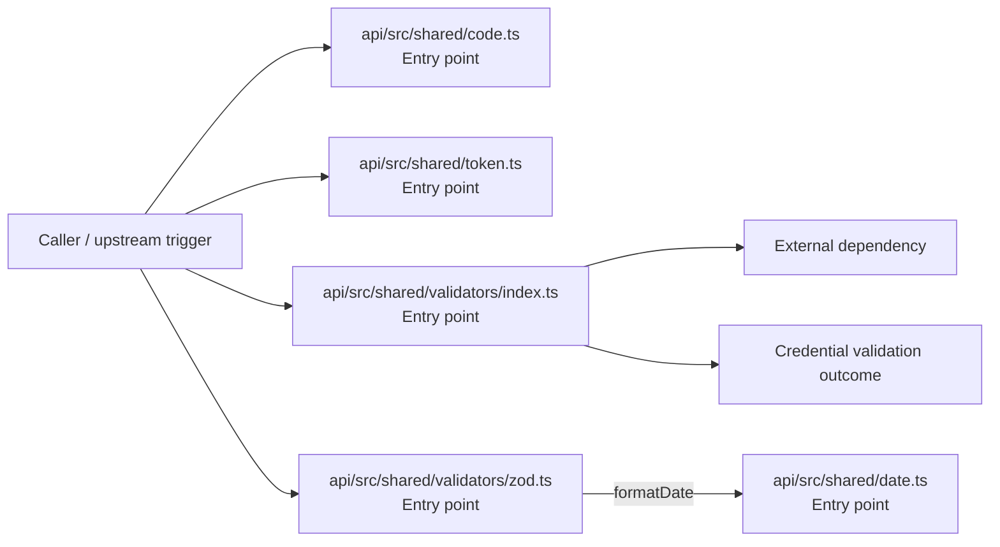

# Module api/src/shared

- Overview: [emplus Docs Wiki](../../../../index.md)
- Summary: [SUMMARY](../../../../SUMMARY.md)
- Feature catalog: [All features](../../../../features/index.md)
- Module index: [All modules](../../index.md)
- Workspace index: [All workspaces](../../../../workspaces/index.md)

## Snapshot

- Path: `api/src/shared`
- Descendant files: 5
- Descendant symbols: 25
- Languages: `TypeScript`
- Workspace: [@emplus/api](../../../../workspaces/api.md)

## Related Features

- [Authentication Read / List](../../../../features/auth-list.md) - Authentication Read / List captures the read / list workflow inside authentication. It spans 3 workspaces.
- [Search Read / List](../../../../features/search-list.md) - Search Read / List captures the read / list workflow inside search. It spans 3 workspaces.
- [Notifications Read / List](../../../../features/notification-list.md) - Notifications Read / List captures the read / list workflow inside notifications. It spans 2 workspaces.
- [Storage Read / List](../../../../features/storage-list.md) - Storage Read / List captures the read / list workflow inside storage. It spans 4 workspaces.
- [Integrations Read / List](../../../../features/integration-list.md) - Integrations Read / List captures the read / list workflow inside integrations. It spans 3 workspaces.
- [User Management Read / List](../../../../features/user-list.md) - User Management Read / List captures the read / list workflow inside user management. It spans 3 workspaces.
- [Notifications Notify](../../../../features/notification-notify.md) - Notifications Notify captures the notify workflow inside notifications. It spans 2 workspaces.
- [Reporting Read / List](../../../../features/reporting-list.md) - Reporting Read / List captures the read / list workflow inside reporting. It spans 2 workspaces.
- [Search Notify](../../../../features/search-notify.md) - Search Notify captures the notify workflow inside search. It spans 2 workspaces.
- [Administration Read / List](../../../../features/admin-list.md) - Administration Read / List captures the read / list workflow inside administration. It spans 2 workspaces.
- [Authentication Verification](../../../../features/auth-verify.md) - Authentication Verification captures the verification workflow inside authentication. It spans 2 workspaces. Key flows include Credential validation, Auth login, Auth login.
- [Integrations Notify](../../../../features/integration-notify.md) - Integrations Notify captures the notify workflow inside integrations. It spans 2 workspaces.
- [Search Create](../../../../features/search-create.md) - Search Create captures the create workflow inside search. It spans 2 workspaces.
- [User Management Notify](../../../../features/user-notify.md) - User Management Notify captures the notify workflow inside user management. It spans 2 workspaces.
- [Storage Notify](../../../../features/storage-notify.md) - Storage Notify captures the notify workflow inside storage. It spans 2 workspaces.
- [User Management Create](../../../../features/user-create.md) - User Management Create captures the create workflow inside user management. It spans 2 workspaces.
- [Order Management Read / List](../../../../features/order-list.md) - Order Management Read / List captures the read / list workflow inside order management. It spans 2 workspaces.
- [Notifications Verification](../../../../features/notification-verify.md) - Notifications Verification captures the verification workflow inside notifications. It spans 2 workspaces. Key flows include Credential validation, Auth login, Auth login.
- [Storage Verification](../../../../features/storage-verify.md) - Storage Verification captures the verification workflow inside storage. It spans 2 workspaces. Key flows include Credential validation, Auth login, Auth login.
- [Administration Notify](../../../../features/admin-notify.md) - Administration Notify captures the notify workflow inside administration. It spans 2 workspaces.
- [Administration Verification](../../../../features/admin-verify.md) - Administration Verification captures the verification workflow inside administration. It spans 2 workspaces. Key flows include Credential validation, Auth login, Auth login.
- [Integrations Verification](../../../../features/integration-verify.md) - Integrations Verification captures the verification workflow inside integrations. It spans 2 workspaces. Key flows include Credential validation, Auth login, Auth login.
- [Reporting Verification](../../../../features/reporting-verify.md) - Reporting Verification captures the verification workflow inside reporting. It spans 2 workspaces. Key flows include Credential validation, Auth login, Auth login.
- [Order Management Verification](../../../../features/order-verify.md) - Order Management Verification captures the verification workflow inside order management. It spans 2 workspaces. Key flows include Credential validation, Auth login, Auth login.
- [Order Management Notify](../../../../features/order-notify.md) - Order Management Notify captures the notify workflow inside order management. It spans 2 workspaces.

## Business Capability

Code generation functions for numeric and invite code creation using crypto library.

## Basic Design

Shared is inferred as a authentication and access control area. The visible implementation layers are Entry point. The module also integrates with zod.

### Boundaries

- Entry points: `api/src/shared/code.ts`, `api/src/shared/date.ts`, `api/src/shared/token.ts`, `api/src/shared/validators/index.ts`, `api/src/shared/validators/zod.ts`
- External interfaces: `zod`

## Detail Design

Primary flow coverage includes Credential validation. Representative files are api/src/shared/code.ts, api/src/shared/date.ts, api/src/shared/token.ts, api/src/shared/validators/index.ts, api/src/shared/validators/zod.ts. Observed behavior hints: Date utilities for formatting and calculating dates in UTF-8

### Components

- Entry point: api/src/shared/code.ts
- Entry point: api/src/shared/date.ts
- Entry point: api/src/shared/token.ts
- Entry point: api/src/shared/validators/index.ts
- Entry point: api/src/shared/validators/zod.ts

## Module Interactions

- `api/src/services` -> `api/src/shared` (4 dependencies)
- `api/src/__tests__` -> `api/src/shared` (3 dependencies)
- `api/src/shared` -> `api/src/constants` (1 dependencies)
- `api/src/shared/validators` -> `api/src/shared` (1 dependencies)
- `api/src/store` -> `api/src/shared` (1 dependencies)

### Interaction Diagram

## Inferred Business Flows

### Credential validation

Execute the module's verification use case inside authentication and access control.

#### Steps

- api/src/shared/code.ts receives the request and turns it into an application-level verification command.
- api/src/shared/date.ts receives the request and turns it into an application-level verification command.
- api/src/shared/token.ts receives the request and turns it into an application-level verification command. It then hands off to index.ts.
- api/src/shared/validators/index.ts receives the request and turns it into an application-level verification command.
- api/src/shared/validators/zod.ts receives the request and turns it into an application-level verification command. It then hands off to formatDate, AppError, date.ts.

#### Flow Diagram

## Child Modules

- [api/src/shared/validators](shared/validators.md) - 2 files, 10 symbols

## Direct Files

- [api/src/shared/code.ts](../../../files/api/src/shared/code.ts.md) — Code generation functions for numeric and invite code creation using crypto library.
- [api/src/shared/date.ts](../../../files/api/src/shared/date.ts.md) — Date utilities for formatting and calculating dates in UTF-8
- [api/src/shared/token.ts](../../../files/api/src/shared/token.ts.md) — Token pair management function with access token and refresh token generation.
