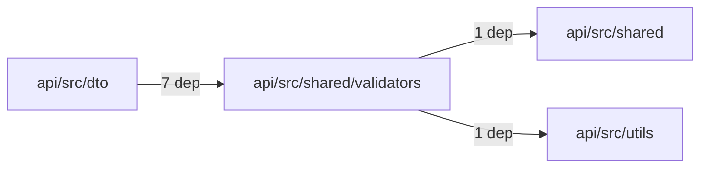
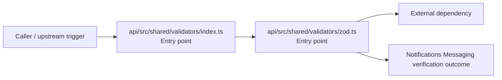

# Module api/src/shared/validators

- Overview: [emplus Docs Wiki](../../../../../index.md)
- Summary: [SUMMARY](../../../../../SUMMARY.md)
- Feature catalog: [All features](../../../../../features/index.md)
- Module index: [All modules](../../../index.md)
- Workspace index: [All workspaces](../../../../../workspaces/index.md)

## Snapshot

- Path: `api/src/shared/validators`
- Descendant files: 2
- Descendant symbols: 10
- Languages: `TypeScript`
- Workspace: [@emplus/api](../../../../../workspaces/api.md)

## Related Features

- [Notifications Notify](../../../../../features/notification-notify.md) - Notifications Notify captures the notify workflow inside notifications. It spans 2 workspaces.
- [Search Notify](../../../../../features/search-notify.md) - Search Notify captures the notify workflow inside search. It spans 2 workspaces.
- [Authentication Verification](../../../../../features/auth-verify.md) - Authentication Verification captures the verification workflow inside authentication. It spans 2 workspaces. Key flows include Credential validation, Auth login, Auth login.
- [Integrations Notify](../../../../../features/integration-notify.md) - Integrations Notify captures the notify workflow inside integrations. It spans 2 workspaces.
- [User Management Notify](../../../../../features/user-notify.md) - User Management Notify captures the notify workflow inside user management. It spans 2 workspaces.
- [Storage Notify](../../../../../features/storage-notify.md) - Storage Notify captures the notify workflow inside storage. It spans 2 workspaces.
- [Notifications Verification](../../../../../features/notification-verify.md) - Notifications Verification captures the verification workflow inside notifications. It spans 2 workspaces. Key flows include Credential validation, Auth login, Auth login.
- [Storage Verification](../../../../../features/storage-verify.md) - Storage Verification captures the verification workflow inside storage. It spans 2 workspaces. Key flows include Credential validation, Auth login, Auth login.
- [Administration Notify](../../../../../features/admin-notify.md) - Administration Notify captures the notify workflow inside administration. It spans 2 workspaces.
- [Administration Verification](../../../../../features/admin-verify.md) - Administration Verification captures the verification workflow inside administration. It spans 2 workspaces. Key flows include Credential validation, Auth login, Auth login.
- [Integrations Verification](../../../../../features/integration-verify.md) - Integrations Verification captures the verification workflow inside integrations. It spans 2 workspaces. Key flows include Credential validation, Auth login, Auth login.
- [Reporting Verification](../../../../../features/reporting-verify.md) - Reporting Verification captures the verification workflow inside reporting. It spans 2 workspaces. Key flows include Credential validation, Auth login, Auth login.
- [Order Management Verification](../../../../../features/order-verify.md) - Order Management Verification captures the verification workflow inside order management. It spans 2 workspaces. Key flows include Credential validation, Auth login, Auth login.
- [Order Management Notify](../../../../../features/order-notify.md) - Order Management Notify captures the notify workflow inside order management. It spans 2 workspaces.

## Business Capability

Validation functions and utilities for the API shared library

## Basic Design

Validators is inferred as a notifications and messaging area. The visible implementation layers are Entry point. The module also integrates with zod.

### Boundaries

- Entry points: `api/src/shared/validators/index.ts`, `api/src/shared/validators/zod.ts`
- External interfaces: `zod`

## Detail Design

Primary flow coverage includes Notifications Messaging verification. Representative files are api/src/shared/validators/index.ts, api/src/shared/validators/zod.ts. Observed behavior hints: Provides 10 documented symbols in api/src/shared/validators/zod.ts.

### Components

- Entry point: api/src/shared/validators/index.ts
- Entry point: api/src/shared/validators/zod.ts

## Module Interactions

- `api/src/dto` -> `api/src/shared/validators` (7 dependencies)
- `api/src/shared/validators` -> `api/src/shared` (1 dependencies)
- `api/src/shared/validators` -> `api/src/utils` (1 dependencies)

### Interaction Diagram

## Inferred Business Flows

### Notifications Messaging verification

Execute the module's verification use case inside notifications and messaging.

#### Steps

- api/src/shared/validators/index.ts receives the request and turns it into an application-level verification command.
- api/src/shared/validators/zod.ts receives the request and turns it into an application-level verification command. It then hands off to formatDate, AppError, date.ts.

#### Flow Diagram

## Child Modules

No child modules.

## Direct Files

- [api/src/shared/validators/index.ts](../../../../files/api/src/shared/validators/index.ts.md) — Validation functions and utilities for the API shared library
- [api/src/shared/validators/zod.ts](../../../../files/api/src/shared/validators/zod.ts.md) — Provides 10 documented symbols in api/src/shared/validators/zod.ts.
