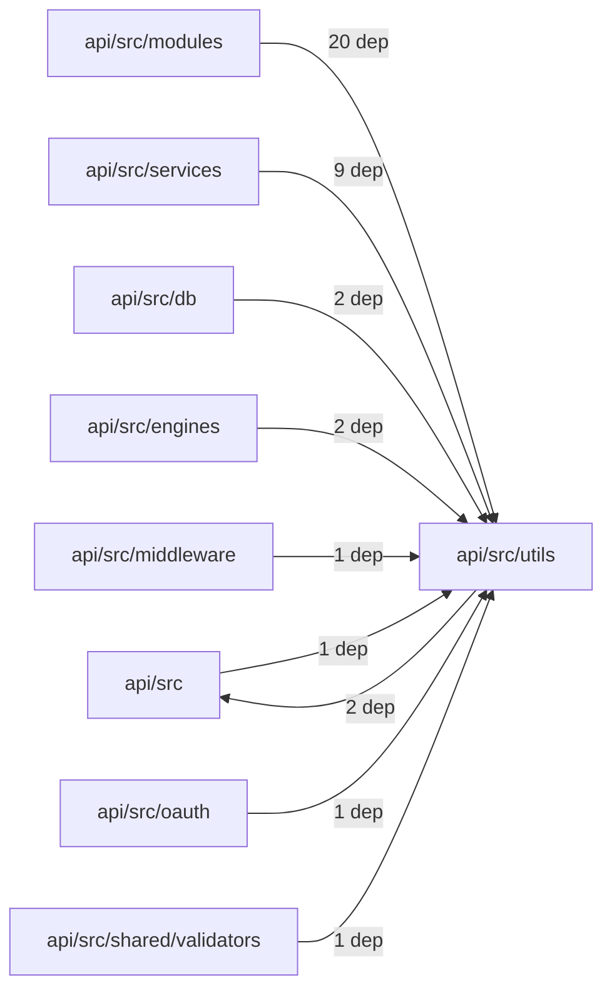
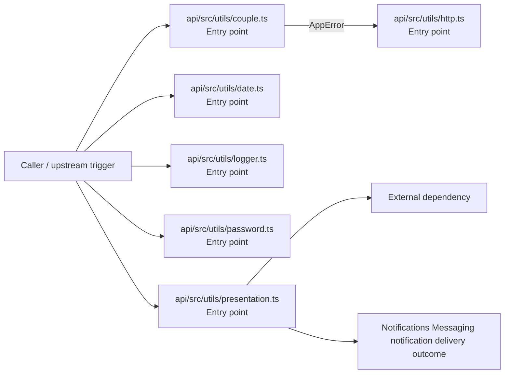

# Module api/src/utils

- Overview: [emplus Docs Wiki](../../../../index.md)
- Summary: [SUMMARY](../../../../SUMMARY.md)
- Feature catalog: [All features](../../../../features/index.md)
- Module index: [All modules](../../index.md)
- Workspace index: [All workspaces](../../../../workspaces/index.md)

## Snapshot

- Path: `api/src/utils`
- Descendant files: 6
- Descendant symbols: 22
- Languages: `TypeScript`
- Workspace: [@emplus/api](../../../../workspaces/api.md)

## Related Features

- [Authentication Read / List](../../../../features/auth-list.md) - Authentication Read / List captures the read / list workflow inside authentication. It spans 3 workspaces.
- [Search Read / List](../../../../features/search-list.md) - Search Read / List captures the read / list workflow inside search. It spans 3 workspaces.
- [Notifications Read / List](../../../../features/notification-list.md) - Notifications Read / List captures the read / list workflow inside notifications. It spans 2 workspaces.
- [Storage Read / List](../../../../features/storage-list.md) - Storage Read / List captures the read / list workflow inside storage. It spans 4 workspaces.
- [Integrations Read / List](../../../../features/integration-list.md) - Integrations Read / List captures the read / list workflow inside integrations. It spans 3 workspaces.
- [User Management Read / List](../../../../features/user-list.md) - User Management Read / List captures the read / list workflow inside user management. It spans 3 workspaces.
- [Notifications Notify](../../../../features/notification-notify.md) - Notifications Notify captures the notify workflow inside notifications. It spans 2 workspaces.
- [Reporting Read / List](../../../../features/reporting-list.md) - Reporting Read / List captures the read / list workflow inside reporting. It spans 2 workspaces.
- [Search Notify](../../../../features/search-notify.md) - Search Notify captures the notify workflow inside search. It spans 2 workspaces.
- [Administration Read / List](../../../../features/admin-list.md) - Administration Read / List captures the read / list workflow inside administration. It spans 2 workspaces.
- [Authentication Verification](../../../../features/auth-verify.md) - Authentication Verification captures the verification workflow inside authentication. It spans 2 workspaces. Key flows include Credential validation, Auth login, Auth login.
- [Integrations Notify](../../../../features/integration-notify.md) - Integrations Notify captures the notify workflow inside integrations. It spans 2 workspaces.
- [User Management Notify](../../../../features/user-notify.md) - User Management Notify captures the notify workflow inside user management. It spans 2 workspaces.
- [Authentication Password Reset](../../../../features/auth-reset.md) - Authentication Password Reset captures the password reset workflow inside authentication. It spans 3 workspaces. Key flows include Password reset, Password reset, Password reset.
- [Storage Notify](../../../../features/storage-notify.md) - Storage Notify captures the notify workflow inside storage. It spans 2 workspaces.
- [Order Management Read / List](../../../../features/order-list.md) - Order Management Read / List captures the read / list workflow inside order management. It spans 2 workspaces.
- [Notifications Verification](../../../../features/notification-verify.md) - Notifications Verification captures the verification workflow inside notifications. It spans 2 workspaces. Key flows include Credential validation, Auth login, Auth login.
- [Storage Verification](../../../../features/storage-verify.md) - Storage Verification captures the verification workflow inside storage. It spans 2 workspaces. Key flows include Credential validation, Auth login, Auth login.
- [Administration Notify](../../../../features/admin-notify.md) - Administration Notify captures the notify workflow inside administration. It spans 2 workspaces.
- [Administration Verification](../../../../features/admin-verify.md) - Administration Verification captures the verification workflow inside administration. It spans 2 workspaces. Key flows include Credential validation, Auth login, Auth login.
- [Integrations Verification](../../../../features/integration-verify.md) - Integrations Verification captures the verification workflow inside integrations. It spans 2 workspaces. Key flows include Credential validation, Auth login, Auth login.
- [Reporting Verification](../../../../features/reporting-verify.md) - Reporting Verification captures the verification workflow inside reporting. It spans 2 workspaces. Key flows include Credential validation, Auth login, Auth login.
- [Order Management Verification](../../../../features/order-verify.md) - Order Management Verification captures the verification workflow inside order management. It spans 2 workspaces. Key flows include Credential validation, Auth login, Auth login.
- [Order Management Notify](../../../../features/order-notify.md) - Order Management Notify captures the notify workflow inside order management. It spans 2 workspaces.

## Business Capability

Gets the ID of the currently active couple for a given user.

## Basic Design

Utils is inferred as a notifications and messaging area. The visible implementation layers are Entry point. The module also integrates with hono, node.

### Boundaries

- Entry points: `api/src/utils/couple.ts`, `api/src/utils/date.ts`, `api/src/utils/http.ts`, `api/src/utils/logger.ts`, `api/src/utils/password.ts`, `api/src/utils/presentation.ts`
- External interfaces: `hono`, `node`

## Detail Design

Primary flow coverage includes Notifications Messaging notification delivery. Representative files are api/src/utils/couple.ts, api/src/utils/date.ts, api/src/utils/http.ts, api/src/utils/logger.ts, api/src/utils/password.ts. Observed behavior hints: A utility file for date-related functions.

### Components

- Entry point: api/src/utils/couple.ts
- Entry point: api/src/utils/date.ts
- Entry point: api/src/utils/http.ts
- Entry point: api/src/utils/logger.ts
- Entry point: api/src/utils/password.ts
- Entry point: api/src/utils/presentation.ts

## Module Interactions

- `api/src/modules` -> `api/src/utils` (20 dependencies)
- `api/src/services` -> `api/src/utils` (9 dependencies)
- `api/src/db` -> `api/src/utils` (2 dependencies)
- `api/src/engines` -> `api/src/utils` (2 dependencies)
- `api/src/utils` -> `api/src` (2 dependencies)
- `api/src` -> `api/src/utils` (1 dependencies)
- `api/src/middleware` -> `api/src/utils` (1 dependencies)
- `api/src/oauth` -> `api/src/utils` (1 dependencies)
- `api/src/shared/validators` -> `api/src/utils` (1 dependencies)

### Interaction Diagram

## Inferred Business Flows

### Notifications Messaging notification delivery

Execute the module's notification delivery use case inside notifications and messaging.

#### Steps

- api/src/utils/couple.ts receives the request and turns it into an application-level notification delivery command. It then hands off to store.ts, AppError, http.ts.
- api/src/utils/date.ts receives the request and turns it into an application-level notification delivery command.
- api/src/utils/http.ts receives the request and turns it into an application-level notification delivery command.
- api/src/utils/logger.ts receives the request and turns it into an application-level notification delivery command.
- api/src/utils/password.ts receives the request and turns it into an application-level notification delivery command.
- api/src/utils/presentation.ts receives the request and turns it into an application-level notification delivery command. It then hands off to CoupleStatus, types.ts.

#### Flow Diagram

## Child Modules

No child modules.

## Direct Files

- [api/src/utils/couple.ts](../../../files/api/src/utils/couple.ts.md) — Gets the ID of the currently active couple for a given user.
- [api/src/utils/date.ts](../../../files/api/src/utils/date.ts.md) — A utility file for date-related functions.
- [api/src/utils/http.ts](../../../files/api/src/utils/http.ts.md) — The `readJson` function is used to read data from request body as JSON.
- [api/src/utils/logger.ts](../../../files/api/src/utils/logger.ts.md) — Logger API functions for log processing and Loki integration.
- [api/src/utils/password.ts](../../../files/api/src/utils/password.ts.md) — Hashes a password and returns the encoded query string, including salt and expected digest.
- [api/src/utils/presentation.ts](../../../files/api/src/utils/presentation.ts.md) — A function that maps a Gender to a corresponding GioiTinhHienThi, according to the given rules.
