# Module deploy

- Overview: [emplus Docs Wiki](../../index.md)
- Summary: [SUMMARY](../../SUMMARY.md)
- Feature catalog: [All features](../../features/index.md)
- Module index: [All modules](index.md)
- Workspace index: [All workspaces](../../workspaces/index.md)

## Snapshot

- Path: `deploy`
- Descendant files: 30
- Descendant symbols: 30
- Languages: `YAML`
- Workspace: [emplus](../../workspaces/root.md)

## Business Capability

Deployment configuration for emplus-api.

## Basic Design

Deploy is inferred as a files and storage area. The visible implementation layers are Utility, Service / use case, Entry point. State is likely persisted in primary database, cache / key-value store.

### Boundaries

- Entry points: `deploy/k8s-prod/base/api.yaml`, `deploy/k8s/base/api.yaml`, `deploy/k8s/base/configmap-api.yaml`
- Data stores: Primary database, Cache / key-value store

## Detail Design

Primary flow coverage includes Files Storage update. Representative files are deploy/k8s-prod/base/api.yaml, deploy/k8s-prod/base/ingress.yaml, deploy/k8s-prod/base/kustomization.yaml, deploy/k8s-prod/base/service.yaml, deploy/k8s-prod/cluster/clusterissuer.yaml. Observed behavior hints: ConfigMap for emplus API, containing environment variables and other data

### Components

- Entry point: deploy/k8s-prod/base/api.yaml
- Entry point: deploy/k8s/base/api.yaml
- Entry point: deploy/k8s/base/configmap-api.yaml
- Service / use case: deploy/k8s-prod/base/service.yaml
- Service / use case: deploy/k8s/base/mailpit.yaml
- Service / use case: deploy/k8s/base/postgres.yaml
- Service / use case: deploy/k8s/base/redis.yaml
- Repository / persistence: deploy/k8s-prod/jobs/db-migrate-job.yaml

## Inferred Business Flows

### Files Storage update

Execute the module's update use case inside files and storage.

#### Steps

- deploy/k8s-prod/base/api.yaml receives the request and turns it into an application-level update command.
- deploy/k8s/base/api.yaml receives the request and turns it into an application-level update command.
- deploy/k8s/base/configmap-api.yaml receives the request and turns it into an application-level update command.
- deploy/k8s-prod/base/service.yaml coordinates the core business rules and state changes for the flow.
- deploy/k8s/base/mailpit.yaml coordinates the core business rules and state changes for the flow.
- deploy/k8s/base/postgres.yaml coordinates the core business rules and state changes for the flow.

#### Flow Diagram

```mermaid
flowchart LR
  caller["Caller / upstream trigger"]
  n1_api_yaml["deploy/k8s-prod/base/api.yaml\nEntry point"]
  n2_api_yaml["deploy/k8s/base/api.yaml\nEntry point"]
  n3_configmap_api_yaml["deploy/k8s/base/configmap-api.yaml\nEntry point"]
  n4_service_yaml["deploy/k8s-prod/base/service.yaml\nService / use case"]
  n5_mailpit_yaml["deploy/k8s/base/mailpit.yaml\nService / use case"]
  n6_postgres_yaml["deploy/k8s/base/postgres.yaml\nService / use case"]
  caller --> n1_api_yaml
  n1_api_yaml --> n2_api_yaml
  n2_api_yaml --> n3_configmap_api_yaml
  n3_configmap_api_yaml --> n4_service_yaml
  n4_service_yaml --> n5_mailpit_yaml
  n5_mailpit_yaml --> n6_postgres_yaml
  store["State / data store"]
  n6_postgres_yaml --> store
  outcome["Files Storage update outcome"]
  n6_postgres_yaml --> outcome
```

## Child Modules

- [deploy/k8s](deploy/k8s.md) - 15 files, 15 symbols
- [deploy/k8s-prod](deploy/k8s-prod.md) - 14 files, 14 symbols
- [deploy/kind](deploy/kind.md) - 1 file, 1 symbol

## Direct Files

No files directly under this module.
