# Module deploy/k8s-prod

- Overview: [emplus Docs Wiki](../../../index.md)
- Summary: [SUMMARY](../../../SUMMARY.md)
- Feature catalog: [All features](../../../features/index.md)
- Module index: [All modules](../index.md)
- Workspace index: [All workspaces](../../../workspaces/index.md)

## Snapshot

- Path: `deploy/k8s-prod`
- Descendant files: 14
- Descendant symbols: 14
- Languages: `YAML`
- Workspace: [emplus](../../../workspaces/root.md)

## Business Capability

K8s Prod appears to implement files and storage through utility, entry point, repository / persistence.

## Basic Design

K8s Prod is inferred as a files and storage area. The visible implementation layers are Utility, Entry point, Repository / persistence. State is likely persisted in primary database.

### Boundaries

- Entry points: `deploy/k8s-prod/base/api.yaml`
- Data stores: Primary database

## Detail Design

Primary flow coverage includes Files Storage update. Representative files are deploy/k8s-prod/base/api.yaml, deploy/k8s-prod/base/ingress.yaml, deploy/k8s-prod/base/kustomization.yaml, deploy/k8s-prod/base/service.yaml, deploy/k8s-prod/cluster/clusterissuer.yaml.

### Components

- Entry point: deploy/k8s-prod/base/api.yaml
- Service / use case: deploy/k8s-prod/base/service.yaml
- Repository / persistence: deploy/k8s-prod/jobs/db-migrate-job.yaml
- Utility: deploy/k8s-prod/base/ingress.yaml
- Utility: deploy/k8s-prod/base/kustomization.yaml
- Utility: deploy/k8s-prod/cluster/clusterissuer.yaml
- Utility: deploy/k8s-prod/overlays/prod/configmap.yaml
- Utility: deploy/k8s-prod/overlays/prod/ingress.patch.yaml

## Inferred Business Flows

### Files Storage update

Execute the module's update use case inside files and storage.

#### Steps

- deploy/k8s-prod/base/api.yaml receives the request and turns it into an application-level update command.
- deploy/k8s-prod/base/service.yaml coordinates the core business rules and state changes for the flow.
- deploy/k8s-prod/jobs/db-migrate-job.yaml loads or persists the records needed to complete the flow.
- deploy/k8s-prod/base/ingress.yaml provides helper logic used during the flow.
- deploy/k8s-prod/base/kustomization.yaml provides helper logic used during the flow.
- deploy/k8s-prod/cluster/clusterissuer.yaml provides helper logic used during the flow.

#### Flow Diagram

```mermaid
flowchart LR
  caller["Caller / upstream trigger"]
  n1_api_yaml["deploy/k8s-prod/base/api.yaml\nEntry point"]
  n2_service_yaml["deploy/k8s-prod/base/service.yaml\nService / use case"]
  n3_db_migrate_job_yaml["deploy/k8s-prod/jobs/db-migrate-job.yaml\nRepository / persistence"]
  n4_ingress_yaml["deploy/k8s-prod/base/ingress.yaml\nUtility"]
  n5_kustomization_yaml["deploy/k8s-prod/base/kustomization.yaml\nUtility"]
  n6_clusterissuer_yaml["deploy/k8s-prod/cluster/clusterissuer.yaml\nUtility"]
  caller --> n1_api_yaml
  n1_api_yaml --> n2_service_yaml
  n2_service_yaml --> n3_db_migrate_job_yaml
  n3_db_migrate_job_yaml --> n4_ingress_yaml
  n4_ingress_yaml --> n5_kustomization_yaml
  n5_kustomization_yaml --> n6_clusterissuer_yaml
  store["State / data store"]
  n6_clusterissuer_yaml --> store
  outcome["Files Storage update outcome"]
  n6_clusterissuer_yaml --> outcome
```

## Child Modules

- [deploy/k8s-prod/base](k8s-prod/base.md) - 4 files, 4 symbols
- [deploy/k8s-prod/cluster](k8s-prod/cluster.md) - 1 file, 1 symbol
- [deploy/k8s-prod/jobs](k8s-prod/jobs.md) - 1 file, 1 symbol
- [deploy/k8s-prod/overlays](k8s-prod/overlays.md) - 8 files, 8 symbols

## Direct Files

No files directly under this module.
