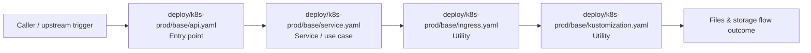

# Module deploy/k8s-prod/base

- Overview: [emplus Docs Wiki](../../../../index.md)
- Summary: [SUMMARY](../../../../SUMMARY.md)
- Feature catalog: [All features](../../../../features/index.md)
- Module index: [All modules](../../index.md)
- Workspace index: [All workspaces](../../../../workspaces/index.md)

## Snapshot

- Path: `deploy/k8s-prod/base`
- Descendant files: 4
- Descendant symbols: 4
- Languages: `YAML`
- Workspace: [emplus](../../../../workspaces/root.md)

## Business Capability

Base appears to implement files and storage through utility, entry point, service / use case.

## Basic Design

Base is inferred as a files and storage area. The visible implementation layers are Utility, Entry point, Service / use case.

### Boundaries

- Entry points: `deploy/k8s-prod/base/api.yaml`

## Detail Design

Primary flow coverage includes Files &amp; storage flow. Representative files are deploy/k8s-prod/base/api.yaml, deploy/k8s-prod/base/ingress.yaml, deploy/k8s-prod/base/kustomization.yaml, deploy/k8s-prod/base/service.yaml.

### Components

- Entry point: deploy/k8s-prod/base/api.yaml
- Service / use case: deploy/k8s-prod/base/service.yaml
- Utility: deploy/k8s-prod/base/ingress.yaml
- Utility: deploy/k8s-prod/base/kustomization.yaml

## Inferred Business Flows

### Files &amp; storage flow

Handle the main files and storage use case exposed by this module.

#### Steps

- deploy/k8s-prod/base/api.yaml receives the request and turns it into an application-level request handling command.
- deploy/k8s-prod/base/service.yaml coordinates the core business rules and state changes for the flow.
- deploy/k8s-prod/base/ingress.yaml provides helper logic used during the flow.
- deploy/k8s-prod/base/kustomization.yaml provides helper logic used during the flow.

#### Flow Diagram

## Child Modules

No child modules.

## Direct Files

- [deploy/k8s-prod/base/api.yaml](../../../files/deploy/k8s-prod/base/api.yaml.md)
- [deploy/k8s-prod/base/ingress.yaml](../../../files/deploy/k8s-prod/base/ingress.yaml.md)
- [deploy/k8s-prod/base/kustomization.yaml](../../../files/deploy/k8s-prod/base/kustomization.yaml.md)
- [deploy/k8s-prod/base/service.yaml](../../../files/deploy/k8s-prod/base/service.yaml.md)
