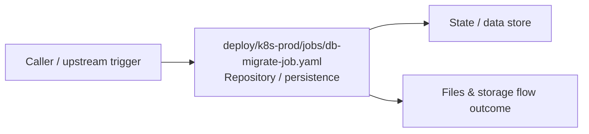

# Module deploy/k8s-prod/jobs

- Overview: [emplus Docs Wiki](../../../../index.md)
- Summary: [SUMMARY](../../../../SUMMARY.md)
- Feature catalog: [All features](../../../../features/index.md)
- Module index: [All modules](../../index.md)
- Workspace index: [All workspaces](../../../../workspaces/index.md)

## Snapshot

- Path: `deploy/k8s-prod/jobs`
- Descendant files: 1
- Descendant symbols: 1
- Languages: `YAML`
- Workspace: [emplus](../../../../workspaces/root.md)

## Business Capability

Jobs appears to implement files and storage through repository / persistence.

## Basic Design

Jobs is inferred as a files and storage area. The visible implementation layers are Repository / persistence. State is likely persisted in primary database.

### Boundaries

- Data stores: Primary database

## Detail Design

Primary flow coverage includes Files &amp; storage flow. Representative files are deploy/k8s-prod/jobs/db-migrate-job.yaml.

### Components

- Repository / persistence: deploy/k8s-prod/jobs/db-migrate-job.yaml

## Inferred Business Flows

### Files &amp; storage flow

Handle the main files and storage use case exposed by this module.

#### Steps

- deploy/k8s-prod/jobs/db-migrate-job.yaml loads or persists the records needed to complete the flow.

#### Flow Diagram

## Child Modules

No child modules.

## Direct Files

- [deploy/k8s-prod/jobs/db-migrate-job.yaml](../../../files/deploy/k8s-prod/jobs/db-migrate-job.yaml.md)
