# Module deploy/k8s

- Overview: [emplus Docs Wiki](../../../index.md)
- Summary: [SUMMARY](../../../SUMMARY.md)
- Feature catalog: [All features](../../../features/index.md)
- Module index: [All modules](../index.md)
- Workspace index: [All workspaces](../../../workspaces/index.md)

## Snapshot

- Path: `deploy/k8s`
- Descendant files: 15
- Descendant symbols: 15
- Languages: `YAML`
- Workspace: [emplus](../../../workspaces/root.md)

## Business Capability

Deployment configuration for emplus-api.

## Basic Design

K8s is inferred as a files and storage area. The visible implementation layers are Utility, Service / use case, Entry point. State is likely persisted in primary database, cache / key-value store.

### Boundaries

- Entry points: `deploy/k8s/base/api.yaml`, `deploy/k8s/base/configmap-api.yaml`
- Data stores: Primary database, Cache / key-value store

## Detail Design

Primary flow coverage includes Files &amp; storage flow. Representative files are deploy/k8s/base/api.yaml, deploy/k8s/base/configmap-api.yaml, deploy/k8s/base/kustomization.yaml, deploy/k8s/base/mailpit.yaml, deploy/k8s/base/minio.yaml. Observed behavior hints: ConfigMap for emplus API, containing environment variables and other data

### Components

- Entry point: deploy/k8s/base/api.yaml
- Entry point: deploy/k8s/base/configmap-api.yaml
- Service / use case: deploy/k8s/base/mailpit.yaml
- Service / use case: deploy/k8s/base/postgres.yaml
- Service / use case: deploy/k8s/base/redis.yaml
- Repository / persistence: deploy/k8s/jobs/db-init-job.yaml
- Repository / persistence: deploy/k8s/jobs/db-seed-job.yaml
- Model / contract: deploy/k8s/observability/loki-values.yaml

## Inferred Business Flows

### Files &amp; storage flow

Handle the main files and storage use case exposed by this module.

#### Steps

- deploy/k8s/base/api.yaml receives the request and turns it into an application-level request handling command.
- deploy/k8s/base/configmap-api.yaml receives the request and turns it into an application-level request handling command.
- deploy/k8s/base/mailpit.yaml coordinates the core business rules and state changes for the flow.
- deploy/k8s/base/postgres.yaml coordinates the core business rules and state changes for the flow.
- deploy/k8s/base/redis.yaml coordinates the core business rules and state changes for the flow.
- deploy/k8s/jobs/db-init-job.yaml loads or persists the records needed to complete the flow.

#### Flow Diagram

```mermaid
flowchart LR
  caller["Caller / upstream trigger"]
  n1_api_yaml["deploy/k8s/base/api.yaml\nEntry point"]
  n2_configmap_api_yaml["deploy/k8s/base/configmap-api.yaml\nEntry point"]
  n3_mailpit_yaml["deploy/k8s/base/mailpit.yaml\nService / use case"]
  n4_postgres_yaml["deploy/k8s/base/postgres.yaml\nService / use case"]
  n5_redis_yaml["deploy/k8s/base/redis.yaml\nService / use case"]
  n6_db_init_job_yaml["deploy/k8s/jobs/db-init-job.yaml\nRepository / persistence"]
  caller --> n1_api_yaml
  n1_api_yaml --> n2_configmap_api_yaml
  n2_configmap_api_yaml --> n3_mailpit_yaml
  n3_mailpit_yaml --> n4_postgres_yaml
  n4_postgres_yaml --> n5_redis_yaml
  n5_redis_yaml --> n6_db_init_job_yaml
  store["State / data store"]
  n6_db_init_job_yaml --> store
  outcome["Files & storage flow outcome"]
  n6_db_init_job_yaml --> outcome
```

## Child Modules

- [deploy/k8s/base](k8s/base.md) - 9 files, 9 symbols
- [deploy/k8s/jobs](k8s/jobs.md) - 3 files, 3 symbols
- [deploy/k8s/observability](k8s/observability.md) - 3 files, 3 symbols

## Direct Files

No files directly under this module.
