# Module deploy/k8s/base

- Overview: [emplus Docs Wiki](../../../../index.md)
- Summary: [SUMMARY](../../../../SUMMARY.md)
- Feature catalog: [All features](../../../../features/index.md)
- Module index: [All modules](../../index.md)
- Workspace index: [All workspaces](../../../../workspaces/index.md)

## Snapshot

- Path: `deploy/k8s/base`
- Descendant files: 9
- Descendant symbols: 9
- Languages: `YAML`
- Workspace: [emplus](../../../../workspaces/root.md)

## Business Capability

Deployment configuration for emplus-api.

## Basic Design

Base is inferred as a files and storage area. The visible implementation layers are Utility, Service / use case, Entry point. State is likely persisted in primary database, cache / key-value store.

### Boundaries

- Entry points: `deploy/k8s/base/api.yaml`, `deploy/k8s/base/configmap-api.yaml`
- Data stores: Primary database, Cache / key-value store

## Detail Design

Primary flow coverage includes Files &amp; storage flow. Representative files are deploy/k8s/base/api.yaml, deploy/k8s/base/configmap-api.yaml, deploy/k8s/base/kustomization.yaml, deploy/k8s/base/mailpit.yaml, deploy/k8s/base/minio.yaml. Observed behavior hints: ConfigMap for emplus API, containing environment variables and other data

### Components

- Entry point: deploy/k8s/base/api.yaml
- Entry point: deploy/k8s/base/configmap-api.yaml
- Service / use case: deploy/k8s/base/mailpit.yaml
- Service / use case: deploy/k8s/base/postgres.yaml
- Service / use case: deploy/k8s/base/redis.yaml
- Utility: deploy/k8s/base/kustomization.yaml
- Utility: deploy/k8s/base/minio.yaml
- Utility: deploy/k8s/base/namespace.yaml

## Inferred Business Flows

### Files &amp; storage flow

Handle the main files and storage use case exposed by this module.

#### Steps

- deploy/k8s/base/api.yaml receives the request and turns it into an application-level request handling command.
- deploy/k8s/base/configmap-api.yaml receives the request and turns it into an application-level request handling command.
- deploy/k8s/base/mailpit.yaml coordinates the core business rules and state changes for the flow.
- deploy/k8s/base/postgres.yaml coordinates the core business rules and state changes for the flow.
- deploy/k8s/base/redis.yaml coordinates the core business rules and state changes for the flow.
- deploy/k8s/base/kustomization.yaml provides helper logic used during the flow.

#### Flow Diagram

```mermaid
flowchart LR
  caller["Caller / upstream trigger"]
  n1_api_yaml["deploy/k8s/base/api.yaml\nEntry point"]
  n2_configmap_api_yaml["deploy/k8s/base/configmap-api.yaml\nEntry point"]
  n3_mailpit_yaml["deploy/k8s/base/mailpit.yaml\nService / use case"]
  n4_postgres_yaml["deploy/k8s/base/postgres.yaml\nService / use case"]
  n5_redis_yaml["deploy/k8s/base/redis.yaml\nService / use case"]
  n6_kustomization_yaml["deploy/k8s/base/kustomization.yaml\nUtility"]
  caller --> n1_api_yaml
  n1_api_yaml --> n2_configmap_api_yaml
  n2_configmap_api_yaml --> n3_mailpit_yaml
  n3_mailpit_yaml --> n4_postgres_yaml
  n4_postgres_yaml --> n5_redis_yaml
  n5_redis_yaml --> n6_kustomization_yaml
  store["State / data store"]
  n6_kustomization_yaml --> store
  outcome["Files & storage flow outcome"]
  n6_kustomization_yaml --> outcome
```

## Child Modules

No child modules.

## Direct Files

- [deploy/k8s/base/api.yaml](../../../files/deploy/k8s/base/api.yaml.md) — Deployment configuration for emplus-api.
- [deploy/k8s/base/configmap-api.yaml](../../../files/deploy/k8s/base/configmap-api.yaml.md) — ConfigMap for emplus API, containing environment variables and other data
- [deploy/k8s/base/kustomization.yaml](../../../files/deploy/k8s/base/kustomization.yaml.md) — A Kustomization file for deploying kubernetes applications.
- [deploy/k8s/base/mailpit.yaml](../../../files/deploy/k8s/base/mailpit.yaml.md) — DeployMailpit Deployment and Service definitions
- [deploy/k8s/base/minio.yaml](../../../files/deploy/k8s/base/minio.yaml.md) — The main deployment definition for MinIO.
- [deploy/k8s/base/namespace.yaml](../../../files/deploy/k8s/base/namespace.yaml.md) — Namespace definition resource in Kubernetes
- [deploy/k8s/base/postgres.yaml](../../../files/deploy/k8s/base/postgres.yaml.md) — A deployment resource for PostgreSQL service in the emplus-local namespace.
- [deploy/k8s/base/redis.yaml](../../../files/deploy/k8s/base/redis.yaml.md) — A Redis Deployment with a Service.
- [deploy/k8s/base/secret.yaml](../../../files/deploy/k8s/base/secret.yaml.md) — A base secret resource in the Emplus namespace.
