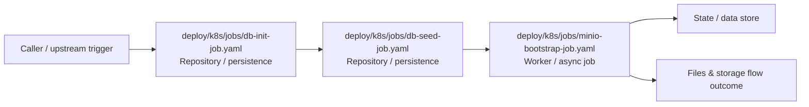

# Module deploy/k8s/jobs

- Overview: [emplus Docs Wiki](../../../../index.md)
- Summary: [SUMMARY](../../../../SUMMARY.md)
- Feature catalog: [All features](../../../../features/index.md)
- Module index: [All modules](../../index.md)
- Workspace index: [All workspaces](../../../../workspaces/index.md)

## Snapshot

- Path: `deploy/k8s/jobs`
- Descendant files: 3
- Descendant symbols: 3
- Languages: `YAML`
- Workspace: [emplus](../../../../workspaces/root.md)

## Business Capability

DB Initialisation Job

## Basic Design

Jobs is inferred as a files and storage area. The visible implementation layers are Repository / persistence, Worker / async job. State is likely persisted in primary database.

### Boundaries

- Data stores: Primary database

## Detail Design

Primary flow coverage includes Files &amp; storage flow. Representative files are deploy/k8s/jobs/db-init-job.yaml, deploy/k8s/jobs/db-seed-job.yaml, deploy/k8s/jobs/minio-bootstrap-job.yaml. Observed behavior hints: db-seed-job.yaml deployment file for Kubernetes

### Components

- Repository / persistence: deploy/k8s/jobs/db-init-job.yaml
- Repository / persistence: deploy/k8s/jobs/db-seed-job.yaml
- Worker / async job: deploy/k8s/jobs/minio-bootstrap-job.yaml

## Inferred Business Flows

### Files &amp; storage flow

Handle the main files and storage use case exposed by this module.

#### Steps

- deploy/k8s/jobs/db-init-job.yaml loads or persists the records needed to complete the flow.
- deploy/k8s/jobs/db-seed-job.yaml loads or persists the records needed to complete the flow.
- deploy/k8s/jobs/minio-bootstrap-job.yaml continues the flow asynchronously after the initial request path finishes.

#### Flow Diagram

## Child Modules

No child modules.

## Direct Files

- [deploy/k8s/jobs/db-init-job.yaml](../../../files/deploy/k8s/jobs/db-init-job.yaml.md) — DB Initialisation Job
- [deploy/k8s/jobs/db-seed-job.yaml](../../../files/deploy/k8s/jobs/db-seed-job.yaml.md) — db-seed-job.yaml deployment file for Kubernetes
- [deploy/k8s/jobs/minio-bootstrap-job.yaml](../../../files/deploy/k8s/jobs/minio-bootstrap-job.yaml.md) — This Job configuration for MinIO uses the `minio/mc` image and defines a script to wait for MinIO bucket creation.
