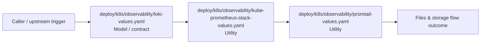

# Module deploy/k8s/observability

- Overview: [emplus Docs Wiki](../../../../index.md)
- Summary: [SUMMARY](../../../../SUMMARY.md)
- Feature catalog: [All features](../../../../features/index.md)
- Module index: [All modules](../../index.md)
- Workspace index: [All workspaces](../../../../workspaces/index.md)

## Snapshot

- Path: `deploy/k8s/observability`
- Descendant files: 3
- Descendant symbols: 3
- Languages: `YAML`
- Workspace: [emplus](../../../../workspaces/root.md)

## Business Capability

KubePrometheusStackValues.yaml file summary.

## Basic Design

Observability is inferred as a files and storage area. The visible implementation layers are Utility, Model / contract.

## Detail Design

Primary flow coverage includes Files &amp; storage flow. Representative files are deploy/k8s/observability/kube-prometheus-stack-values.yaml, deploy/k8s/observability/loki-values.yaml, deploy/k8s/observability/promtail-values.yaml. Observed behavior hints: Kubernetes Lobi Deploying Schema Configuration Configuration

### Components

- Model / contract: deploy/k8s/observability/loki-values.yaml
- Utility: deploy/k8s/observability/kube-prometheus-stack-values.yaml
- Utility: deploy/k8s/observability/promtail-values.yaml

## Inferred Business Flows

### Files &amp; storage flow

Handle the main files and storage use case exposed by this module.

#### Steps

- deploy/k8s/observability/loki-values.yaml defines the contracts or state objects moved between layers.
- deploy/k8s/observability/kube-prometheus-stack-values.yaml provides helper logic used during the flow.
- deploy/k8s/observability/promtail-values.yaml provides helper logic used during the flow.

#### Flow Diagram

## Child Modules

No child modules.

## Direct Files

- [deploy/k8s/observability/kube-prometheus-stack-values.yaml](../../../files/deploy/k8s/observability/kube-prometheus-stack-values.yaml.md) — KubePrometheusStackValues.yaml file summary.
- [deploy/k8s/observability/loki-values.yaml](../../../files/deploy/k8s/observability/loki-values.yaml.md) — Kubernetes Lobi Deploying Schema Configuration Configuration
- [deploy/k8s/observability/promtail-values.yaml](../../../files/deploy/k8s/observability/promtail-values.yaml.md) — Observability Prometheus Configuration
