# Module design-builder

- Overview: [emplus Docs Wiki](../../index.md)
- Summary: [SUMMARY](../../SUMMARY.md)
- Feature catalog: [All features](../../features/index.md)
- Module index: [All modules](index.md)
- Workspace index: [All workspaces](../../workspaces/index.md)

## Snapshot

- Path: `design-builder`
- Descendant files: 31
- Descendant symbols: 31
- Languages: `CSS`, `JSON`, `JavaScript`, `TypeScript`
- Workspace: [@emplus/design-builder](../../workspaces/design-builder.md)

## Related Features

- [Authentication Read / List](../../features/auth-list.md) - Authentication Read / List captures the read / list workflow inside authentication. It spans 3 workspaces.
- [Search Read / List](../../features/search-list.md) - Search Read / List captures the read / list workflow inside search. It spans 3 workspaces.
- [Storage Read / List](../../features/storage-list.md) - Storage Read / List captures the read / list workflow inside storage. It spans 4 workspaces.
- [Integrations Read / List](../../features/integration-list.md) - Integrations Read / List captures the read / list workflow inside integrations. It spans 3 workspaces.
- [User Management Read / List](../../features/user-list.md) - User Management Read / List captures the read / list workflow inside user management. It spans 3 workspaces.
- [Authentication Password Reset](../../features/auth-reset.md) - Authentication Password Reset captures the password reset workflow inside authentication. It spans 3 workspaces. Key flows include Password reset, Password reset, Password reset.
- [Design](../../features/design.md) - Design captures the main design behavior discovered in the codebase. Key flows include Design operations flow, Design operations flow.

## Business Capability

JSON schema definition for components file

## Basic Design

Design Builder is inferred as a files and storage area. The visible implementation layers are UI surface, Configuration, Utility. The module also integrates with next, sonner, @, lucide-react, react, react-colorful.

### Boundaries

- Entry points: `design-builder/src/App.tsx`, `design-builder/src/app/layout.tsx`, `design-builder/src/app/page.tsx`, `design-builder/src/components/theme-preview.tsx`, `design-builder/src/components/token-category-list.tsx`, `design-builder/src/components/token-editor.tsx`
- External interfaces: `next`, `sonner`, `@`, `lucide-react`, `react`, `react-colorful`

## Detail Design

Primary flow coverage includes Files Storage listing, Files Storage synchronization. Representative files are design-builder/components.json, design-builder/next-env.d.ts, design-builder/next.config.js, design-builder/package.json, design-builder/postcss.config.js. Observed behavior hints: Provides 0 documented symbols in design-builder/next-env.d.ts.

### Components

- UI surface: design-builder/src/App.tsx
- UI surface: design-builder/src/app/layout.tsx
- UI surface: design-builder/src/app/page.tsx
- UI surface: design-builder/src/components/theme-preview.tsx
- UI surface: design-builder/src/components/token-category-list.tsx
- UI surface: design-builder/src/components/token-editor.tsx
- UI surface: design-builder/src/components/ui/button.tsx
- UI surface: design-builder/src/components/ui/card.tsx

## Inferred Business Flows

### Files Storage listing

Execute the module's listing use case inside files and storage.

#### Steps

- The user or operator enters the flow through design-builder/src/App.tsx, which surfaces the listing interaction. It then hands off to BuilderPage, builder-page.tsx.
- The user or operator enters the flow through design-builder/src/app/layout.tsx, which surfaces the listing interaction. It then hands off to globals.css.
- The user or operator enters the flow through design-builder/src/app/page.tsx, which surfaces the listing interaction.
- The user or operator enters the flow through design-builder/src/components/theme-preview.tsx, which surfaces the listing interaction.
- The user or operator enters the flow through design-builder/src/components/token-category-list.tsx, which surfaces the listing interaction.
- The user or operator enters the flow through design-builder/src/components/token-editor.tsx, which surfaces the listing interaction.

#### Flow Diagram

```mermaid
flowchart LR
  caller["Caller / upstream trigger"]
  n1_App_tsx["design-builder/src/App.tsx\nUI surface"]
  n2_layout_tsx["design-builder/src/app/layout.tsx\nUI surface"]
  n3_page_tsx["design-builder/src/app/page.tsx\nUI surface"]
  n4_theme_preview_tsx["design-builder/src/components/theme-preview.tsx\nUI surface"]
  n5_token_category_list_tsx["design-builder/src/components/token-category-list.tsx\nUI surface"]
  n6_token_editor_tsx["design-builder/src/components/token-editor.tsx\nUI surface"]
  caller --> n1_App_tsx
  n1_App_tsx --> n2_layout_tsx
  n2_layout_tsx --> n3_page_tsx
  n3_page_tsx --> n4_theme_preview_tsx
  n4_theme_preview_tsx --> n5_token_category_list_tsx
  n5_token_category_list_tsx --> n6_token_editor_tsx
  ext["External dependency"]
  n6_token_editor_tsx --> ext
  outcome["Files Storage listing outcome"]
  n6_token_editor_tsx --> outcome
```

### Files Storage synchronization

Execute the module's synchronization use case inside files and storage.

#### Steps

- The user or operator enters the flow through design-builder/src/App.tsx, which surfaces the synchronization interaction. It then hands off to BuilderPage, builder-page.tsx.
- The user or operator enters the flow through design-builder/src/app/layout.tsx, which surfaces the synchronization interaction. It then hands off to globals.css.
- The user or operator enters the flow through design-builder/src/app/page.tsx, which surfaces the synchronization interaction.
- The user or operator enters the flow through design-builder/src/components/theme-preview.tsx, which surfaces the synchronization interaction.
- The user or operator enters the flow through design-builder/src/components/token-category-list.tsx, which surfaces the synchronization interaction.
- The user or operator enters the flow through design-builder/src/components/token-editor.tsx, which surfaces the synchronization interaction.

#### Flow Diagram

```mermaid
flowchart LR
  caller["Caller / upstream trigger"]
  n1_App_tsx["design-builder/src/App.tsx\nUI surface"]
  n2_layout_tsx["design-builder/src/app/layout.tsx\nUI surface"]
  n3_page_tsx["design-builder/src/app/page.tsx\nUI surface"]
  n4_theme_preview_tsx["design-builder/src/components/theme-preview.tsx\nUI surface"]
  n5_token_category_list_tsx["design-builder/src/components/token-category-list.tsx\nUI surface"]
  n6_token_editor_tsx["design-builder/src/components/token-editor.tsx\nUI surface"]
  caller --> n1_App_tsx
  n1_App_tsx --> n2_layout_tsx
  n2_layout_tsx --> n3_page_tsx
  n3_page_tsx --> n4_theme_preview_tsx
  n4_theme_preview_tsx --> n5_token_category_list_tsx
  n5_token_category_list_tsx --> n6_token_editor_tsx
  ext["External dependency"]
  n6_token_editor_tsx --> ext
  outcome["Files Storage synchronization outcome"]
  n6_token_editor_tsx --> outcome
```

## Child Modules

- [design-builder/src](design-builder/src.md) - 22 files, 27 symbols

## Direct Files

- [design-builder/components.json](../files/design-builder/components.json.md) — JSON schema definition for components file
- [design-builder/next-env.d.ts](../files/design-builder/next-env.d.ts.md) — Provides 0 documented symbols in design-builder/next-env.d.ts.
- [design-builder/next.config.js](../files/design-builder/next.config.js.md) — Next.config.js configuration file for the design-builder library.
- [design-builder/package.json](../files/design-builder/package.json.md) — The @emplus/design-builder/package.json file holds metadata and dependencies for the design-builder project.
- [design-builder/postcss.config.js](../files/design-builder/postcss.config.js.md) — Configuration file for PostCSS plugin design-builder
- [design-builder/tailwind.config.js](../files/design-builder/tailwind.config.js.md) — Tailwind configuration file for design-builder
- [design-builder/tsconfig.json](../files/design-builder/tsconfig.json.md) — tsconfig.json file configuration
- [design-builder/tsconfig.node.json](../files/design-builder/tsconfig.node.json.md) — TSconfig node.json file contents
- [design-builder/vite.config.ts](../files/design-builder/vite.config.ts.md) — Vite configuration file for the design-builder library.
