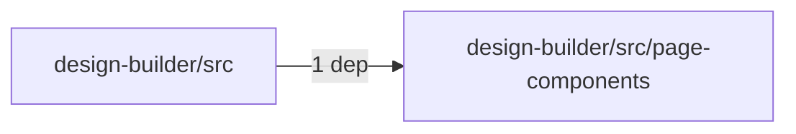

# Module design-builder/src

- Overview: [emplus Docs Wiki](../../../index.md)
- Summary: [SUMMARY](../../../SUMMARY.md)
- Feature catalog: [All features](../../../features/index.md)
- Module index: [All modules](../index.md)
- Workspace index: [All workspaces](../../../workspaces/index.md)

## Snapshot

- Path: `design-builder/src`
- Descendant files: 22
- Descendant symbols: 27
- Languages: `CSS`, `TypeScript`
- Workspace: [@emplus/design-builder](../../../workspaces/design-builder.md)

## Related Features

- [Authentication Read / List](../../../features/auth-list.md) - Authentication Read / List captures the read / list workflow inside authentication. It spans 3 workspaces.
- [Search Read / List](../../../features/search-list.md) - Search Read / List captures the read / list workflow inside search. It spans 3 workspaces.
- [Storage Read / List](../../../features/storage-list.md) - Storage Read / List captures the read / list workflow inside storage. It spans 4 workspaces.
- [Integrations Read / List](../../../features/integration-list.md) - Integrations Read / List captures the read / list workflow inside integrations. It spans 3 workspaces.
- [User Management Read / List](../../../features/user-list.md) - User Management Read / List captures the read / list workflow inside user management. It spans 3 workspaces.
- [Authentication Password Reset](../../../features/auth-reset.md) - Authentication Password Reset captures the password reset workflow inside authentication. It spans 3 workspaces. Key flows include Password reset, Password reset, Password reset.
- [Design](../../../features/design.md) - Design captures the main design behavior discovered in the codebase. Key flows include Design operations flow, Design operations flow.

## Business Capability

The main application component, handling the user interface layout and toaster notifications.

## Basic Design

Src is inferred as a authentication and access control area. The visible implementation layers are UI surface, Utility, Repository / persistence. The module also integrates with sonner, @, next, lucide-react, react, react-colorful.

### Boundaries

- Entry points: `design-builder/src/App.tsx`, `design-builder/src/app/layout.tsx`, `design-builder/src/app/page.tsx`, `design-builder/src/components/theme-preview.tsx`, `design-builder/src/components/token-category-list.tsx`, `design-builder/src/components/token-editor.tsx`
- External interfaces: `sonner`, `@`, `next`, `lucide-react`, `react`, `react-colorful`

## Detail Design

Primary flow coverage includes Auth listing, Auth synchronization. Representative files are design-builder/src/App.tsx, design-builder/src/app/globals.css, design-builder/src/app/layout.tsx, design-builder/src/app/page.tsx, design-builder/src/components/export-dialog.tsx. Observed behavior hints: globals.css

### Components

- UI surface: design-builder/src/App.tsx
- UI surface: design-builder/src/app/layout.tsx
- UI surface: design-builder/src/app/page.tsx
- UI surface: design-builder/src/components/theme-preview.tsx
- UI surface: design-builder/src/components/token-category-list.tsx
- UI surface: design-builder/src/components/token-editor.tsx
- UI surface: design-builder/src/components/ui/button.tsx
- UI surface: design-builder/src/components/ui/card.tsx

## Module Interactions

- `design-builder/src` -> `design-builder/src/page-components` (1 dependencies)

### Interaction Diagram

## Inferred Business Flows

### Auth listing

Execute the module's listing use case inside authentication and access control.

#### Steps

- The user or operator enters the flow through design-builder/src/App.tsx, which surfaces the listing interaction. It then hands off to BuilderPage, builder-page.tsx.
- The user or operator enters the flow through design-builder/src/app/layout.tsx, which surfaces the listing interaction. It then hands off to globals.css.
- The user or operator enters the flow through design-builder/src/app/page.tsx, which surfaces the listing interaction.
- The user or operator enters the flow through design-builder/src/components/theme-preview.tsx, which surfaces the listing interaction.
- The user or operator enters the flow through design-builder/src/components/token-category-list.tsx, which surfaces the listing interaction.
- The user or operator enters the flow through design-builder/src/components/token-editor.tsx, which surfaces the listing interaction.

#### Flow Diagram

```mermaid
flowchart LR
  caller["Caller / upstream trigger"]
  n1_App_tsx["design-builder/src/App.tsx\nUI surface"]
  n2_layout_tsx["design-builder/src/app/layout.tsx\nUI surface"]
  n3_page_tsx["design-builder/src/app/page.tsx\nUI surface"]
  n4_theme_preview_tsx["design-builder/src/components/theme-preview.tsx\nUI surface"]
  n5_token_category_list_tsx["design-builder/src/components/token-category-list.tsx\nUI surface"]
  n6_token_editor_tsx["design-builder/src/components/token-editor.tsx\nUI surface"]
  caller --> n1_App_tsx
  n1_App_tsx --> n2_layout_tsx
  n2_layout_tsx --> n3_page_tsx
  n3_page_tsx --> n4_theme_preview_tsx
  n4_theme_preview_tsx --> n5_token_category_list_tsx
  n5_token_category_list_tsx --> n6_token_editor_tsx
  ext["External dependency"]
  n6_token_editor_tsx --> ext
  outcome["Auth listing outcome"]
  n6_token_editor_tsx --> outcome
```

### Auth synchronization

Execute the module's synchronization use case inside authentication and access control.

#### Steps

- The user or operator enters the flow through design-builder/src/App.tsx, which surfaces the synchronization interaction. It then hands off to BuilderPage, builder-page.tsx.
- The user or operator enters the flow through design-builder/src/app/layout.tsx, which surfaces the synchronization interaction. It then hands off to globals.css.
- The user or operator enters the flow through design-builder/src/app/page.tsx, which surfaces the synchronization interaction.
- The user or operator enters the flow through design-builder/src/components/theme-preview.tsx, which surfaces the synchronization interaction.
- The user or operator enters the flow through design-builder/src/components/token-category-list.tsx, which surfaces the synchronization interaction.
- The user or operator enters the flow through design-builder/src/components/token-editor.tsx, which surfaces the synchronization interaction.

#### Flow Diagram

```mermaid
flowchart LR
  caller["Caller / upstream trigger"]
  n1_App_tsx["design-builder/src/App.tsx\nUI surface"]
  n2_layout_tsx["design-builder/src/app/layout.tsx\nUI surface"]
  n3_page_tsx["design-builder/src/app/page.tsx\nUI surface"]
  n4_theme_preview_tsx["design-builder/src/components/theme-preview.tsx\nUI surface"]
  n5_token_category_list_tsx["design-builder/src/components/token-category-list.tsx\nUI surface"]
  n6_token_editor_tsx["design-builder/src/components/token-editor.tsx\nUI surface"]
  caller --> n1_App_tsx
  n1_App_tsx --> n2_layout_tsx
  n2_layout_tsx --> n3_page_tsx
  n3_page_tsx --> n4_theme_preview_tsx
  n4_theme_preview_tsx --> n5_token_category_list_tsx
  n5_token_category_list_tsx --> n6_token_editor_tsx
  ext["External dependency"]
  n6_token_editor_tsx --> ext
  outcome["Auth synchronization outcome"]
  n6_token_editor_tsx --> outcome
```

## Child Modules

- [design-builder/src/app](src/app.md) - 3 files, 3 symbols
- [design-builder/src/components](src/components.md) - 12 files, 9 symbols
- [design-builder/src/lib](src/lib.md) - 1 file, 1 symbol
- [design-builder/src/page-components](src/page-components.md) - 1 file, 1 symbol
- [design-builder/src/store](src/store.md) - 1 file, 1 symbol
- [design-builder/src/types](src/types.md) - 1 file, 10 symbols

## Direct Files

- [design-builder/src/App.tsx](../../files/design-builder/src/App.tsx.md) — The main application component, handling the user interface layout and toaster notifications.
- [design-builder/src/index.css](../../files/design-builder/src/index.css.md) — The index.css file defines constants and utilities for a design-builder component.
- [design-builder/src/main.tsx](../../files/design-builder/src/main.tsx.md) — Main file of the design-builder project.
