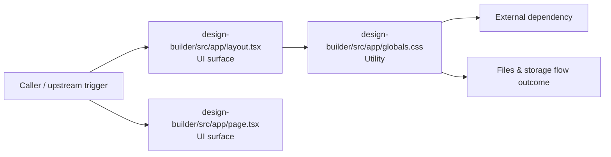

# Module design-builder/src/app

- Overview: [emplus Docs Wiki](../../../../index.md)
- Summary: [SUMMARY](../../../../SUMMARY.md)
- Feature catalog: [All features](../../../../features/index.md)
- Module index: [All modules](../../index.md)
- Workspace index: [All workspaces](../../../../workspaces/index.md)

## Snapshot

- Path: `design-builder/src/app`
- Descendant files: 3
- Descendant symbols: 3
- Languages: `CSS`, `TypeScript`
- Workspace: [@emplus/design-builder](../../../../workspaces/design-builder.md)

## Business Capability

globals.css

## Basic Design

App is inferred as a files and storage area. The visible implementation layers are UI surface, Utility. The module also integrates with @, next.

### Boundaries

- Entry points: `design-builder/src/app/layout.tsx`, `design-builder/src/app/page.tsx`
- External interfaces: `@`, `next`

## Detail Design

Primary flow coverage includes Files &amp; storage flow. Representative files are design-builder/src/app/globals.css, design-builder/src/app/layout.tsx, design-builder/src/app/page.tsx. Observed behavior hints: The RootLayout component is a functional React component that returns an HTML template.

### Components

- UI surface: design-builder/src/app/layout.tsx
- UI surface: design-builder/src/app/page.tsx
- Utility: design-builder/src/app/globals.css

## Inferred Business Flows

### Files &amp; storage flow

Handle the main files and storage use case exposed by this module.

#### Steps

- The user or operator enters the flow through design-builder/src/app/layout.tsx, which surfaces the request handling interaction. It then hands off to globals.css.
- The user or operator enters the flow through design-builder/src/app/page.tsx, which surfaces the request handling interaction.
- design-builder/src/app/globals.css provides helper logic used during the flow.

#### Flow Diagram

## Child Modules

No child modules.

## Direct Files

- [design-builder/src/app/globals.css](../../../files/design-builder/src/app/globals.css.md) — globals.css
- [design-builder/src/app/layout.tsx](../../../files/design-builder/src/app/layout.tsx.md) — The RootLayout component is a functional React component that returns an HTML template.
- [design-builder/src/app/page.tsx](../../../files/design-builder/src/app/page.tsx.md) — The Home page component of the design-builder app.
