# Module design-builder/src/components

- Overview: [emplus Docs Wiki](../../../../index.md)
- Summary: [SUMMARY](../../../../SUMMARY.md)
- Feature catalog: [All features](../../../../features/index.md)
- Module index: [All modules](../../index.md)
- Workspace index: [All workspaces](../../../../workspaces/index.md)

## Snapshot

- Path: `design-builder/src/components`
- Descendant files: 12
- Descendant symbols: 9
- Languages: `TypeScript`
- Workspace: [@emplus/design-builder](../../../../workspaces/design-builder.md)

## Related Features

- [Authentication Read / List](../../../../features/auth-list.md) - Authentication Read / List captures the read / list workflow inside authentication. It spans 3 workspaces.
- [Storage Read / List](../../../../features/storage-list.md) - Storage Read / List captures the read / list workflow inside storage. It spans 4 workspaces.
- [Design](../../../../features/design.md) - Design captures the main design behavior discovered in the codebase. Key flows include Design operations flow, Design operations flow.

## Business Capability

exposes export dialog functionality

## Basic Design

Components is inferred as a authentication and access control area. The visible implementation layers are UI surface, Repository / persistence, Utility. The module also integrates with @, lucide-react, react, sonner, react-colorful, @radix-ui.

### Boundaries

- Entry points: `design-builder/src/components/theme-preview.tsx`, `design-builder/src/components/token-category-list.tsx`, `design-builder/src/components/token-editor.tsx`, `design-builder/src/components/ui/button.tsx`, `design-builder/src/components/ui/card.tsx`, `design-builder/src/components/ui/label.tsx`
- External interfaces: `@`, `lucide-react`, `react`, `sonner`, `react-colorful`, `@radix-ui`

## Detail Design

Primary flow coverage includes Auth login. Representative files are design-builder/src/components/export-dialog.tsx, design-builder/src/components/theme-preview.tsx, design-builder/src/components/token-category-list.tsx, design-builder/src/components/token-editor.tsx, design-builder/src/components/ui/button.tsx. Observed behavior hints: A function component that renders a theme preview with customizable colors and tokens.

### Components

- UI surface: design-builder/src/components/theme-preview.tsx
- UI surface: design-builder/src/components/token-category-list.tsx
- UI surface: design-builder/src/components/token-editor.tsx
- UI surface: design-builder/src/components/ui/button.tsx
- UI surface: design-builder/src/components/ui/card.tsx
- UI surface: design-builder/src/components/ui/label.tsx
- UI surface: design-builder/src/components/ui/scroll-area.tsx
- UI surface: design-builder/src/components/ui/sonner.tsx

## Inferred Business Flows

### Auth login

Authenticate the caller, validate credentials, and establish a usable session or token.

#### Steps

- The user or operator enters the flow through design-builder/src/components/theme-preview.tsx, which surfaces the login interaction.
- The user or operator enters the flow through design-builder/src/components/token-category-list.tsx, which surfaces the login interaction.
- The user or operator enters the flow through design-builder/src/components/token-editor.tsx, which surfaces the login interaction.
- The user or operator enters the flow through design-builder/src/components/ui/button.tsx, which surfaces the login interaction.
- The user or operator enters the flow through design-builder/src/components/ui/card.tsx, which surfaces the login interaction.
- The user or operator enters the flow through design-builder/src/components/ui/label.tsx, which surfaces the login interaction.

#### Flow Diagram

```mermaid
flowchart LR
  caller["Caller / upstream trigger"]
  n1_theme_preview_tsx["design-builder/src/components/theme-preview.tsx\nUI surface"]
  n2_token_category_list_tsx["design-builder/src/components/token-category-list.tsx\nUI surface"]
  n3_token_editor_tsx["design-builder/src/components/token-editor.tsx\nUI surface"]
  n4_button_tsx["design-builder/src/components/ui/button.tsx\nUI surface"]
  n5_card_tsx["design-builder/src/components/ui/card.tsx\nUI surface"]
  n6_label_tsx["design-builder/src/components/ui/label.tsx\nUI surface"]
  caller --> n1_theme_preview_tsx
  n1_theme_preview_tsx --> n2_token_category_list_tsx
  n2_token_category_list_tsx --> n3_token_editor_tsx
  n3_token_editor_tsx --> n4_button_tsx
  n4_button_tsx --> n5_card_tsx
  n5_card_tsx --> n6_label_tsx
  ext["External dependency"]
  n6_label_tsx --> ext
  outcome["Auth login outcome"]
  n6_label_tsx --> outcome
```

## Child Modules

- [design-builder/src/components/ui](components/ui.md) - 8 files, 4 symbols

## Direct Files

- [design-builder/src/components/export-dialog.tsx](../../../files/design-builder/src/components/export-dialog.tsx.md) — exposes export dialog functionality
- [design-builder/src/components/theme-preview.tsx](../../../files/design-builder/src/components/theme-preview.tsx.md) — A function component that renders a theme preview with customizable colors and tokens.
- [design-builder/src/components/token-category-list.tsx](../../../files/design-builder/src/components/token-category-list.tsx.md) — A React functional component that renders a list of categories with their icons and labels.
- [design-builder/src/components/token-editor.tsx](../../../files/design-builder/src/components/token-editor.tsx.md) — The TokenEditor component provides a text area for editing and managing tokens in the design-builder.
