# Module design-builder/src/components/ui

- Overview: [emplus Docs Wiki](../../../../../index.md)
- Summary: [SUMMARY](../../../../../SUMMARY.md)
- Feature catalog: [All features](../../../../../features/index.md)
- Module index: [All modules](../../../index.md)
- Workspace index: [All workspaces](../../../../../workspaces/index.md)

## Snapshot

- Path: `design-builder/src/components/ui`
- Descendant files: 8
- Descendant symbols: 4
- Languages: `TypeScript`
- Workspace: [@emplus/design-builder](../../../../../workspaces/design-builder.md)

## Related Features

- [Design](../../../../../features/design.md) - Design captures the main design behavior discovered in the codebase. Key flows include Design operations flow, Design operations flow.

## Business Capability

Button component props.

## Basic Design

Ui is inferred as a design operations area. The visible implementation layers are UI surface, Utility. The module also integrates with @, @radix-ui, class-variance-authority, react, sonner.

### Boundaries

- Entry points: `design-builder/src/components/ui/button.tsx`, `design-builder/src/components/ui/card.tsx`, `design-builder/src/components/ui/label.tsx`, `design-builder/src/components/ui/scroll-area.tsx`, `design-builder/src/components/ui/sonner.tsx`, `design-builder/src/components/ui/switch.tsx`
- External interfaces: `@`, `@radix-ui`, `class-variance-authority`, `react`, `sonner`

## Detail Design

Primary flow coverage includes Design operations flow. Representative files are design-builder/src/components/ui/button.tsx, design-builder/src/components/ui/card.tsx, design-builder/src/components/ui/input.tsx, design-builder/src/components/ui/label.tsx, design-builder/src/components/ui/scroll-area.tsx. Observed behavior hints: DesignBuilder UI Card component.

### Components

- UI surface: design-builder/src/components/ui/button.tsx
- UI surface: design-builder/src/components/ui/card.tsx
- UI surface: design-builder/src/components/ui/label.tsx
- UI surface: design-builder/src/components/ui/scroll-area.tsx
- UI surface: design-builder/src/components/ui/sonner.tsx
- UI surface: design-builder/src/components/ui/switch.tsx
- UI surface: design-builder/src/components/ui/tabs.tsx
- Utility: design-builder/src/components/ui/input.tsx

## Inferred Business Flows

### Design operations flow

Handle the main design operations use case exposed by this module.

#### Steps

- The user or operator enters the flow through design-builder/src/components/ui/button.tsx, which surfaces the request handling interaction.
- The user or operator enters the flow through design-builder/src/components/ui/card.tsx, which surfaces the request handling interaction.
- The user or operator enters the flow through design-builder/src/components/ui/label.tsx, which surfaces the request handling interaction.
- The user or operator enters the flow through design-builder/src/components/ui/scroll-area.tsx, which surfaces the request handling interaction.
- The user or operator enters the flow through design-builder/src/components/ui/sonner.tsx, which surfaces the request handling interaction.
- The user or operator enters the flow through design-builder/src/components/ui/switch.tsx, which surfaces the request handling interaction.

#### Flow Diagram

```mermaid
flowchart LR
  caller["Caller / upstream trigger"]
  n1_button_tsx["design-builder/src/components/ui/button.tsx\nUI surface"]
  n2_card_tsx["design-builder/src/components/ui/card.tsx\nUI surface"]
  n3_label_tsx["design-builder/src/components/ui/label.tsx\nUI surface"]
  n4_scroll_area_tsx["design-builder/src/components/ui/scroll-area.tsx\nUI surface"]
  n5_sonner_tsx["design-builder/src/components/ui/sonner.tsx\nUI surface"]
  n6_switch_tsx["design-builder/src/components/ui/switch.tsx\nUI surface"]
  caller --> n1_button_tsx
  n1_button_tsx --> n2_card_tsx
  n2_card_tsx --> n3_label_tsx
  n3_label_tsx --> n4_scroll_area_tsx
  n4_scroll_area_tsx --> n5_sonner_tsx
  n5_sonner_tsx --> n6_switch_tsx
  ext["External dependency"]
  n6_switch_tsx --> ext
  outcome["Design operations flow outcome"]
  n6_switch_tsx --> outcome
```

## Child Modules

No child modules.

## Direct Files

- [design-builder/src/components/ui/button.tsx](../../../../files/design-builder/src/components/ui/button.tsx.md) — Button component props.
- [design-builder/src/components/ui/card.tsx](../../../../files/design-builder/src/components/ui/card.tsx.md) — DesignBuilder UI Card component.
- [design-builder/src/components/ui/input.tsx](../../../../files/design-builder/src/components/ui/input.tsx.md) — The `InputProps` interface defines the properties that can be passed to an HTML input element
- [design-builder/src/components/ui/label.tsx](../../../../files/design-builder/src/components/ui/label.tsx.md) — A semantic label component used to display a string as text.
- [design-builder/src/components/ui/scroll-area.tsx](../../../../files/design-builder/src/components/ui/scroll-area.tsx.md) — Scroll area component properties and usage.
- [design-builder/src/components/ui/sonner.tsx](../../../../files/design-builder/src/components/ui/sonner.tsx.md) — The Toaster component constructor in Sonner UI.
- [design-builder/src/components/ui/switch.tsx](../../../../files/design-builder/src/components/ui/switch.tsx.md) — Switch component in UI.
- [design-builder/src/components/ui/tabs.tsx](../../../../files/design-builder/src/components/ui/tabs.tsx.md) — Tabs component
