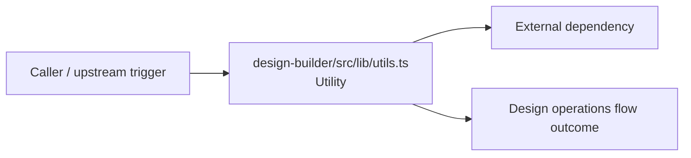

# Module design-builder/src/lib

- Overview: [emplus Docs Wiki](../../../../index.md)
- Summary: [SUMMARY](../../../../SUMMARY.md)
- Feature catalog: [All features](../../../../features/index.md)
- Module index: [All modules](../../index.md)
- Workspace index: [All workspaces](../../../../workspaces/index.md)

## Snapshot

- Path: `design-builder/src/lib`
- Descendant files: 1
- Descendant symbols: 1
- Languages: `TypeScript`
- Workspace: [@emplus/design-builder](../../../../workspaces/design-builder.md)

## Related Features

- [Design](../../../../features/design.md) - Design captures the main design behavior discovered in the codebase. Key flows include Design operations flow, Design operations flow.

## Business Capability

Builds a design-builder by merging input models using twMerge.

## Basic Design

Lib is inferred as a design operations area. The visible implementation layers are Utility. The module also integrates with clsx, tailwind-merge.

### Boundaries

- External interfaces: `clsx`, `tailwind-merge`

## Detail Design

Primary flow coverage includes Design operations flow. Representative files are design-builder/src/lib/utils.ts.

### Components

- Utility: design-builder/src/lib/utils.ts

## Inferred Business Flows

### Design operations flow

Handle the main design operations use case exposed by this module.

#### Steps

- design-builder/src/lib/utils.ts provides helper logic used during the flow.

#### Flow Diagram

## Child Modules

No child modules.

## Direct Files

- [design-builder/src/lib/utils.ts](../../../files/design-builder/src/lib/utils.ts.md) — Builds a design-builder by merging input models using twMerge.
