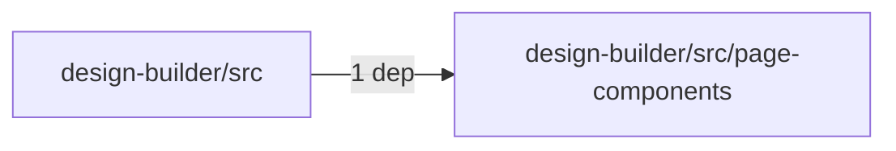
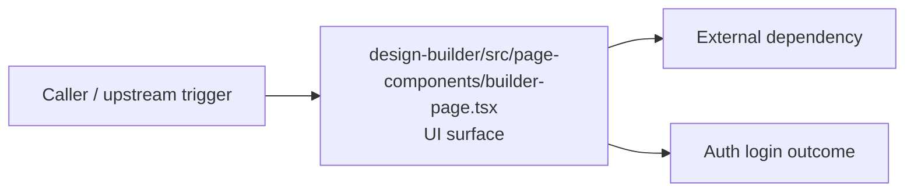

# Module design-builder/src/page-components

- Overview: [emplus Docs Wiki](../../../../index.md)
- Summary: [SUMMARY](../../../../SUMMARY.md)
- Feature catalog: [All features](../../../../features/index.md)
- Module index: [All modules](../../index.md)
- Workspace index: [All workspaces](../../../../workspaces/index.md)

## Snapshot

- Path: `design-builder/src/page-components`
- Descendant files: 1
- Descendant symbols: 1
- Languages: `TypeScript`
- Workspace: [@emplus/design-builder](../../../../workspaces/design-builder.md)

## Related Features

- [Authentication Read / List](../../../../features/auth-list.md) - Authentication Read / List captures the read / list workflow inside authentication. It spans 3 workspaces.
- [Search Read / List](../../../../features/search-list.md) - Search Read / List captures the read / list workflow inside search. It spans 3 workspaces.
- [Storage Read / List](../../../../features/storage-list.md) - Storage Read / List captures the read / list workflow inside storage. It spans 4 workspaces.
- [Integrations Read / List](../../../../features/integration-list.md) - Integrations Read / List captures the read / list workflow inside integrations. It spans 3 workspaces.
- [User Management Read / List](../../../../features/user-list.md) - User Management Read / List captures the read / list workflow inside user management. It spans 3 workspaces.

## Business Capability

Builders Page component

## Basic Design

Page Components is inferred as a authentication and access control area. The visible implementation layers are UI surface. The module also integrates with @, lucide-react, react, sonner.

### Boundaries

- Entry points: `design-builder/src/page-components/builder-page.tsx`
- External interfaces: `@`, `lucide-react`, `react`, `sonner`

## Detail Design

Primary flow coverage includes Auth login. Representative files are design-builder/src/page-components/builder-page.tsx.

### Components

- UI surface: design-builder/src/page-components/builder-page.tsx

## Module Interactions

- `design-builder/src` -> `design-builder/src/page-components` (1 dependencies)

### Interaction Diagram

## Inferred Business Flows

### Auth login

Authenticate the caller, validate credentials, and establish a usable session or token.

#### Steps

- The user or operator enters the flow through design-builder/src/page-components/builder-page.tsx, which surfaces the login interaction.

#### Flow Diagram

## Child Modules

No child modules.

## Direct Files

- [design-builder/src/page-components/builder-page.tsx](../../../files/design-builder/src/page-components/builder-page.tsx.md) — Builders Page component
