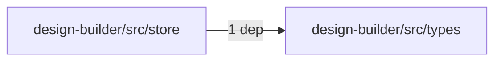
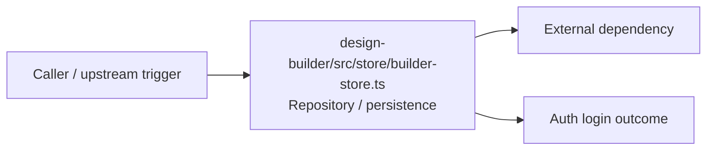

# Module design-builder/src/store

- Overview: [emplus Docs Wiki](../../../../index.md)
- Summary: [SUMMARY](../../../../SUMMARY.md)
- Feature catalog: [All features](../../../../features/index.md)
- Module index: [All modules](../../index.md)
- Workspace index: [All workspaces](../../../../workspaces/index.md)

## Snapshot

- Path: `design-builder/src/store`
- Descendant files: 1
- Descendant symbols: 1
- Languages: `TypeScript`
- Workspace: [@emplus/design-builder](../../../../workspaces/design-builder.md)

## Related Features

- [Authentication Password Reset](../../../../features/auth-reset.md) - Authentication Password Reset captures the password reset workflow inside authentication. It spans 3 workspaces. Key flows include Password reset, Password reset, Password reset.

## Business Capability

BuilderStore interface

## Basic Design

Store is inferred as a authentication and access control area. The visible implementation layers are Repository / persistence. The module also integrates with zustand.

### Boundaries

- External interfaces: `zustand`

## Detail Design

Primary flow coverage includes Auth login. Representative files are design-builder/src/store/builder-store.ts.

### Components

- Repository / persistence: design-builder/src/store/builder-store.ts

## Module Interactions

- `design-builder/src/store` -> `design-builder/src/types` (1 dependencies)

### Interaction Diagram

## Inferred Business Flows

### Auth login

Authenticate the caller, validate credentials, and establish a usable session or token.

#### Steps

- design-builder/src/store/builder-store.ts loads or persists the records needed to complete the flow. It then hands off to DesignSystemConfig, tokens.ts.

#### Flow Diagram

## Child Modules

No child modules.

## Direct Files

- [design-builder/src/store/builder-store.ts](../../../files/design-builder/src/store/builder-store.ts.md) — BuilderStore interface
