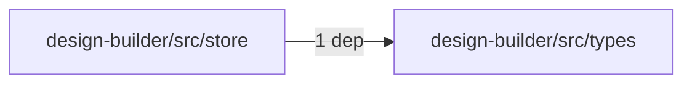
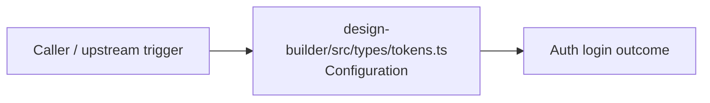

# Module design-builder/src/types

- Overview: [emplus Docs Wiki](../../../../index.md)
- Summary: [SUMMARY](../../../../SUMMARY.md)
- Feature catalog: [All features](../../../../features/index.md)
- Module index: [All modules](../../index.md)
- Workspace index: [All workspaces](../../../../workspaces/index.md)

## Snapshot

- Path: `design-builder/src/types`
- Descendant files: 1
- Descendant symbols: 10
- Languages: `TypeScript`
- Workspace: [@emplus/design-builder](../../../../workspaces/design-builder.md)

## Business Capability

Provides 10 documented symbols in design-builder/src/types/tokens.ts.

## Basic Design

Types is inferred as a authentication and access control area. The visible implementation layers are Configuration.

## Detail Design

Primary flow coverage includes Auth login. Representative files are design-builder/src/types/tokens.ts.

### Components

- Configuration: design-builder/src/types/tokens.ts

## Module Interactions

- `design-builder/src/store` -> `design-builder/src/types` (1 dependencies)

### Interaction Diagram

## Inferred Business Flows

### Auth login

Authenticate the caller, validate credentials, and establish a usable session or token.

#### Steps

- design-builder/src/types/tokens.ts supplies runtime configuration that shapes how the flow behaves.

#### Flow Diagram

## Child Modules

No child modules.

## Direct Files

- [design-builder/src/types/tokens.ts](../../../files/design-builder/src/types/tokens.ts.md) — Provides 10 documented symbols in design-builder/src/types/tokens.ts.
