# Module mobile

- Overview: [emplus Docs Wiki](../../index.md)
- Summary: [SUMMARY](../../SUMMARY.md)
- Feature catalog: [All features](../../features/index.md)
- Module index: [All modules](index.md)
- Workspace index: [All workspaces](../../workspaces/index.md)

## Snapshot

- Path: `mobile`
- Descendant files: 243
- Descendant symbols: 654
- Languages: `JSON`, `JavaScript`, `Kotlin`, `Swift`, `TypeScript`
- Workspace: [@emplus/mobile](../../workspaces/mobile.md)

## Related Features

- [Authentication Login](../../features/auth-login.md) - Authentication Login captures the login workflow inside authentication. It spans 2 workspaces. Key flows include Auth login, Auth registration, Auth login.
- [Authentication Read / List](../../features/auth-list.md) - Authentication Read / List captures the read / list workflow inside authentication. It spans 3 workspaces.
- [User Management Login](../../features/user-login.md) - User Management Login captures the login workflow inside user management. It spans 2 workspaces. Key flows include Auth login, Auth registration, Auth login.
- [Search Read / List](../../features/search-list.md) - Search Read / List captures the read / list workflow inside search. It spans 3 workspaces.
- [Search Login](../../features/search-login.md) - Search Login captures the login workflow inside search. It spans 2 workspaces. Key flows include Auth login, Auth registration, Auth login.
- [Notifications Read / List](../../features/notification-list.md) - Notifications Read / List captures the read / list workflow inside notifications. It spans 2 workspaces.
- [Storage Read / List](../../features/storage-list.md) - Storage Read / List captures the read / list workflow inside storage. It spans 4 workspaces.
- [Integrations Read / List](../../features/integration-list.md) - Integrations Read / List captures the read / list workflow inside integrations. It spans 3 workspaces.
- [User Management Read / List](../../features/user-list.md) - User Management Read / List captures the read / list workflow inside user management. It spans 3 workspaces.
- [Notifications Notify](../../features/notification-notify.md) - Notifications Notify captures the notify workflow inside notifications. It spans 2 workspaces.
- [Order Management Login](../../features/order-login.md) - Order Management Login captures the login workflow inside order management. It spans 2 workspaces. Key flows include Auth login, Auth login, Auth login.
- [Notifications Login](../../features/notification-login.md) - Notifications Login captures the login workflow inside notifications. It spans 2 workspaces. Key flows include Auth login, Auth registration, Auth login.
- [Reporting Read / List](../../features/reporting-list.md) - Reporting Read / List captures the read / list workflow inside reporting. It spans 2 workspaces.
- [Search Notify](../../features/search-notify.md) - Search Notify captures the notify workflow inside search. It spans 2 workspaces.
- [Storage Login](../../features/storage-login.md) - Storage Login captures the login workflow inside storage. It spans 2 workspaces. Key flows include Auth login, Auth registration, Auth login.
- [Administration Read / List](../../features/admin-list.md) - Administration Read / List captures the read / list workflow inside administration. It spans 2 workspaces.
- [Authentication Verification](../../features/auth-verify.md) - Authentication Verification captures the verification workflow inside authentication. It spans 2 workspaces. Key flows include Credential validation, Auth login, Auth login.
- [Integrations Login](../../features/integration-login.md) - Integrations Login captures the login workflow inside integrations. It spans 2 workspaces. Key flows include Auth login, Auth registration, Auth login.
- [Integrations Notify](../../features/integration-notify.md) - Integrations Notify captures the notify workflow inside integrations. It spans 2 workspaces.
- [Search Create](../../features/search-create.md) - Search Create captures the create workflow inside search. It spans 2 workspaces.
- [User Management Notify](../../features/user-notify.md) - User Management Notify captures the notify workflow inside user management. It spans 2 workspaces.
- [Administration Login](../../features/admin-login.md) - Administration Login captures the login workflow inside administration. It spans 2 workspaces. Key flows include Auth login, Auth registration, Auth login.
- [Authentication Password Reset](../../features/auth-reset.md) - Authentication Password Reset captures the password reset workflow inside authentication. It spans 3 workspaces. Key flows include Password reset, Password reset, Password reset.
- [Storage Notify](../../features/storage-notify.md) - Storage Notify captures the notify workflow inside storage. It spans 2 workspaces.
- [User Management Create](../../features/user-create.md) - User Management Create captures the create workflow inside user management. It spans 2 workspaces.
- [Order Management Read / List](../../features/order-list.md) - Order Management Read / List captures the read / list workflow inside order management. It spans 2 workspaces.
- [Reporting Login](../../features/reporting-login.md) - Reporting Login captures the login workflow inside reporting. It spans 2 workspaces. Key flows include Auth login, Auth registration, Auth login.
- [Notifications Verification](../../features/notification-verify.md) - Notifications Verification captures the verification workflow inside notifications. It spans 2 workspaces. Key flows include Credential validation, Auth login, Auth login.
- [Storage Verification](../../features/storage-verify.md) - Storage Verification captures the verification workflow inside storage. It spans 2 workspaces. Key flows include Credential validation, Auth login, Auth login.
- [Administration Notify](../../features/admin-notify.md) - Administration Notify captures the notify workflow inside administration. It spans 2 workspaces.
- [Administration Verification](../../features/admin-verify.md) - Administration Verification captures the verification workflow inside administration. It spans 2 workspaces. Key flows include Credential validation, Auth login, Auth login.
- [Integrations Verification](../../features/integration-verify.md) - Integrations Verification captures the verification workflow inside integrations. It spans 2 workspaces. Key flows include Credential validation, Auth login, Auth login.
- [Reporting Verification](../../features/reporting-verify.md) - Reporting Verification captures the verification workflow inside reporting. It spans 2 workspaces. Key flows include Credential validation, Auth login, Auth login.
- [Order Management Verification](../../features/order-verify.md) - Order Management Verification captures the verification workflow inside order management. It spans 2 workspaces. Key flows include Credential validation, Auth login, Auth login.
- [Order Management Notify](../../features/order-notify.md) - Order Management Notify captures the notify workflow inside order management. It spans 2 workspaces.
- [Mobile](../../features/mobile.md) - Mobile captures the main mobile behavior discovered in the codebase. Key flows include Mobile operations flow, Mobile operations flow.

## Business Capability

The MainActivity is the entry point of an Android app built using React Native.

## Basic Design

Mobile is inferred as a authentication and access control area. The visible implementation layers are Entry point, UI surface, Utility. State is likely persisted in session / token state, primary database. The module also integrates with @, @expo-google-fonts, expo-font, expo-router, expo-splash-screen, expo-status-bar.

### Boundaries

- Entry points: `mobile/app/(tabs)/notifications.tsx`, `mobile/app/(tabs)/timeline.tsx`, `mobile/app/forgot-password.tsx`, `mobile/app/register.tsx`, `mobile/ios/Em/Images.xcassets/SplashScreenBackground.colorset/Contents.json`, `mobile/ios/Em/Images.xcassets/SplashScreenLegacy.imageset/Contents.json`
- Data stores: Session / token state, Primary database
- External interfaces: `@`, `@expo-google-fonts`, `expo-font`, `expo-router`, `expo-splash-screen`, `expo-status-bar`

## Detail Design

Primary flow coverage includes Auth login. Representative files are mobile/android/app/src/main/java/com/truongdq/emplus/MainActivity.kt, mobile/android/app/src/main/java/com/truongdq/emplus/MainApplication.kt, mobile/app.json, mobile/app/_layout.tsx, mobile/app/(tabs)/_layout.tsx. Observed behavior hints: MainApplication class is the entry point of an Android application built with Expo

### Components

- UI surface: mobile/app/(tabs)/notifications.tsx
- UI surface: mobile/app/(tabs)/timeline.tsx
- UI surface: mobile/app/forgot-password.tsx
- UI surface: mobile/app/register.tsx
- UI surface: mobile/ios/Em/Images.xcassets/SplashScreenBackground.colorset/Contents.json
- UI surface: mobile/ios/Em/Images.xcassets/SplashScreenLegacy.imageset/Contents.json
- UI surface: mobile/src/alert-dialog-context.tsx
- UI surface: mobile/src/animations/presets.ts

## Inferred Business Flows

### Auth login

Authenticate the caller, validate credentials, and establish a usable session or token.

#### Steps

- The user or operator enters the flow through mobile/app/(tabs)/notifications.tsx, which surfaces the login interaction.
- The user or operator enters the flow through mobile/app/(tabs)/timeline.tsx, which surfaces the login interaction.
- The user or operator enters the flow through mobile/app/forgot-password.tsx, which surfaces the login interaction.
- The user or operator enters the flow through mobile/app/register.tsx, which surfaces the login interaction.
- The user or operator enters the flow through mobile/ios/Em/Images.xcassets/SplashScreenBackground.colorset/Contents.json, which surfaces the login interaction.
- The user or operator enters the flow through mobile/ios/Em/Images.xcassets/SplashScreenLegacy.imageset/Contents.json, which surfaces the login interaction.

#### Flow Diagram

```mermaid
flowchart LR
  caller["Caller / upstream trigger"]
  n1_notifications_tsx["mobile/app/(tabs)/notifications.tsx\nUI surface"]
  n2_timeline_tsx["mobile/app/(tabs)/timeline.tsx\nUI surface"]
  n3_forgot_password_tsx["mobile/app/forgot-password.tsx\nUI surface"]
  n4_register_tsx["mobile/app/register.tsx\nUI surface"]
  n5_Contents_json["mobile/ios/Em/Images.xcassets/SplashScreenBackground.colorset/Contents.json\nUI surface"]
  n6_Contents_json["mobile/ios/Em/Images.xcassets/SplashScreenLegacy.imageset/Contents.json\nUI surface"]
  caller --> n1_notifications_tsx
  n1_notifications_tsx --> n2_timeline_tsx
  n2_timeline_tsx --> n3_forgot_password_tsx
  n3_forgot_password_tsx --> n4_register_tsx
  n4_register_tsx --> n5_Contents_json
  n5_Contents_json --> n6_Contents_json
  store["State / data store"]
  n6_Contents_json --> store
  ext["External dependency"]
  n6_Contents_json --> ext
  outcome["Auth login outcome"]
  n6_Contents_json --> outcome
```

## Child Modules

- [mobile/android](mobile/android.md) - 2 files, 2 symbols
- [mobile/app](mobile/app.md) - 24 files, 54 symbols
- [mobile/assets](mobile/assets.md) - 13 files, 13 symbols
- [mobile/ios](mobile/ios.md) - 6 files, 6 symbols
- [mobile/scripts](mobile/scripts.md) - 2 files, 4 symbols
- [mobile/src](mobile/src.md) - 188 files, 570 symbols

## Direct Files

- [mobile/app.json](../files/mobile/app.json.md) — main app file for Expo EM+ project.
- [mobile/babel.config.js](../files/mobile/babel.config.js.md) — The configuration file for the Babel team.
- [mobile/eas.json](../files/mobile/eas.json.md) — JSON Configuration File
- [mobile/index.js](../files/mobile/index.js.md) — The index file for the mobile application.
- [mobile/metro.config.js](../files/mobile/metro.config.js.md) — Configuration file for mobile/metro project.
- [mobile/package.json](../files/mobile/package.json.md) — mobile/package.json file
- [mobile/tsconfig.components.json](../files/mobile/tsconfig.components.json.md) — Source configuration file for mobile application.
- [mobile/tsconfig.json](../files/mobile/tsconfig.json.md) — TSConfig for Mobile Expo
