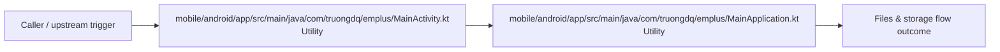

# Module mobile/android/app/src/main/java/com/truongdq

- Overview: [emplus Docs Wiki](../../../../../../../../../index.md)
- Summary: [SUMMARY](../../../../../../../../../SUMMARY.md)
- Feature catalog: [All features](../../../../../../../../../features/index.md)
- Module index: [All modules](../../../../../../../index.md)
- Workspace index: [All workspaces](../../../../../../../../../workspaces/index.md)

## Snapshot

- Path: `mobile/android/app/src/main/java/com/truongdq`
- Descendant files: 2
- Descendant symbols: 2
- Languages: `Kotlin`
- Workspace: [@emplus/mobile](../../../../../../../../../workspaces/mobile.md)

## Business Capability

The MainActivity is the entry point of an Android app built using React Native.

## Basic Design

Truongdq is inferred as a files and storage area. The visible implementation layers are Utility.

## Detail Design

Primary flow coverage includes Files &amp; storage flow. Representative files are mobile/android/app/src/main/java/com/truongdq/emplus/MainActivity.kt, mobile/android/app/src/main/java/com/truongdq/emplus/MainApplication.kt. Observed behavior hints: MainApplication class is the entry point of an Android application built with Expo

### Components

- Utility: mobile/android/app/src/main/java/com/truongdq/emplus/MainActivity.kt
- Utility: mobile/android/app/src/main/java/com/truongdq/emplus/MainApplication.kt

## Inferred Business Flows

### Files &amp; storage flow

Handle the main files and storage use case exposed by this module.

#### Steps

- mobile/android/app/src/main/java/com/truongdq/emplus/MainActivity.kt provides helper logic used during the flow.
- mobile/android/app/src/main/java/com/truongdq/emplus/MainApplication.kt provides helper logic used during the flow.

#### Flow Diagram

## Child Modules

- [mobile/android/app/src/main/java/com/truongdq/emplus](truongdq/emplus.md) - 2 files, 2 symbols

## Direct Files

No files directly under this module.
